# 矿山智能调度 Agent 技术方案

> 版本：v1.0  
> 适用场景：矿山自动驾驶调度平台、调度员辅助决策、异常分析、受控操作执行  
> 技术主线：Spring AI Alibaba + Spring Boot + Dubbo + MCP + RAG + operator-mcp + 人在回路安全闭环

---

## 1. 方案摘要

本方案目标是在现有矿山调度平台之上建设一个**可信、可审计、可回滚、人在回路的智能调度 Agent 系统**。

该系统不应让 LLM 直接操作调度平台，也不应让 Agent 直接访问数据库、Redis、Kafka 或 Dubbo 服务。正确架构是：

```text
用户 / 调度员
  -> Assistant Agent
  -> SubAgent 编排
  -> operator-mcp 操作中心
  -> Dubbo Adapter
  -> 现有调度微服务
```

核心结论：

1. **Agent 负责理解、分析、问答、生成操作提案。**
2. **operator-mcp 是唯一操作入口。**
3. **只读请求可以直接执行，但必须审计。**
4. **写操作必须经过提案生成、安全门评估、用户确认、一次性 token 校验。**
5. **现有 Java8 + Spring Boot + Dubbo 系统不建议大改。**
6. **新 Agent 服务建议独立使用 JDK17+、Spring Boot 3.x、Spring AI Alibaba。**
7. **第一阶段目标不是自动调度，而是可信辅助调度。**

---

## 2. 当前架构与约束

### 2.1 当前系统架构

当前调度管理平台是微服务工程集群：

- 基于 Java8
- 基于 Spring Boot 老版本
- 基于 Dubbo 做服务间调用
- 按领域拆分服务，例如：
  - device-center
  - user-center
  - dispatch-center
  - vehicle-center
  - task-center
  - map-center
  - alarm-center
- Dubbo 服务上层有类似 dubbo-to-http 的网关服务，对外提供 HTTP API

### 2.2 关键约束

| 约束 | 影响 |
|---|---|
| 老系统基于 Java8 | 不适合直接引入新版 Spring AI Alibaba |
| 调度系统属于生产控制系统 | Agent 不能绕过权限直接写入 |
| 调度操作有安全风险 | 必须引入提案、确认、审计、回滚机制 |
| 矿山状态实时变化 | 静态知识库不能替代实时业务查询 |
| LLM 存在幻觉 | 所有结论要有依据，所有写操作要有审批链 |
| Dubbo 服务已有业务边界 | 需要 operator-mcp 统一封装和防腐 |
| 业务接口风险不同 | 需要只读、低风险写、高风险写分级治理 |

### 2.3 设计原则

1. **不影响当前调度系统稳定运行。**
2. **不侵入现有核心调度链路。**
3. **所有业务操作都通过 operator-mcp 封装。**
4. **Agent 不直接操作数据库、中间件、Dubbo。**
5. **只读能力先行，写操作逐步开放。**
6. **高风险操作必须人在回路。**
7. **所有提案、审批、执行、失败、回滚都必须可追溯。**
8. **知识库回答必须尽量给出来源。**

---

## 3. 建设目标

### 3.1 一阶段目标

建设面向调度员、运维人员、管理人员的智能助手，支持：

- 调度系统知识问答
- 接口文档查询
- 车辆状态查询
- 任务状态查询
- 异常原因分析
- SOP 检索
- 操作建议生成
- 操作提案生成
- 用户确认后执行有限低风险写操作

### 3.2 长期目标

逐步演进为：

- 后台巡视 Agent
- 异常自动发现
- 调度提案自动生成
- 半自动辅助调度
- 多角色审批
- 策略引擎 + Agent 协同
- 人在回路的受控自治调度

---

## 4. 总体架构

### 4.1 架构总览

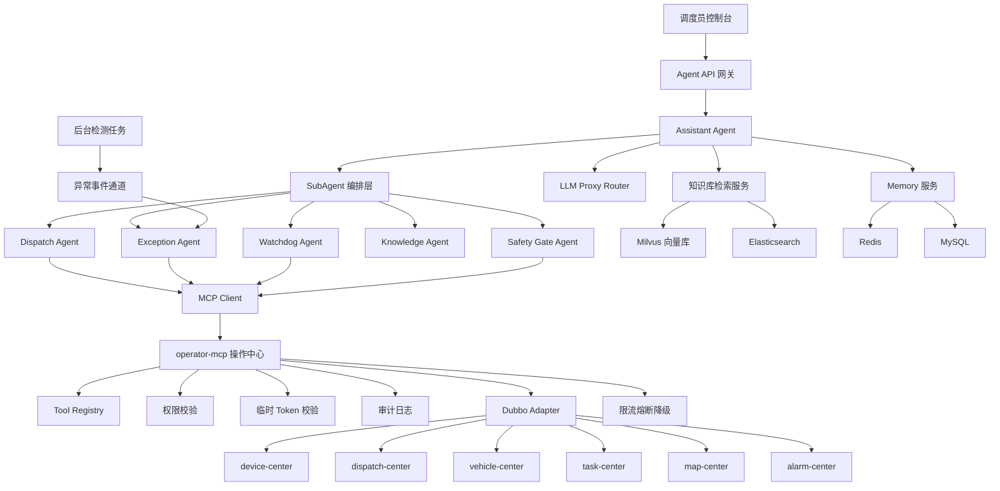

### 4.2 核心模块职责

| 模块 | 职责 |
|---|---|
| Agent API 网关 | 对外提供聊天、会话、提案、确认、执行结果查询接口 |
| Assistant Agent | 用户主入口，负责意图识别、任务拆解、上下文组织、回答生成 |
| SubAgent 编排层 | 负责专业 Agent 调度和上下文传递 |
| Knowledge Agent | 检索知识库、接口文档、SOP、制度文档 |
| Dispatch Agent | 生成调度分析、车辆任务调整建议 |
| Exception Agent | 分析异常事件，生成处置建议和操作提案 |
| Watchdog Agent | 接收后台算法检测结果，触发异常分析 |
| Safety Gate Agent | 对操作提案进行风险评估和安全兜底 |
| operator-mcp | 唯一操作中心，封装所有业务工具 |
| LLM Proxy Router | 负责模型路由、限流、降级、成本控制 |
| Memory 服务 | 管理会话记忆、用户偏好、业务事件记忆 |
| 知识库服务 | 文档切分、Embedding、召回、重排、引用生成 |
| 审计服务 | 记录会话、工具调用、提案、审批、执行链路 |

---

## 5. Agent 体系设计

### 5.1 Agent 分层

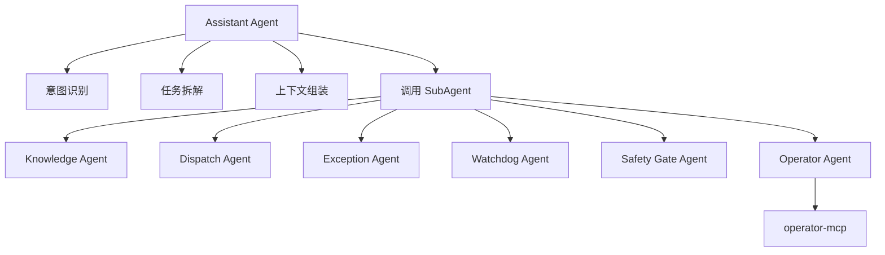

### 5.2 Agent 职责边界

| Agent | 输入 | 输出 | 可调用工具 | 是否允许写操作 |
|---|---|---|---|---|
| Assistant Agent | 用户问题、会话上下文 | 回答、任务计划、提案草稿 | 只读工具、知识库工具 | 不允许 |
| Knowledge Agent | 检索问题 | 带来源的知识结果 | 知识库工具 | 不允许 |
| Dispatch Agent | 车辆、任务、道路状态 | 调度建议、提案草稿 | 只读工具、提案工具 | 不直接写 |
| Exception Agent | 异常事件、上下文快照 | 异常分析、处置建议 | 只读工具、提案工具 | 不直接写 |
| Watchdog Agent | 后台检测事件 | 巡视报告、异常事件 | 检测结果读取工具 | 不直接写 |
| Safety Gate Agent | 操作提案 | 风险等级、是否放行 | 规则库、只读工具 | 不允许 |
| Operator Agent | 已批准提案 | MCP 工具调用请求 | MCP 工具 | 只通过 operator-mcp |

### 5.3 Assistant Agent

职责：

- 接收用户自然语言请求
- 识别意图类型
- 判断是知识问答、只读查询、异常分析还是写操作请求
- 对复杂任务进行拆解
- 调用合适的 SubAgent
- 生成最终自然语言回复
- 对写操作生成 Proposal，而不是直接执行

典型意图：

| 意图 | 示例 | 处理方式 |
|---|---|---|
| 知识问答 | 压车怎么处理 | 调用 Knowledge Agent |
| 状态查询 | 查 truck-101 当前状态 | 调用只读 MCP 工具 |
| 异常分析 | 为什么 A 路段堵车 | 调用 Exception Agent |
| 操作建议 | 是否要调整车辆路线 | 调用 Dispatch Agent |
| 写操作 | 把 truck-101 调到 A 装载点 | 生成 Proposal |

### 5.4 Dispatch Agent

职责：

- 结合车辆状态、任务状态、道路状态、地图语义生成调度建议
- 输出结构化调度提案
- 不直接执行调度操作

输出应包含：

- 当前状态判断
- 约束条件
- 可选方案
- 推荐方案
- 影响分析
- 风险点
- 回滚建议

### 5.5 Exception Agent

职责：

- 处理压车、拥堵、车辆静止、通信异常、任务超时等事件
- 结合知识库和实时业务接口做原因分析
- 生成处置建议或操作提案

### 5.6 Watchdog Agent

职责：

- 接收后台算法检测结果
- 汇总异常事件
- 对高严重度事件触发 Exception Agent
- 第一阶段可以只做 mock 或规则触发

### 5.7 Safety Gate Agent

职责：

- 对 Proposal 做最终安全评估
- 判断风险等级
- 判断是否允许进入用户确认阶段
- 判断是否需要二次确认或多角色审批

评估维度：

- 用户权限
- 操作类型
- 目标车辆
- 目标矿区
- 当前任务状态
- 道路状态
- 是否影响其他车辆
- 是否高风险时间段
- 是否违反 SOP
- 是否存在回滚方案

---

## 6. operator-mcp 设计

### 6.1 定位

`operator-mcp` 是整个系统的**操作防火墙**。

它不是普通 MCP Server，而是：

- 工具注册中心
- 权限中心
- 提案执行中心
- Dubbo 防腐层
- 审计中心
- 限流熔断层
- token 校验层

所有影响调度平台状态的操作必须通过 operator-mcp。

### 6.2 内部架构

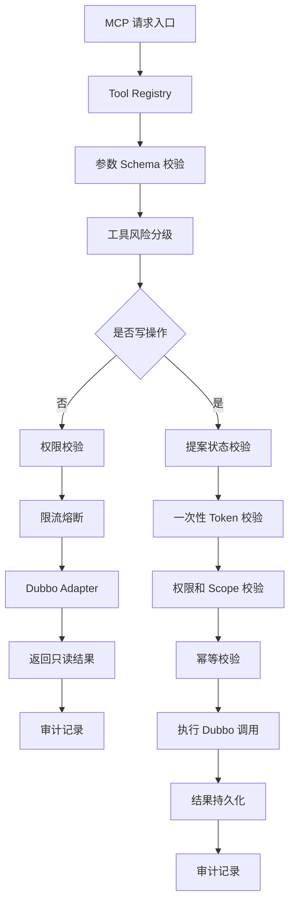

### 6.3 核心模块

| 模块 | 说明 |
|---|---|
| MCP Server | 对 Agent 暴露工具 |
| Tool Registry | 注册工具名称、描述、参数、风险等级 |
| Permission Validator | 校验用户、角色、矿区、车辆、操作权限 |
| Token Validator | 校验一次性授权 token |
| Proposal Store | 存储提案、审批、状态流转 |
| Dubbo Adapter | 将工具调用转换为 Dubbo 调用 |
| Rate Limiter | 对工具、用户、车辆、接口限流 |
| Circuit Breaker | 对异常 Dubbo 服务降级 |
| Audit Logger | 记录完整调用链 |
| Operation Executor | 执行写操作 |
| Result Callback | 回传执行结果 |
| Hook Engine | 预留鉴权、token 获取、风控、mock 扩展点 |

### 6.4 Tool 定义示例

```json
{
  "toolName": "dispatch.adjustVehicleTask",
  "description": "调整指定车辆的调度任务",
  "operationType": "WRITE",
  "riskLevel": "HIGH",
  "requiredPermission": "DISPATCH_TASK_ADJUST",
  "requiredToken": true,
  "idempotentKeyFields": ["proposalId", "vehicleId", "targetTaskId"],
  "timeoutMs": 3000,
  "rateLimit": {
    "userQps": 1,
    "globalQps": 10
  },
  "parameters": {
    "proposalId": "string",
    "vehicleId": "string",
    "targetTaskId": "string",
    "reason": "string"
  }
}
```

### 6.5 工具开放策略

第一阶段建议只开放：

| 工具 | 类型 | 风险 |
|---|---|---|
| vehicle.getStatus | 只读 | 低 |
| vehicle.listNearby | 只读 | 低 |
| task.getCurrentTask | 只读 | 低 |
| dispatch.getQueueStatus | 只读 | 中 |
| map.getRoadSegmentStatus | 只读 | 中 |
| alarm.listActiveAlarms | 只读 | 中 |
| proposal.create | 写内部表 | 低 |
| proposal.approve | 写内部表 | 中 |
| dispatch.markSuggestion | 低风险写 | 中 |

不建议第一阶段开放：

- 强制停车
- 批量改派
- 封路
- 调整全局调度策略
- 直接修改车辆任务状态
- 直接清除安全告警

---

## 7. 安全与权限体系

### 7.1 操作分级

| 类型 | 示例 | 是否需要提案 | 是否需要用户确认 | 是否需要 token |
|---|---|---:|---:|---:|
| 只读 | 查询车辆状态 | 否 | 否 | 否 |
| 低风险写 | 标记建议已读 | 是 | 是 | 是 |
| 中风险写 | 调整任务优先级 | 是 | 是 | 是 |
| 高风险写 | 车辆任务重分配 | 是 | 是 | 是 |
| 极高风险 | 停车、封路、批量调度 | 是 | 多角色审批 | 是 |

### 7.2 写操作安全链路

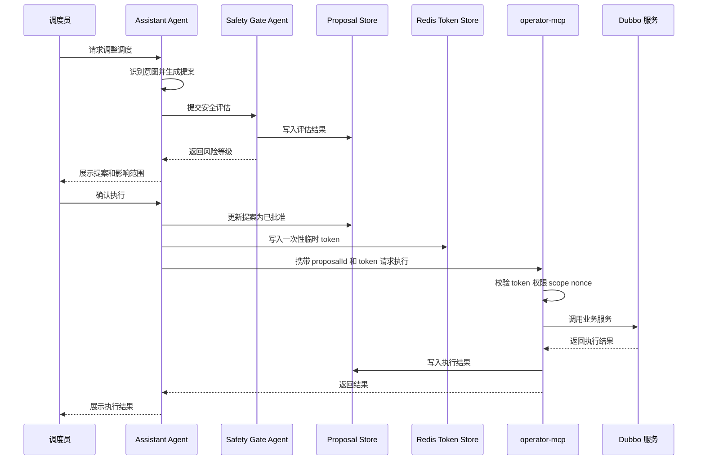

### 7.3 一次性 token 结构

```json
{
  "tokenId": "tok_20260415_xxx",
  "userId": "u123",
  "proposalId": "p987",
  "operationType": "dispatch.adjustVehicleTask",
  "scope": {
    "mineId": "mine-001",
    "vehicleIds": ["truck-102"],
    "taskIds": ["task-7788"]
  },
  "expireTime": "2026-04-15T10:30:00+09:00",
  "nonce": "random-uuid",
  "used": false
}
```

### 7.4 必须拒绝的情况

operator-mcp 执行写操作前，以下情况必须拒绝：

- token 不存在
- token 已过期
- token 已使用
- proposalId 不匹配
- userId 不匹配
- operationType 不匹配
- scope 越权
- Safety Gate 未通过
- 提案状态不是可执行状态
- 参数与提案内容不一致
- 幂等键重复且状态异常

---

## 8. 操作提案机制

### 8.1 Proposal 数据结构

```json
{
  "proposalId": "p_20260415_0001",
  "userId": "u_001",
  "sessionId": "s_001",
  "intent": "调整车辆 truck-102 到新的装载任务",
  "riskLevel": "HIGH",
  "operationType": "dispatch.adjustVehicleTask",
  "targetObjects": {
    "mineId": "mine-001",
    "vehicleIds": ["truck-102"],
    "taskIds": ["task-7788"]
  },
  "preCheckResult": {
    "vehicleOnline": true,
    "vehicleLoaded": false,
    "roadAvailable": true,
    "conflictDetected": false
  },
  "safetyAssessment": {
    "passed": true,
    "riskItems": ["任务变更会影响当前排队顺序"],
    "requiredApprovalLevel": "USER_CONFIRM"
  },
  "recommendedAction": "将 truck-102 从等待区调度至 A 区装载点",
  "impactAnalysis": "预计减少 A 区装载等待时间 6 分钟，不影响当前卸载队列",
  "rollbackPlan": "若执行失败，恢复 truck-102 原任务并重新进入等待队列",
  "status": "WAIT_USER_CONFIRM",
  "auditTraceId": "trace-xxx",
  "createdAt": "2026-04-15T10:00:00+09:00"
}
```

### 8.2 Proposal 状态机

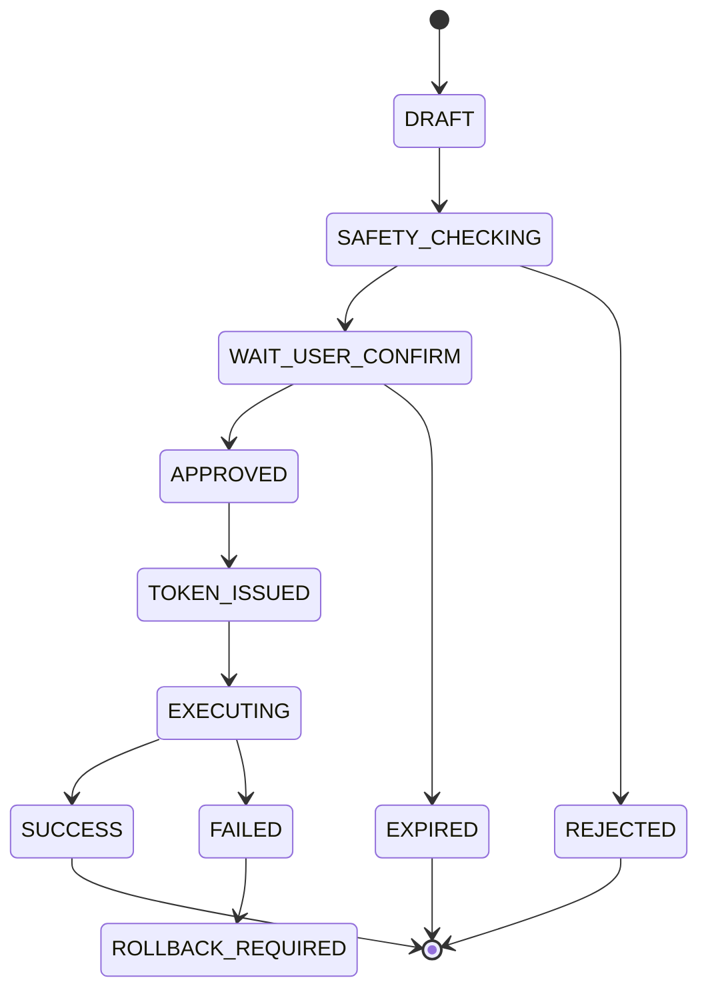

### 8.3 状态说明

| 状态 | 说明 |
|---|---|
| DRAFT | Agent 初步生成草稿 |
| SAFETY_CHECKING | 安全门评估中 |
| WAIT_USER_CONFIRM | 等待用户确认 |
| APPROVED | 用户已确认 |
| TOKEN_ISSUED | 已签发一次性 token |
| EXECUTING | operator-mcp 正在执行 |
| SUCCESS | 执行成功 |
| FAILED | 执行失败 |
| REJECTED | 安全门或用户拒绝 |
| EXPIRED | 超时未确认 |
| ROLLBACK_REQUIRED | 需要人工或系统回滚 |

---

## 9. 知识库与 Memory 设计

### 9.1 知识库内容

| 知识类型 | 示例 |
|---|---|
| 接口文档 | Dubbo 接口、HTTP 网关接口、字段说明 |
| 调度规则 | 车辆优先级、装载区规则、卸载区规则 |
| SOP | 车辆离线、压车、通信异常、道路拥堵处理 |
| 设备文档 | 矿卡、挖机、基站、调度终端 |
| 地图知识 | 道路、坡道、装载点、卸载点、禁行区 |
| 历史案例 | 异常处置记录、事故复盘 |
| 安全文档 | 高风险操作约束、审批制度 |
| 系统手册 | 调度平台使用说明、运维手册 |

### 9.2 RAG 流程

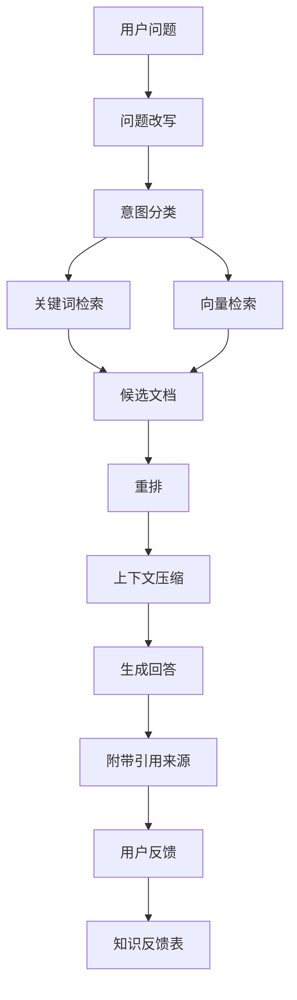

### 9.3 文档切分策略

| 文档类型 | 切分策略 |
|---|---|
| 接口文档 | 按服务、接口、方法切分 |
| SOP | 按场景、步骤、注意事项切分 |
| 调度规则 | 按规则条款切分 |
| 地图语义 | 按矿区、道路段、装卸点切分 |
| 历史案例 | 按事件、原因、处置、结果切分 |

### 9.4 Memory 分类

| Memory 类型 | 生命周期 | 存储 |
|---|---|---|
| 会话 Memory | 当前会话 | Redis + MySQL |
| 用户偏好 Memory | 长期 | MySQL |
| 业务事件 Memory | 中期 | MySQL / ES |
| 提案 Memory | 长期 | MySQL |
| 工具调用 Memory | 长期 | MySQL / ES |
| 短期推理上下文 | 单次请求 | 进程内上下文 |

### 9.5 用户纠错沉淀机制

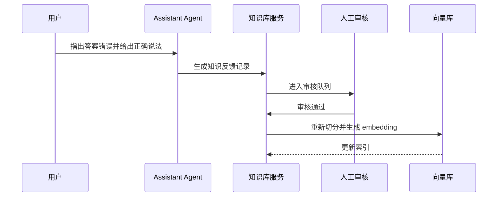

---

## 10. 异常检测与后台任务

### 10.1 基本原则

压车检测、车辆长时间静止检测、通信异常检测、任务超时检测等算法**不应依赖 LLM**。

LLM 的职责是：

- 解释异常
- 关联上下文
- 检索 SOP
- 生成处置提案
- 提醒调度员确认

### 10.2 异常事件结构

```json
{
  "eventId": "evt_20260415_0001",
  "eventType": "VEHICLE_CONGESTION",
  "mineId": "mine-001",
  "roadSegmentId": "road-A-12",
  "involvedVehicles": ["truck-101", "truck-102", "truck-103"],
  "severity": "HIGH",
  "detectedAt": "2026-04-15T10:00:00+09:00",
  "evidence": {
    "avgSpeed": 1.2,
    "durationSeconds": 480,
    "queueLength": 5,
    "mapConfidence": 0.92
  },
  "contextSnapshot": {
    "nearbyShovel": "shovel-07",
    "nearestDumpPoint": "dump-02",
    "roadStatus": "AVAILABLE",
    "weather": "NORMAL"
  },
  "suggestedAction": "分析是否需要调整后续车辆路线"
}
```

### 10.3 后台异常链路

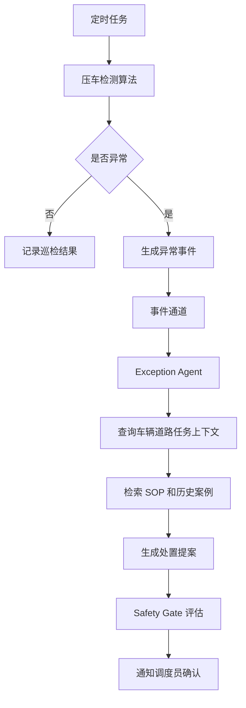

### 10.4 压车检测建议逻辑

第一阶段可以先用规则算法：

```text
当同一路段内车辆数量超过阈值，且平均速度低于阈值，持续时间超过阈值，则判定为疑似压车。
```

输入：

- 车辆位置
- 车辆速度
- 道路段 ID
- 当前任务状态
- 装载点和卸载点排队长度
- 高精地图道路语义

输出：

- 是否压车
- 严重程度
- 涉及车辆
- 证据数据
- 建议触发的 Agent

---

## 11. Spring AI Alibaba 落地方案

### 11.1 推荐使用方式

| 能力 | 建议实现 |
|---|---|
| ChatClient | Assistant Agent 主对话入口 |
| Tool Calling | 只读工具调用、提案生成工具 |
| MCP | operator-mcp 对外工具协议 |
| Advisor | RAG、Memory、安全前置检查、审计增强 |
| Prompt Template | 不同 Agent 的系统提示词模板 |
| Structured Output | 提案、异常分析、安全评估输出 |
| RAG | 知识库检索增强 |
| Memory | 多轮会话和用户偏好 |
| Observability | traceId、tool call、token、延迟统计 |
| Multi-Agent | Agent Framework 或 Graph 编排 |

### 11.2 推荐工程模块

```text
mine-agent-platform
├── agent-api
├── agent-core
├── agent-memory
├── agent-rag
├── agent-safety
├── agent-proposal
├── agent-observability
├── operator-mcp
├── operator-dubbo-adapter
├── exception-detection
└── common-domain
```

### 11.3 Java 版本策略

| 模块 | 建议 JDK | 原因 |
|---|---:|---|
| 现有 Dubbo 服务 | Java8 | 保持稳定 |
| operator-dubbo-adapter | Java8 或 Java17 双方案 | 取决于 Dubbo 版本兼容性 |
| agent-core | Java17+ | 适配新 AI 工程生态 |
| agent-rag | Java17+ | 使用新框架能力 |
| operator-mcp | Java17+ 优先 | MCP 和 Agent 生态更适配 |

务实建议：

**不要把 Spring AI Alibaba 强行塞进老 Java8 调度服务里。**

正确做法是新增独立 Agent 服务，通过 operator-mcp / Adapter 与老系统交互。

---

## 12. 与现有 Dubbo 微服务集成

### 12.1 防腐层设计

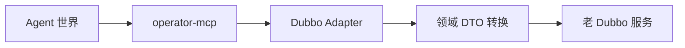

### 12.2 集成原则

1. 不直接改调度核心链路。
2. 不直接访问数据库。
3. 不直接访问 Redis、Kafka 等中间件。
4. Dubbo 接口必须通过 Adapter 封装。
5. Adapter 内部做字段转换、异常转换、超时控制。
6. 工具开放必须逐个评审。
7. 先开放只读工具，再开放低风险写工具。

### 12.3 灰度方式

| 阶段 | 灰度策略 |
|---|---|
| 只读阶段 | 仅开放给内部测试账号 |
| 提案阶段 | 只生成建议，不允许执行 |
| 低风险执行阶段 | 只开放单矿区、单班组、少量工具 |
| 扩大试点 | 按矿区、角色、接口逐步放开 |
| 稳定运行 | 引入审批、监控、告警、回滚机制 |

---

## 13. 数据模型设计

### 13.1 agent_session

| 字段 | 说明 |
|---|---|
| id | 主键 |
| session_id | 会话 ID |
| user_id | 用户 ID |
| mine_id | 矿区 ID |
| title | 会话标题 |
| status | 状态 |
| created_at | 创建时间 |
| updated_at | 更新时间 |

### 13.2 agent_message

| 字段 | 说明 |
|---|---|
| id | 主键 |
| session_id | 会话 ID |
| role | user assistant tool system |
| content | 消息内容 |
| trace_id | 调用链 ID |
| created_at | 创建时间 |

### 13.3 agent_memory

| 字段 | 说明 |
|---|---|
| id | 主键 |
| memory_id | 记忆 ID |
| user_id | 用户 ID |
| session_id | 会话 ID |
| memory_type | 会话、用户偏好、业务事件 |
| content | 记忆内容 |
| source | 来源 |
| importance | 重要性 |
| expire_at | 过期时间 |
| created_at | 创建时间 |

### 13.4 agent_proposal

| 字段 | 说明 |
|---|---|
| id | 主键 |
| proposal_id | 提案 ID |
| user_id | 用户 ID |
| session_id | 会话 ID |
| intent | 用户意图 |
| operation_type | 操作类型 |
| risk_level | 风险等级 |
| target_objects | 目标对象 JSON |
| pre_check_result | 前置检查 JSON |
| safety_assessment | 安全评估 JSON |
| recommended_action | 推荐动作 |
| impact_analysis | 影响分析 |
| rollback_plan | 回滚方案 |
| status | 状态 |
| audit_trace_id | 审计链路 ID |
| created_at | 创建时间 |
| approved_at | 批准时间 |
| executed_at | 执行时间 |

### 13.5 agent_proposal_approval

| 字段 | 说明 |
|---|---|
| id | 主键 |
| proposal_id | 提案 ID |
| approver_id | 审批人 |
| approval_type | 用户确认、二次确认、多角色审批 |
| decision | 通过或拒绝 |
| comment | 审批备注 |
| created_at | 创建时间 |

### 13.6 agent_tool_registry

| 字段 | 说明 |
|---|---|
| id | 主键 |
| tool_name | 工具名 |
| operation_type | READ 或 WRITE |
| risk_level | 风险等级 |
| permission_code | 权限码 |
| schema_json | 参数 Schema |
| enabled | 是否启用 |
| version | 工具版本 |
| created_at | 创建时间 |

### 13.7 agent_tool_call_log

| 字段 | 说明 |
|---|---|
| id | 主键 |
| trace_id | 调用链 ID |
| session_id | 会话 ID |
| user_id | 用户 ID |
| tool_name | 工具名 |
| request_json | 请求 JSON |
| response_json | 响应 JSON |
| status | 成功或失败 |
| latency_ms | 延迟 |
| error_message | 错误信息 |
| created_at | 创建时间 |

### 13.8 agent_operation_audit

| 字段 | 说明 |
|---|---|
| id | 主键 |
| trace_id | 调用链 ID |
| user_id | 用户 ID |
| proposal_id | 提案 ID |
| tool_name | 工具名 |
| request_json | 请求内容 |
| response_json | 响应内容 |
| result_status | 成功失败 |
| error_code | 错误码 |
| latency_ms | 耗时 |
| created_at | 创建时间 |

### 13.9 agent_safety_assessment

| 字段 | 说明 |
|---|---|
| id | 主键 |
| assessment_id | 评估 ID |
| proposal_id | 提案 ID |
| risk_level | 风险等级 |
| passed | 是否通过 |
| risk_items | 风险项 JSON |
| required_approval_level | 审批级别 |
| model_output | 模型输出 |
| rule_output | 规则输出 |
| created_at | 创建时间 |

### 13.10 agent_exception_event

| 字段 | 说明 |
|---|---|
| id | 主键 |
| event_id | 事件 ID |
| event_type | 事件类型 |
| mine_id | 矿区 ID |
| severity | 严重等级 |
| context_snapshot | 上下文快照 |
| evidence | 证据 |
| proposal_id | 关联提案 |
| status | 状态 |
| detected_at | 检测时间 |

### 13.11 agent_knowledge_feedback

| 字段 | 说明 |
|---|---|
| id | 主键 |
| feedback_id | 反馈 ID |
| user_id | 用户 ID |
| session_id | 会话 ID |
| original_answer | 原答案 |
| corrected_answer | 用户纠正内容 |
| status | 待审核、已采纳、已拒绝 |
| reviewer_id | 审核人 |
| created_at | 创建时间 |

---

## 14. 关键调用链路

### 14.1 只读查询链路

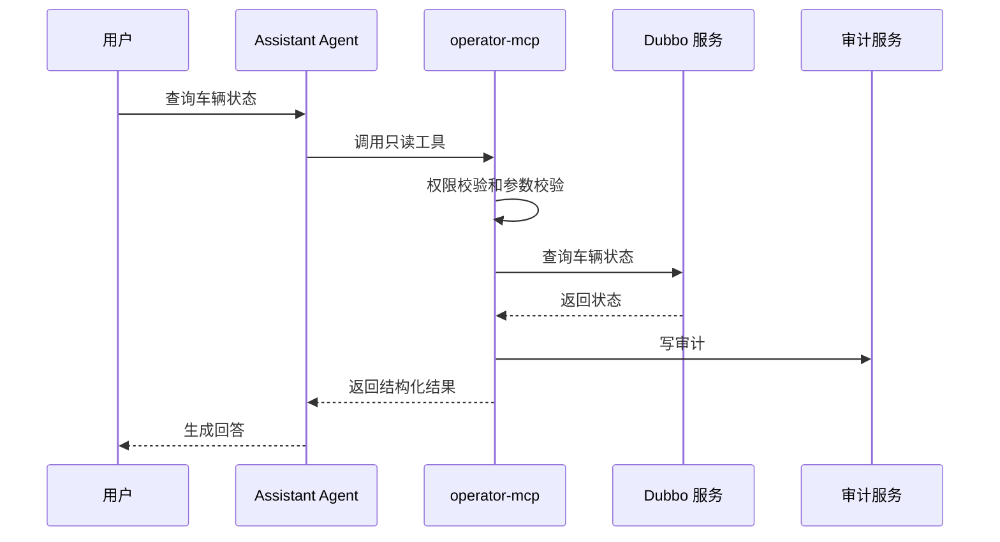

### 14.2 用户请求生成调度提案链路

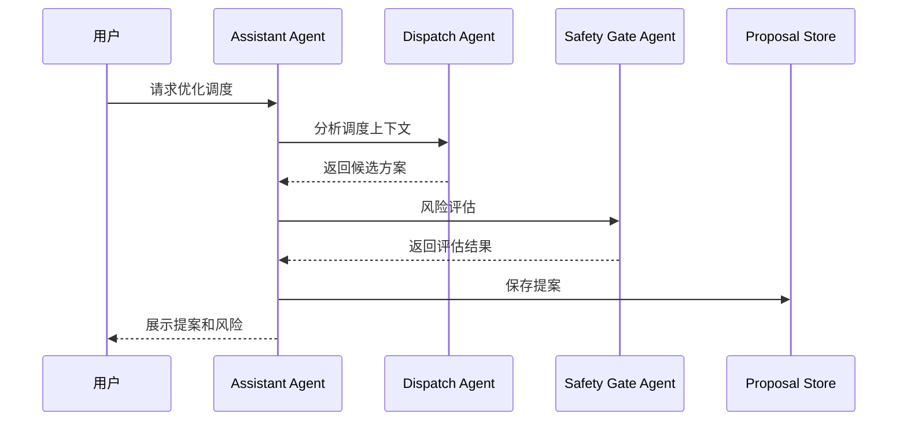

### 14.3 用户确认后执行写操作链路

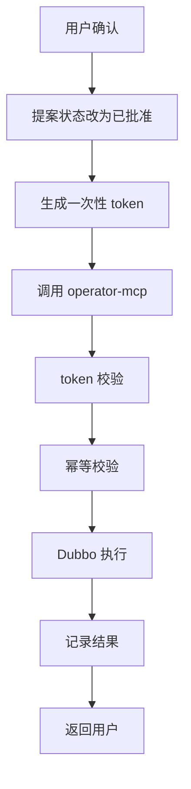

### 14.4 后台异常检测触发提案链路

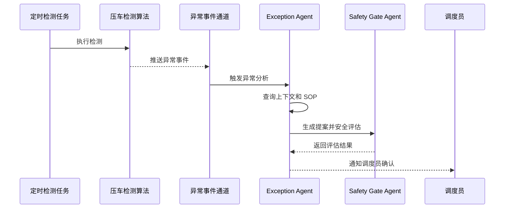

### 14.5 用户纠正答案并沉淀知识链路

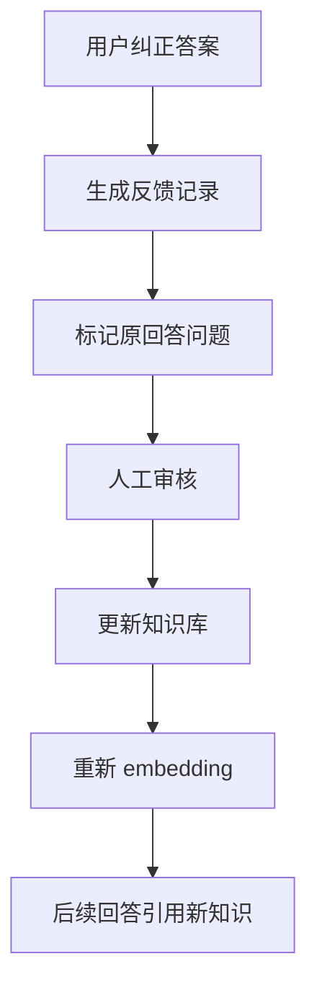

---

## 15. MVP 范围

### 15.1 第一阶段必须做

- Assistant Agent
- Knowledge Agent
- RAG 知识库
- 只读 MCP 工具
- operator-mcp 基础版本
- 审计日志
- 提案数据模型
- Safety Gate mock 版本
- 用户确认流程
- 1 到 3 个低风险写操作闭环

### 15.2 第一阶段不要做

- 不做完全自治调度
- 不做高风险自动执行
- 不让 LLM 直接访问数据库
- 不让 LLM 直接调用 Dubbo
- 不一次性开放所有接口
- 不做复杂多角色审批
- 不做全量历史数据智能分析
- 不做无引用来源的知识问答

---

## 16. 分阶段实施路线

| 阶段 | 目标 | 交付物 | 技术重点 | 验收标准 |
|---|---|---|---|---|
| Phase 0 | 技术验证 | Spring AI Alibaba demo、MCP demo、RAG demo | 验证 Chat、RAG、Tool Calling | 能完成问答和工具调用 |
| Phase 1 | 只读问答 | 知识库、接口文档查询、车辆状态查询 | RAG、只读工具、审计 | 答案有来源，只读工具可审计 |
| Phase 2 | 提案生成 | Proposal 模型、Safety Gate、用户确认页 | 结构化输出、风险评估 | 能生成可追溯提案 |
| Phase 3 | 有限写操作 | operator-mcp 写操作、token 校验 | token、幂等、审计 | 用户确认后才能执行 |
| Phase 4 | 异常检测联动 | 压车检测 mock、Exception Agent | 事件驱动、异常分析 | 异常可生成处置建议 |
| Phase 5 | 半自动调度辅助 | 多 Agent 协作、更多调度工具 | 调度策略、回滚机制 | 人在回路下辅助调度 |
| Phase 6 | 多角色审批 | 审批流、策略引擎、风控规则 | 审批治理、策略引擎 | 高风险操作可治理 |

---

## 17. 原草稿需要修正的点

| 原草稿问题 | 建议 |
|---|---|
| operator-cmp 命名不一致 | 统一为 operator-mcp |
| 有状态服务描述不清晰 | 状态应集中在 Proposal、Token、Audit，不要散落在服务内存 |
| SubAgent 边界不清 | 按 Assistant、Dispatch、Exception、Watchdog、Safety、Knowledge 拆分 |
| Skills 描述偏泛 | Skills 应落到 Tool Registry 和 MCP Tool |
| 安全门位置不明确 | 写操作前必须强制 Safety Gate |
| token 流程不完整 | 补充 scope、nonce、expire、used 校验 |
| 知识库未区分类型 | 区分静态知识、实时业务状态、历史事件 |
| 压车检测与 AI 关系不清 | 算法检测不依赖 LLM，LLM 只做解释和提案 |
| Java8 兼容性未展开 | Agent 新服务独立 JDK17+，老服务通过 Adapter 对接 |

---

## 18. 技术风险与规避措施

| 风险 | 规避策略 |
|---|---|
| LLM 幻觉 | RAG 引用、结构化输出、Safety Gate |
| 越权操作 | operator-mcp 统一权限校验 |
| 误操作 | 提案 + 用户确认 + 一次性 token |
| 调度核心链路受影响 | Agent 旁路接入，不改核心链路 |
| Dubbo 调用雪崩 | 限流、熔断、超时、降级 |
| 知识库污染 | 用户反馈需审核后入库 |
| 工具滥用 | Tool Registry 分级、开关、审计 |
| 高风险自动化过早 | MVP 只做辅助，不做自治 |

---

## 19. 后续可演进方向

1. 引入策略引擎，将硬规则和 LLM 建议分离。
2. 引入仿真沙箱，在执行前模拟调度影响。
3. 引入高精地图语义能力，结合坡度、路段拥堵、装卸点状态做调度建议。
4. 引入多角色审批，覆盖封路、批量改派、停驶等高风险操作。
5. 引入实时事件流，将 Kafka 事件、车辆状态、告警事件统一建模。
6. 引入调度效果评估，追踪 Agent 提案是否真正降低等待时间。
7. 引入 A/B 灰度，比较人工调度和 Agent 辅助调度的效果。

---

## 20. 最终推荐架构边界

最合理的边界是：

```text
LLM / Agent
只负责理解、分析、生成提案

operator-mcp
负责权限、token、安全、工具、执行、审计

Dubbo Adapter
负责兼容老系统

现有调度系统
保持核心业务稳定，不被 Agent 直接侵入
```

最终判断：

**这个项目第一阶段不要追求自动调度，而要先做成可信、可审计、可回滚、人在回路的智能调度助手。**

这才是矿山生产系统能真正落地的路线。
