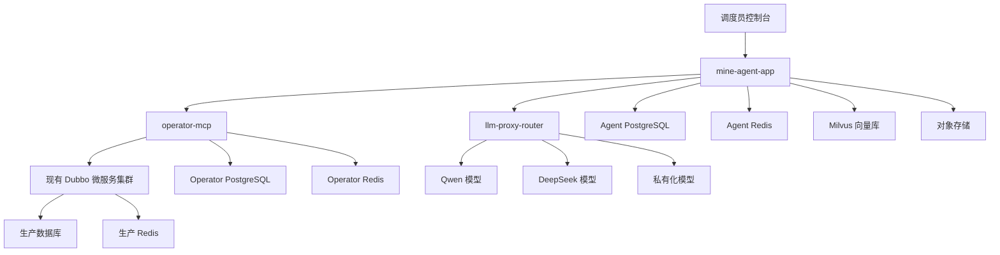
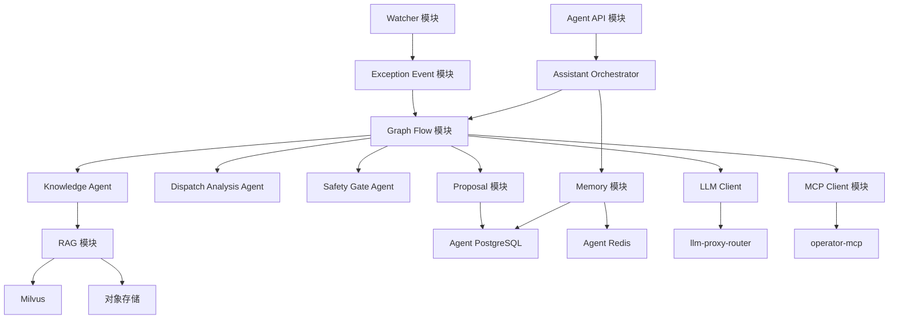
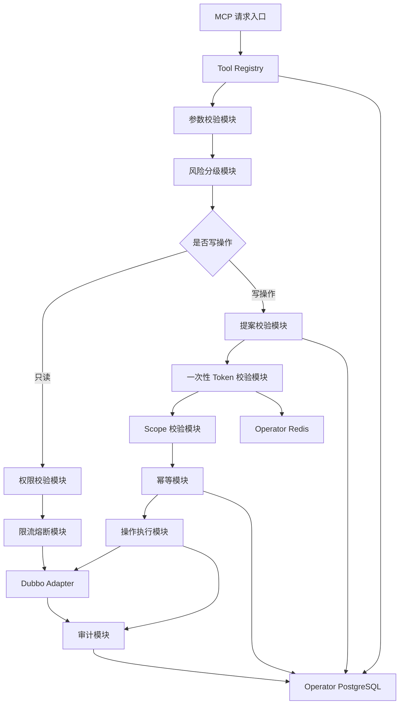
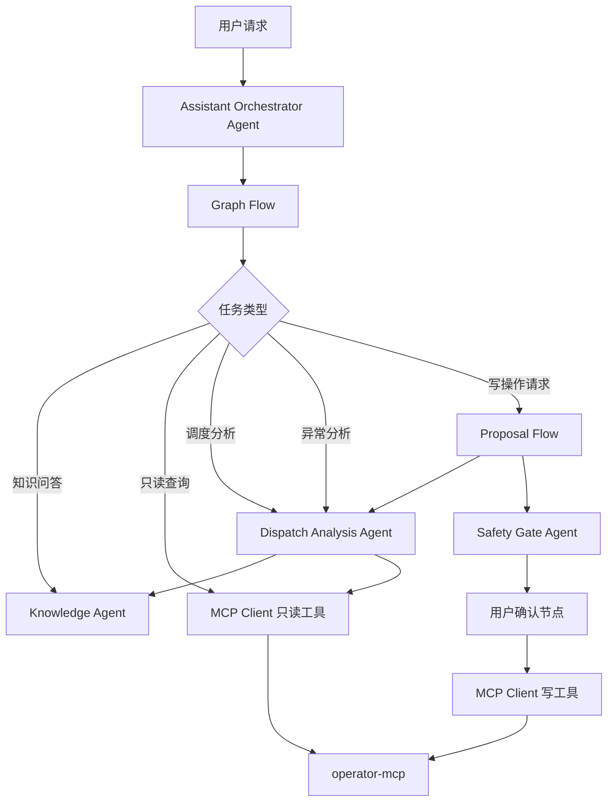
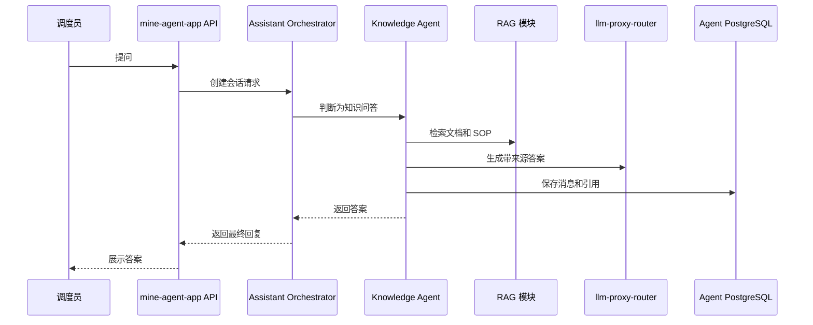
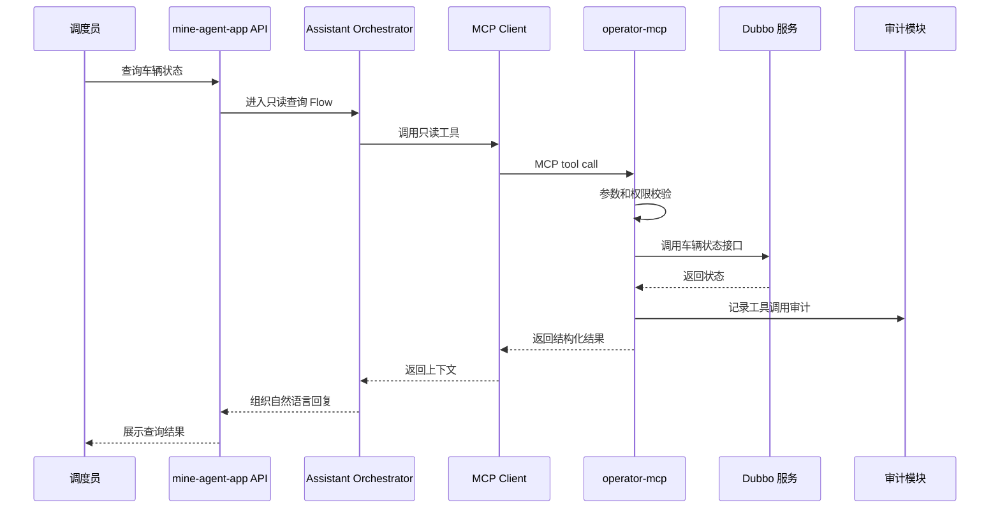
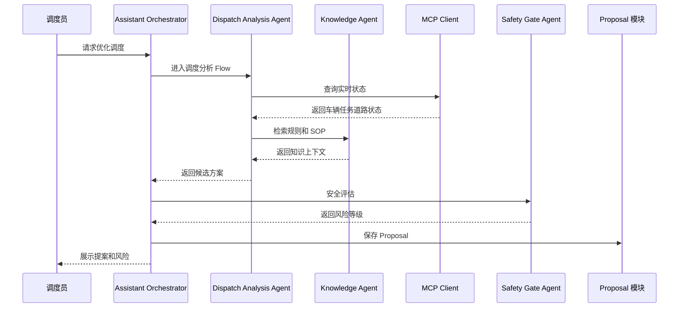
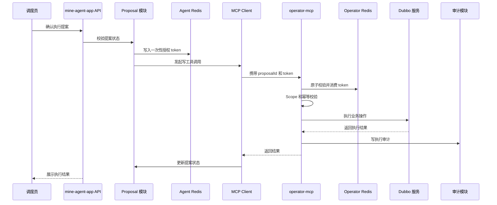
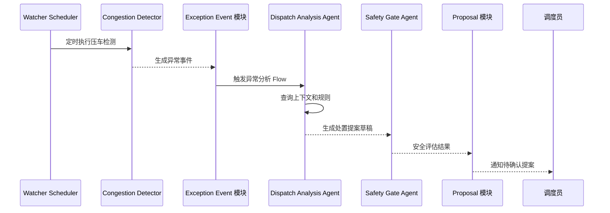
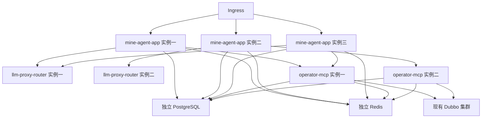

# 矿山智能调度 Agent 技术方案

> 架构收敛整合版  
> 重点：补充整体系统架构、服务边界、Agent 边界、模块调用关系，并控制服务数量和 Agent 数量。  
> 技术主线：Spring AI Alibaba + Spring Boot + Dubbo + MCP + Graph Flow + RAG + operator-mcp + LLM Proxy Router + 人在回路安全闭环

---

## 1. 方案摘要

本方案目标是在现有矿山自动驾驶调度平台之上建设一套**可信、可审计、可回滚、人在回路的智能调度 Agent 系统**。

系统不是让大模型直接调度矿车，也不是让 Agent 直接访问生产数据库、生产 Redis、生产 Kafka 或 Dubbo 服务。正确边界是：

```text
调度员
  -> mine-agent-app
  -> operator-mcp
  -> 现有 Dubbo 微服务
```

本版方案对服务和 Agent 做了收敛：

1. **服务不要拆太多。**
2. **Agent 不要拆太细。**
3. **能作为应用内模块的，不单独拆服务。**
4. **能作为 Flow 节点或 Tool 的，不单独做 Agent。**
5. **只有安全、执行、模型网关这类边界强的能力才独立服务。**

最终推荐新增服务只有三个：

| 服务 | 是否新增独立服务 | 说明 |
|---|---:|---|
| mine-agent-app | 是 | Agent 主应用，包含 API、Graph Flow、核心 Agent、RAG、Memory、Proposal、Safety、异常事件处理 |
| operator-mcp | 是 | 唯一业务操作中心，对上 MCP，对下 Dubbo |
| llm-proxy-router | 是，但很薄 | 统一模型入口，负责多供应商路由、降级、限流、日志脱敏 |

其他能力不建议第一阶段独立拆服务：

| 能力 | 处理方式 |
|---|---|
| Knowledge Service | 合并进 mine-agent-app 的 RAG 模块 |
| Memory Service | 合并进 mine-agent-app 的 Memory 模块 |
| Proposal Service | 合并进 mine-agent-app 的 Proposal 模块 |
| Safety Service | 合并进 mine-agent-app 的 Safety 模块 |
| Watchdog Agent | 不作为 Agent，做成 deterministic watcher 模块 |
| Exception Agent | 合并进 Dispatch Analysis Agent |
| Operator Agent | 不作为 Agent，做成 MCP Client 模块 |
| Audit Service | 第一阶段合并进 mine-agent-app 和 operator-mcp，各自写审计表 |

---

## 2. 当前系统约束

当前调度平台已经是 Java8 + Spring Boot + Dubbo 微服务体系，按 device-center、user-center 等领域服务拆分，并通过 Dubbo 互相调用。这一点来自原始方案草稿。原草稿还明确要求 operator-mcp 对上使用 MCP 协议，对下调用 Dubbo，并且写操作需要安全门、用户确认和临时 token。  

因此，Agent 系统必须遵守以下边界：

1. 不侵入现有调度核心链路。
2. 不让 LLM 直接调用 Dubbo。
3. 不让 LLM 直接访问生产数据库、生产 Redis、生产 Kafka。
4. 所有业务工具必须通过 operator-mcp 封装。
5. 只读接口先行，写接口逐步开放。
6. 写操作必须走提案、安全评估、用户确认、一次性 token、幂等、审计。
7. 新 Agent 服务建议独立使用 JDK17+，不要把 Spring AI Alibaba 强塞进老 Java8 服务。

---

## 3. 服务收敛后的整体架构

### 3.1 推荐新增服务边界



### 3.2 服务职责

| 服务 | 核心职责 | 不负责什么 |
|---|---|---|
| mine-agent-app | 用户入口、Agent 编排、RAG、Memory、Proposal、Safety、异常事件处理、MCP Client | 不直接调 Dubbo、不直接写生产系统 |
| operator-mcp | 工具注册、权限校验、token 校验、幂等、审计、Dubbo Adapter、执行受控操作 | 不做自然语言推理、不做复杂 RAG |
| llm-proxy-router | 模型路由、失败降级、限流、模型能力管理、日志脱敏、token 统计 | 不理解业务、不保存业务状态 |
| 现有 Dubbo 集群 | 继续负责现有调度业务能力 | 不感知 Agent 内部流程 |

### 3.3 为什么这样拆

| 拆分点 | 原因 |
|---|---|
| mine-agent-app 独立 | 需要 JDK17+、Spring AI Alibaba、Graph Flow、RAG，不适合进老系统 |
| operator-mcp 独立 | 是安全边界和操作边界，必须与 Agent 推理层隔离 |
| llm-proxy-router 独立 | 模型密钥、路由、降级、限流属于基础设施能力，避免散落在 Agent 服务 |
| RAG、Memory、Proposal 不独立 | 第一阶段独立拆服务会增加调用链、部署、事务和排障复杂度 |
| Watchdog 不做 Agent | 压车检测是确定性算法，不应交给 LLM 自由判断 |

---

## 4. mine-agent-app 内部模块架构

### 4.1 内部模块总览



### 4.2 mine-agent-app 模块职责

| 模块 | 职责 | 是否独立服务 |
|---|---|---:|
| Agent API 模块 | 对外提供聊天、会话、提案、确认、结果查询接口 | 否 |
| Assistant Orchestrator | 主入口，识别意图，选择 Flow，组织上下文 | 否 |
| Graph Flow 模块 | 固化只读查询、提案、写操作、异常处理流程 | 否 |
| Knowledge Agent | 负责知识问答、接口文档、SOP 检索 | 否 |
| Dispatch Analysis Agent | 负责调度分析、异常分析、候选方案生成 | 否 |
| Safety Gate Agent | 负责提案风险评估和安全兜底 | 否 |
| RAG 模块 | 文档切分、检索、重排、引用来源 | 否 |
| Memory 模块 | 会话、用户偏好、短期上下文、业务记忆 | 否 |
| Proposal 模块 | 提案创建、状态流转、用户确认、审批记录 | 否 |
| MCP Client 模块 | 调用 operator-mcp 暴露的工具 | 否 |
| Watcher 模块 | 定时压车检测、异常检测、事件生成 | 否 |
| Exception Event 模块 | 异常事件入库、去重、触发 Flow | 否 |
| LLM Client 模块 | 对接 llm-proxy-router | 否 |

结论：

> 第一阶段 mine-agent-app 是一个“模块化单体”，不是一堆微服务。

---

## 5. operator-mcp 内部模块架构

### 5.1 operator-mcp 定位

operator-mcp 是**唯一业务操作中心**，也是 Agent 世界和现有 Dubbo 世界之间的安全隔离层。

它负责：

1. 对上暴露 MCP Tool。
2. 对下调用 Dubbo 服务。
3. 对所有工具做权限校验。
4. 对写操作做 Proposal、Token、Scope、幂等校验。
5. 对 Dubbo 调用做限流、熔断、降级、超时。
6. 记录完整审计日志。

### 5.2 内部模块



### 5.3 operator-mcp 状态边界

operator-mcp 从业务语义上是有状态的，但实例必须无状态。

| 状态 | 存储位置 | 是否允许只在内存 |
|---|---|---:|
| Tool Registry | Operator PostgreSQL + 本地缓存 | 否 |
| Proposal 执行状态 | Agent PostgreSQL 或 Operator PostgreSQL | 否 |
| 一次性 token | Operator Redis | 否 |
| token used 标记 | Operator Redis 原子写 | 否 |
| 幂等记录 | Operator PostgreSQL | 否 |
| 审计日志 | Operator PostgreSQL | 否 |
| Dubbo 连接池 | 实例内存 | 是 |
| 本地缓存 | 实例内存 | 可以，但必须可重建 |

---

## 6. Agent 收敛后的设计

### 6.1 最终只保留三个核心 Agent

| Agent | 职责 | 为什么保留 |
|---|---|---|
| Assistant Orchestrator Agent | 用户主入口，意图识别，Flow 选择，结果整合 | 必须有主控入口 |
| Knowledge Agent | 知识库、接口文档、SOP、制度文档检索 | 知识问答与业务分析都依赖它 |
| Dispatch Analysis Agent | 调度分析、异常分析、候选方案生成 | 调度业务核心能力 |
| Safety Gate Agent | 风险评估、合规检查、安全兜底 | 写操作安全闭环必需 |

严格说是“三类业务 Agent + 一个主控 Orchestrator”。Watchdog、Exception、Operator 不再作为独立 Agent。

### 6.2 被合并或降级的 Agent

| 原设计 Agent | 处理方式 | 原因 |
|---|---|---|
| Exception Agent | 合并进 Dispatch Analysis Agent | 异常分析本质也是调度分析的一种 |
| Watchdog Agent | 改成 Watcher 确定性模块 | 压车检测不需要 LLM 推理 |
| Operator Agent | 改成 MCP Client 模块 | 执行不应由 Agent 自由决策 |
| SupervisorAgent | 作为 Orchestrator 内部编排模式 | 不单独暴露为业务 Agent |
| ReActAgent | 只作为 Knowledge 或 Dispatch 内部局部推理模式 | 不作为全局控制流 |

### 6.3 Agent 调用关系



### 6.4 每个 Agent 的输入输出

| Agent | 输入 | 输出 | 可调用工具 | 是否允许写 |
|---|---|---|---|---|
| Assistant Orchestrator Agent | 用户请求、会话上下文、用户身份 | 任务类型、Flow 选择、最终回答 | LLM、Memory、Flow | 否 |
| Knowledge Agent | 用户问题、检索上下文 | 带来源的知识答案 | RAG、文档库 | 否 |
| Dispatch Analysis Agent | 实时状态、异常事件、知识上下文 | 候选方案、影响分析、提案草稿 | 只读 MCP、Knowledge Agent | 否 |
| Safety Gate Agent | Proposal、用户权限、风险上下文 | 风险等级、是否通过、审批要求 | 规则库、只读 MCP、Knowledge Agent | 否 |

---

## 7. 推荐工程结构

### 7.1 服务级工程

```text
mine-dispatch-agent-system
├── mine-agent-app
├── operator-mcp
├── llm-proxy-router
└── common-contracts
```

### 7.2 mine-agent-app 内部包结构

```text
mine-agent-app
├── api
│   ├── ChatController
│   ├── ProposalController
│   └── EventController
├── orchestrator
│   ├── AssistantOrchestrator
│   └── IntentClassifier
├── flow
│   ├── ReadOnlyQueryFlow
│   ├── KnowledgeQaFlow
│   ├── DispatchAnalysisFlow
│   ├── ProposalFlow
│   └── ControlledOperationFlow
├── agent
│   ├── KnowledgeAgent
│   ├── DispatchAnalysisAgent
│   └── SafetyGateAgent
├── rag
│   ├── DocumentIngestionService
│   ├── RetrieverService
│   ├── RerankService
│   └── CitationService
├── memory
│   ├── SessionMemoryService
│   ├── UserPreferenceMemoryService
│   └── BusinessMemoryService
├── proposal
│   ├── ProposalService
│   ├── ProposalStateMachine
│   └── ApprovalService
├── mcp
│   ├── McpClientService
│   └── ToolCallFacade
├── watcher
│   ├── CongestionDetector
│   ├── WatcherScheduler
│   └── ExceptionEventService
├── llm
│   ├── LlmClient
│   └── ModelCapabilitySelector
└── persistence
    ├── entity
    ├── repository
    └── migration
```

### 7.3 operator-mcp 内部包结构

```text
operator-mcp
├── mcp
│   ├── McpServerEndpoint
│   └── ToolDispatcher
├── registry
│   ├── ToolRegistryService
│   └── ToolSchemaService
├── security
│   ├── PermissionValidator
│   ├── TokenValidator
│   └── ScopeValidator
├── idempotency
│   └── IdempotencyService
├── audit
│   └── OperationAuditService
├── governance
│   ├── RateLimiter
│   ├── CircuitBreaker
│   └── TimeoutPolicy
├── dubbo
│   ├── DeviceCenterAdapter
│   ├── DispatchCenterAdapter
│   ├── VehicleCenterAdapter
│   ├── TaskCenterAdapter
│   ├── MapCenterAdapter
│   └── AlarmCenterAdapter
└── persistence
    ├── entity
    ├── repository
    └── migration
```

---

## 8. 核心调用链路

### 8.1 知识问答链路



### 8.2 只读查询链路



### 8.3 调度提案生成链路



### 8.4 用户确认后执行写操作链路



### 8.5 后台异常检测链路



---

## 9. Graph Flow 与 Agent 的关系

### 9.1 总原则

Graph Flow 是流程控制器，Agent 是 Flow 节点里的智能能力。

```text
Graph Flow 决定必须走哪些节点；
Agent 只在节点内完成分析和生成。
```

### 9.2 Flow 清单

| Flow | 触发条件 | 涉及 Agent | 是否可写 |
|---|---|---|---:|
| KnowledgeQaFlow | 知识问答 | Knowledge Agent | 否 |
| ReadOnlyQueryFlow | 车辆、任务、道路查询 | Assistant Orchestrator | 否 |
| DispatchAnalysisFlow | 调度建议、异常分析 | Dispatch Analysis Agent、Knowledge Agent | 否 |
| ProposalFlow | 需要生成操作提案 | Dispatch Analysis Agent、Safety Gate Agent | 否 |
| ControlledOperationFlow | 用户确认执行 | Safety Gate Agent、MCP Client | 只能通过 operator-mcp |
| ExceptionEventFlow | 后台异常事件 | Dispatch Analysis Agent、Safety Gate Agent | 否 |

### 9.3 为什么 Graph Flow 不单独拆服务

Graph Flow 与 Agent 上下文、Memory、Proposal 状态高度耦合。第一阶段把它放在 mine-agent-app 内部最合适：

1. 少一次 RPC。
2. 事务和状态更容易处理。
3. Debug 更简单。
4. 研发效率更高。
5. 后续复杂度上来后再拆也不晚。

---

## 10. 数据与中间件隔离

### 10.1 推荐中间件收敛

为了避免过度拆分，第一阶段建议：

| 中间件 | 建议 |
|---|---|
| PostgreSQL | 一个独立 Agent PostgreSQL 实例，内部用 schema 区分 agent 和 operator |
| Redis | 一个独立 Agent Redis 实例，内部用 key prefix 区分 agent 和 operator |
| Milvus | 独立实例或独立 collection |
| Elasticsearch | 第一阶段可选，能不用就先不用 |
| Kafka | 第一阶段可选，异常事件可先用数据库表或 Redis Stream |
| Object Storage | 存储文档原文和解析结果 |

### 10.2 PostgreSQL Schema 建议

```text
agent_pg
├── schema agent_core
│   ├── agent_session
│   ├── agent_message
│   ├── agent_memory
│   ├── agent_proposal
│   ├── agent_proposal_approval
│   ├── agent_exception_event
│   └── agent_knowledge_feedback
├── schema operator_core
│   ├── operator_tool_registry
│   ├── operator_tool_call_log
│   ├── operator_operation_audit
│   └── operator_idempotency_record
└── schema llm_core
    └── llm_call_log
```

### 10.3 Redis Key 前缀

```text
agent:session:{sessionId}
agent:stream:{messageId}
agent:lock:watcher:{jobName}
operator:token:{proposalId}:{tokenId}
operator:token:used:{tokenId}
operator:ratelimit:{toolName}:{userId}
operator:idempotency:{idempotencyKey}
```

---

## 11. 多实例部署与状态处理

### 11.1 总体部署



### 11.2 状态处理原则

| 状态 | 存储 | 多实例要求 |
|---|---|---|
| 会话消息 | PostgreSQL | 任意实例可读取 |
| 短期上下文 | Redis | 可恢复 |
| Proposal | PostgreSQL | 使用状态机和乐观锁 |
| token | Redis | 原子消费 |
| 幂等记录 | PostgreSQL 或 Redis | 写操作必须查 |
| Graph checkpoint | PostgreSQL | 断线可恢复 |
| SSE 流式状态 | Redis | 可断线重连 |
| Watcher 任务锁 | Redis | 避免重复执行 |
| 工具注册 | PostgreSQL + 本地缓存 | 缓存可重建 |

### 11.3 是否需要粘性会话

| 场景 | 是否需要 |
|---|---:|
| 普通 HTTP 请求 | 不需要 |
| Proposal 确认 | 不需要 |
| MCP 工具调用 | 不需要 |
| SSE 流式响应 | 可以短期粘性，但不能依赖 |
| WebSocket | 可以粘性，但状态必须外置 |
| 后台任务 | 不需要，使用分布式锁 |

---

## 12. 最小可落地版本

### 12.1 最小服务清单

第一阶段只需要：

```text
mine-agent-app
operator-mcp
llm-proxy-router
PostgreSQL
Redis
Milvus
Object Storage
```

Elasticsearch、Kafka、独立审计服务、独立知识库服务、独立 Memory 服务都可以后置。

### 12.2 最小 Agent 清单

第一阶段只需要：

```text
Assistant Orchestrator Agent
Knowledge Agent
Dispatch Analysis Agent
Safety Gate Agent
```

Exception Agent、Watchdog Agent、Operator Agent 都不需要第一阶段独立存在。

### 12.3 最小工具清单

| 工具 | 类型 | 是否第一阶段开放 |
|---|---|---:|
| vehicle.getStatus | 只读 | 是 |
| task.getCurrentTask | 只读 | 是 |
| dispatch.getQueueStatus | 只读 | 是 |
| map.getRoadSegmentStatus | 只读 | 是 |
| alarm.listActiveAlarms | 只读 | 是 |
| proposal.create | 内部写 | 是 |
| proposal.approve | 内部写 | 是 |
| dispatch.markSuggestion | 低风险写 | 可选 |
| dispatch.adjustVehicleTask | 高风险写 | 暂不开放 |
| dispatch.stopVehicle | 极高风险写 | 暂不开放 |
| map.closeRoadSegment | 极高风险写 | 暂不开放 |

---

## 13. 服务合并与后续拆分策略

### 13.1 当前不建议拆的服务

| 能力 | 不拆原因 |
|---|---|
| RAG 服务 | 与 Agent 上下文耦合强，第一阶段 QPS 不高 |
| Memory 服务 | 与会话强绑定，独立拆分增加复杂度 |
| Proposal 服务 | 与 Flow 状态机强绑定 |
| Safety 服务 | 与 Proposal 和用户确认强绑定 |
| Exception 服务 | 第一阶段事件量有限 |
| Audit 服务 | 可先库表化，后续再汇聚到 ES 或日志平台 |

### 13.2 未来可以拆的条件

| 服务 | 拆分触发条件 |
|---|---|
| agent-rag-service | 文档量大、检索 QPS 高、需要独立扩容 |
| memory-service | 多个 Agent 应用共享长期记忆 |
| proposal-service | 多系统共享提案审批流 |
| audit-service | 审计量大，需要独立检索和合规报表 |
| exception-event-service | 事件流规模扩大，需要 Kafka 和消费组 |
| llm-proxy-router | 如果已有企业统一模型网关，可以直接复用 |

### 13.3 拆分原则

1. 先模块化，后微服务化。
2. 有独立扩容需求再拆。
3. 有明确安全边界再拆。
4. 有跨系统复用价值再拆。
5. 不为了架构好看而拆。

---

## 14. 最终推荐架构结论

最终推荐架构是：

```text
新增三个服务：
1. mine-agent-app
2. operator-mcp
3. llm-proxy-router

保留四个核心 Agent：
1. Assistant Orchestrator Agent
2. Knowledge Agent
3. Dispatch Analysis Agent
4. Safety Gate Agent

合并三个原 Agent：
1. Exception Agent 合并进 Dispatch Analysis Agent
2. Watchdog Agent 改为 Watcher 确定性模块
3. Operator Agent 改为 MCP Client 模块

状态处理：
1. 服务实例无状态
2. 业务状态外置到 PostgreSQL 和 Redis
3. 写操作依赖 Proposal 状态机、一次性 token、幂等键和审计链

第一阶段目标：
可信辅助调度，不做完全自治调度。
```

一句话判断：

> 这个系统应该做成“模块化单体 Agent 应用 + 独立操作防火墙 + 薄模型网关”，而不是一开始就拆成一堆微服务和一堆 Agent。
