# 矿山智能调度 Agent 技术方案

> 最新完整整合版  
> 适用场景：矿山自动驾驶调度平台、调度员辅助决策、异常分析、知识问答、受控操作执行  
> 技术主线：Spring AI Alibaba + Spring Boot + Dubbo + MCP + Graph Flow + RAG + operator-mcp + LLM Proxy Router + 人在回路安全闭环  
> 核心取向：保留完整方案深度，但收敛服务数量和 Agent 数量，避免过度微服务化。

---

## 1. 方案摘要

本方案目标是在现有矿山自动驾驶调度平台之上，建设一套**可信、可审计、可回滚、人在回路的智能调度 Agent 系统**。

它不是让大模型直接调度矿车，也不是让 Agent 直接访问生产数据库、生产 Redis、生产 Kafka 或 Dubbo 服务。正确架构是：

```text
调度员
  -> mine-agent-app
  -> operator-mcp
  -> 现有 Dubbo 微服务
```

本版方案在保留完整系统设计的同时，对服务和 Agent 做明确收敛：

1. **服务不要拆太多。**
2. **Agent 不要拆太细。**
3. **能作为应用内模块的，不单独拆服务。**
4. **能作为 Flow 节点或 Tool 的，不单独做 Agent。**
5. **只有安全边界、执行边界、模型网关边界强的能力才独立服务。**

最终推荐新增服务只有三个：

| 服务 | 是否独立服务 | 说明 |
|---|---:|---|
| mine-agent-app | 是 | Agent 主应用，包含 API、Graph Flow、核心 Agent、RAG、Memory、Proposal、Safety、异常事件处理 |
| operator-mcp | 是 | 唯一业务操作中心，对上 MCP，对下 Dubbo |
| llm-proxy-router | 是，但保持很薄 | 统一模型入口，负责多供应商路由、降级、限流、日志脱敏、token 统计 |

其他能力第一阶段不建议独立拆服务：

| 能力 | 处理方式 |
|---|---|
| Knowledge Service | 合并进 mine-agent-app 的 RAG 模块 |
| Memory Service | 合并进 mine-agent-app 的 Memory 模块 |
| Proposal Service | 合并进 mine-agent-app 的 Proposal 模块 |
| Safety Service | 合并进 mine-agent-app 的 Safety 模块 |
| Watchdog Agent | 不作为 Agent，做成 deterministic watcher 模块 |
| Exception Agent | 合并进 Dispatch Analysis Agent |
| Operator Agent | 不作为 Agent，做成 MCP Client 模块 |
| Audit Service | 第一阶段合并进 mine-agent-app 和 operator-mcp，各自写审计表 |
| Event Service | 第一阶段用异常事件表或 Redis Stream，后续再引入 Kafka |

一句话结论：

> 这个系统应该做成“模块化单体 Agent 应用 + 独立操作防火墙 + 薄模型网关”，而不是一开始就拆成一堆微服务和一堆 Agent。

---

## 2. 当前架构与约束

### 2.1 当前系统架构

当前调度管理平台是微服务工程集群：

- 基于 Java8。
- 基于 Spring Boot 老版本。
- 通过 Dubbo 做服务间调用。
- 按领域拆分服务，例如：
  - device-center
  - user-center
  - dispatch-center
  - vehicle-center
  - task-center
  - map-center
  - alarm-center
- Dubbo 服务上层有类似 dubbo-to-http 的网关服务，对外提供 HTTP API。

### 2.2 关键约束

| 约束 | 对方案的影响 |
|---|---|
| 老系统基于 Java8 | 不建议直接引入新版 Spring AI Alibaba |
| 调度系统属于生产控制系统 | Agent 不能绕过权限直接写入 |
| 调度操作有安全风险 | 必须有提案、确认、审计、回滚机制 |
| 矿山状态实时变化 | 静态知识库不能替代实时业务查询 |
| LLM 存在幻觉 | 所有关键结论要有依据，所有写操作要有审批链 |
| Dubbo 服务已有业务边界 | 需要 operator-mcp 做统一封装和防腐 |
| 业务接口风险不同 | 需要只读、低风险写、高风险写分级治理 |
| 多模型供应商可能不稳定 | 需要 LLM Proxy Router 统一路由和降级 |
| Agent 读写数据量可能波动 | Agent 中间件应与生产环境隔离 |
| 过度微服务化会拖慢落地 | 第一阶段以模块化单体为主，服务边界少而硬 |

---

## 3. 最高优先级设计原则

### 3.1 插件化旁路与故障隔离

智能调度 Agent 的定位不是现有调度系统的核心依赖，而是一个**可插拔、可关闭、可降级、可整体摘除的旁路智能插件**。

必须满足：

1. 原有调度系统不依赖 Agent 服务启动。
2. 原有调度系统不依赖 Agent 数据库、Redis、Milvus、LLM Proxy。
3. 原有调度系统不调用 Agent 才能完成生产调度闭环。
4. Agent 不接管原有调度主链路，只做辅助问答、分析、提案和受控操作入口。
5. Agent 故障时，调度员应能继续使用原有调度平台完成全部生产操作。
6. Agent 的 UI 入口可以隐藏、禁用或降级，不影响原有系统页面打开和核心功能使用。
7. operator-mcp 故障时，只影响 Agent 的工具调用和受控操作，不影响现有 Dubbo 服务之间的正常调用。
8. llm-proxy-router 或模型供应商故障时，只影响智能问答和智能分析，不影响生产调度。

推荐依赖方向：

```text
Agent 依赖原有调度能力；
原有调度系统不依赖 Agent。
```

禁止出现以下反向依赖：

| 禁止项 | 原因 |
|---|---|
| 原有调度服务启动时依赖 Agent 服务 | Agent 故障会拖垮生产系统 |
| 原有调度主流程同步调用 Agent | LLM 延迟和异常会影响生产操作 |
| 原有调度数据库依赖 Agent 写入状态 | Agent 故障会造成业务状态不完整 |
| 原有调度系统通过 Agent 才能执行车辆派发 | 违反旁路插件原则 |
| Agent 中间件与生产中间件强耦合 | Agent IO 波动可能影响生产链路 |

插件化旁路关系：

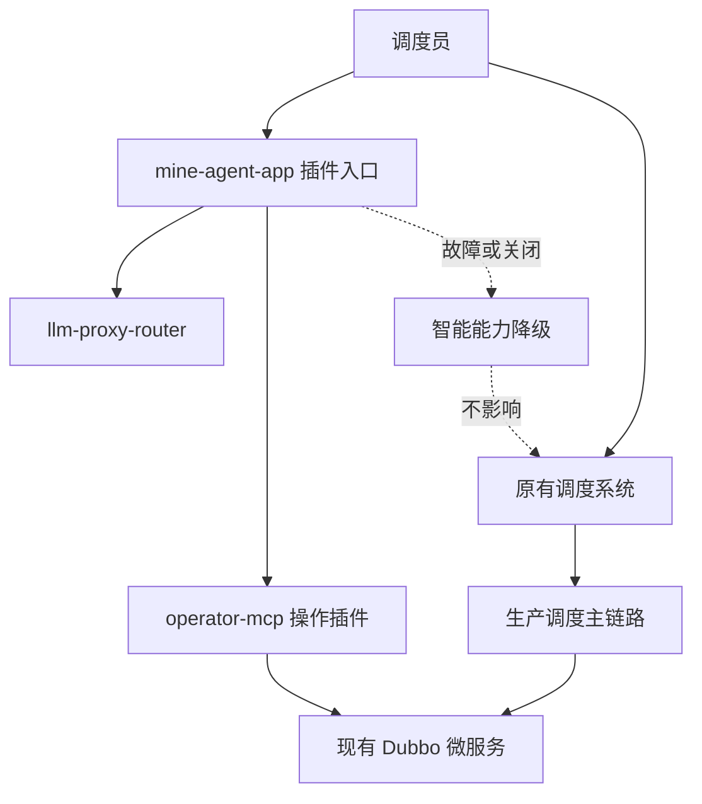

### 3.2 降级策略

| 故障点 | 降级方式 | 对生产运营影响 |
|---|---|---|
| mine-agent-app 故障 | 隐藏智能助手入口，提示暂不可用 | 不影响生产运营 |
| operator-mcp 故障 | 禁止 Agent 工具调用和执行操作 | 不影响原有 Dubbo 主链路 |
| llm-proxy-router 故障 | 智能问答和分析不可用 | 不影响生产运营 |
| Agent PostgreSQL 故障 | 会话、提案、审计不可用 | 不影响生产运营 |
| Agent Redis 故障 | token、短期上下文、锁不可用 | 不影响生产运营 |
| Milvus 故障 | 知识库检索降级或不可用 | 不影响生产运营 |
| 模型供应商故障 | 切换备用模型，全部失败则降级 | 不影响生产运营 |

实现要求：

1. Agent 所有入口都要有独立开关，例如 `agent.enabled=false` 可整体关闭。
2. 前端入口应作为菜单插件或侧边栏插件接入，不能阻塞原页面加载。
3. 与原系统对接只通过已有 API、Dubbo Adapter 或 operator-mcp，不在原系统内加入强依赖 SDK。
4. 所有 Agent 调用必须有超时、熔断和降级文案。
5. 原有调度系统发布、回滚、扩容不应等待 Agent 服务。
6. Agent 发布失败时，只回滚 Agent 自身，不回滚调度系统。
7. Agent 的数据库迁移、向量索引构建、模型配置变更不应影响生产系统发布。

这个原则优先级高于所有智能化能力。只要某个能力会让原有生产调度依赖 Agent，就不应该进入第一阶段。

---

## 4. 建设目标

### 4.1 第一阶段目标

建设面向调度员、运维人员、管理人员的智能助手，支持：

- 调度系统知识问答。
- 接口文档查询。
- SOP 检索。
- 车辆状态查询。
- 任务状态查询。
- 道路状态查询。
- 异常原因分析。
- 操作建议生成。
- 操作提案生成。
- 用户确认后执行有限低风险写操作。

### 4.2 长期目标

逐步演进为：

- 后台巡视能力。
- 异常自动发现。
- 调度提案自动生成。
- 半自动辅助调度。
- 多角色审批。
- 策略引擎与 Agent 协同。
- 高精地图感知调度分析。
- 人在回路的受控自治调度。

---

## 5. 收敛后的总体架构

### 5.1 服务级总体架构

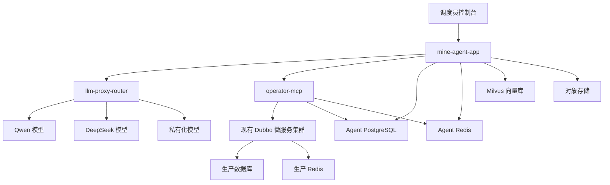

说明：

1. PostgreSQL 和 Redis 可以是独立 Agent 中间件实例，内部用 schema 或 key prefix 区分 agent 和 operator。
2. operator-mcp 不使用生产数据库，不直接操作生产 Redis。
3. operator-mcp 只通过 Dubbo 调用现有业务能力。
4. 现有 Dubbo 服务不依赖 operator-mcp。

### 5.2 核心边界

```text
mine-agent-app：
负责理解、分析、检索、生成回答、生成提案、管理会话和 Memory。

Graph Flow：
在 mine-agent-app 内部负责固定业务流程，保证安全门、确认、token、审计不可跳过。

operator-mcp：
负责权限、工具、token、幂等、执行、审计，是 Agent 到生产能力的唯一受控出口。

Dubbo Adapter：
位于 operator-mcp 内部，负责对接老 Dubbo 服务，屏蔽协议和 DTO 差异。

llm-proxy-router：
负责模型供应商路由、降级、限流、日志脱敏，不理解业务。

现有调度系统：
保持核心业务稳定，不被 Agent 直接侵入，也不依赖 Agent 存活。
```

### 5.3 服务职责

| 服务 | 核心职责 | 不负责什么 |
|---|---|---|
| mine-agent-app | 用户入口、Agent 编排、RAG、Memory、Proposal、Safety、异常事件处理、MCP Client | 不直接调 Dubbo、不直接写生产系统 |
| operator-mcp | 工具注册、权限校验、token 校验、幂等、审计、Dubbo Adapter、执行受控操作 | 不做自然语言推理、不做复杂 RAG |
| llm-proxy-router | 模型路由、失败降级、限流、模型能力管理、日志脱敏、token 统计 | 不理解业务、不保存业务状态 |
| 现有 Dubbo 集群 | 继续负责现有调度业务能力 | 不感知 Agent 内部流程，不依赖 Agent 存活 |

### 5.4 为什么这样拆

| 拆分点 | 原因 |
|---|---|
| mine-agent-app 独立 | 需要 JDK17+、Spring AI Alibaba、Graph Flow、RAG，不适合进老 Java8 系统 |
| operator-mcp 独立 | 是安全边界和操作边界，必须与 Agent 推理层隔离 |
| llm-proxy-router 独立 | 模型密钥、路由、降级、限流属于基础设施能力，避免散落在 Agent 服务 |
| RAG、Memory、Proposal 不独立 | 第一阶段独立拆服务会增加调用链、部署、事务和排障复杂度 |
| Watchdog 不做 Agent | 压车检测是确定性算法，不应交给 LLM 自由判断 |

---

## 6. mine-agent-app 内部模块架构

### 6.1 内部模块总览

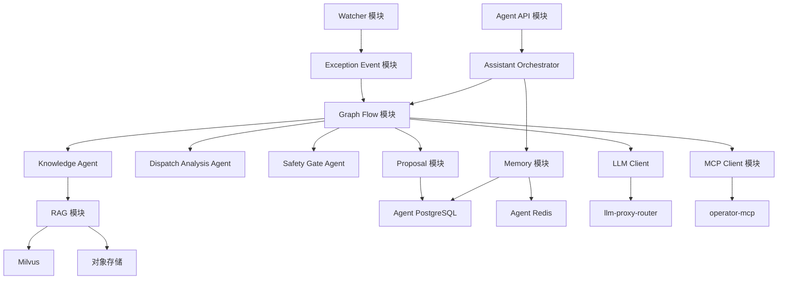

### 6.2 mine-agent-app 模块职责

| 模块 | 职责 | 是否独立服务 |
|---|---|---:|
| Agent API 模块 | 对外提供聊天、会话、提案、确认、结果查询接口 | 否 |
| Assistant Orchestrator | 主入口，识别意图，选择 Flow，组织上下文 | 否 |
| Graph Flow 模块 | 固化只读查询、提案、写操作、异常处理流程 | 否 |
| Knowledge Agent | 负责知识问答、接口文档、SOP 检索 | 否 |
| Dispatch Analysis Agent | 负责调度分析、异常分析、候选方案生成 | 否 |
| Safety Gate Agent | 负责提案风险评估和安全兜底 | 否 |
| RAG 模块 | 文档切分、检索、重排、引用来源 | 否 |
| Memory 模块 | 会话、用户偏好、短期上下文、业务记忆 | 否 |
| Proposal 模块 | 提案创建、状态流转、用户确认、审批记录 | 否 |
| MCP Client 模块 | 调用 operator-mcp 暴露的工具 | 否 |
| Watcher 模块 | 定时压车检测、异常检测、事件生成 | 否 |
| Exception Event 模块 | 异常事件入库、去重、触发 Flow | 否 |
| LLM Client 模块 | 对接 llm-proxy-router | 否 |

结论：

> 第一阶段 mine-agent-app 是一个“模块化单体”，不是一堆微服务。

---

## 7. operator-mcp 设计

### 7.1 定位

`operator-mcp` 是整个系统的**操作防火墙**，也是 Agent 世界和现有 Dubbo 世界之间的安全隔离层。

它不是普通 MCP Server，而是：

- 工具注册中心。
- 权限中心。
- 提案执行中心。
- Dubbo 防腐层。
- 审计中心。
- 限流熔断层。
- token 校验层。
- 幂等控制层。

所有影响调度平台状态的操作必须通过 operator-mcp。

### 7.2 operator-mcp 内部架构

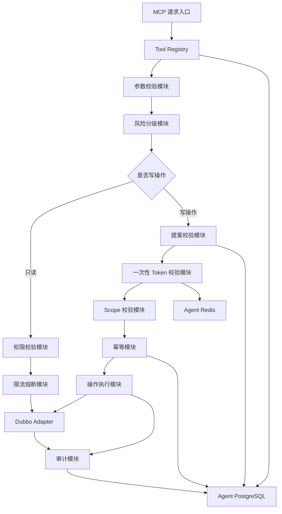

### 7.3 operator-mcp 是否有状态

结论：

> operator-mcp 从业务语义上是有状态的，但从服务实例角度必须设计为无状态。

更准确地说：

```text
有状态的是 Proposal、Token、Audit、Idempotency、Tool Registry；
不是某一个 operator-mcp Pod 的内存。
```

| 状态 | 存储位置 | 是否允许只在内存 |
|---|---|---:|
| Tool Registry | PostgreSQL + 本地只读缓存 | 否 |
| Proposal 执行状态 | PostgreSQL | 否 |
| 一次性 token | Redis | 否 |
| token used 标记 | Redis 原子写 | 否 |
| 幂等记录 | PostgreSQL 或 Redis | 否 |
| 审计日志 | PostgreSQL | 否 |
| Dubbo 连接池 | 实例内存 | 是 |
| 本地缓存 | 实例内存 | 可以，但必须可重建 |

### 7.4 Tool 定义示例

```json
{
  "toolName": "dispatch.adjustVehicleTask",
  "description": "调整指定车辆的调度任务",
  "operationType": "WRITE",
  "riskLevel": "HIGH",
  "requiredPermission": "DISPATCH_TASK_ADJUST",
  "requiredToken": true,
  "idempotentKeyFields": ["proposalId", "vehicleId", "targetTaskId"],
  "timeoutMs": 3000,
  "rateLimit": {
    "userQps": 1,
    "globalQps": 10
  },
  "parameters": {
    "proposalId": "string",
    "vehicleId": "string",
    "targetTaskId": "string",
    "reason": "string"
  }
}
```

### 7.5 工具开放策略

第一阶段建议只开放：

| 工具 | 类型 | 风险 | 是否开放 |
|---|---|---|---:|
| vehicle.getStatus | 只读 | 低 | 是 |
| vehicle.listNearby | 只读 | 低 | 是 |
| task.getCurrentTask | 只读 | 低 | 是 |
| dispatch.getQueueStatus | 只读 | 中 | 是 |
| map.getRoadSegmentStatus | 只读 | 中 | 是 |
| alarm.listActiveAlarms | 只读 | 中 | 是 |
| proposal.create | Agent 内部写 | 低 | 是 |
| proposal.approve | Agent 内部写 | 中 | 是 |
| dispatch.markSuggestion | 低风险写 | 中 | 可选 |

第一阶段不建议开放：

- 强制停车。
- 批量改派。
- 封路。
- 调整全局调度策略。
- 直接修改车辆任务状态。
- 直接清除安全告警。

---

## 8. Agent 收敛后的设计

### 8.1 最终只保留四个核心 Agent

| Agent | 职责 | 为什么保留 |
|---|---|---|
| Assistant Orchestrator Agent | 用户主入口，意图识别，Flow 选择，结果整合 | 必须有主控入口 |
| Knowledge Agent | 知识库、接口文档、SOP、制度文档检索 | 知识问答与业务分析都依赖它 |
| Dispatch Analysis Agent | 调度分析、异常分析、候选方案生成 | 调度业务核心能力 |
| Safety Gate Agent | 风险评估、合规检查、安全兜底 | 写操作安全闭环必需 |

### 8.2 被合并或降级的 Agent

| 原设计 Agent | 处理方式 | 原因 |
|---|---|---|
| Exception Agent | 合并进 Dispatch Analysis Agent | 异常分析本质也是调度分析的一种 |
| Watchdog Agent | 改成 Watcher 确定性模块 | 压车检测不需要 LLM 推理 |
| Operator Agent | 改成 MCP Client 模块 | 执行不应由 Agent 自由决策 |
| SupervisorAgent | 作为 Orchestrator 内部编排模式 | 不单独暴露为业务 Agent |
| ReActAgent | 只作为 Knowledge 或 Dispatch 内部局部推理模式 | 不作为全局控制流 |

### 8.3 Agent 调用关系

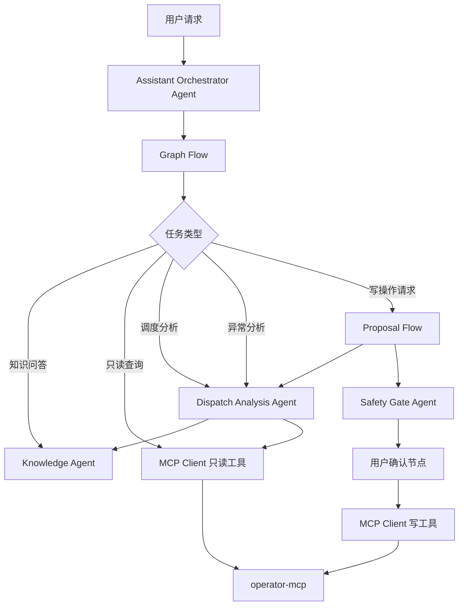

### 8.4 每个 Agent 的输入输出

| Agent | 输入 | 输出 | 可调用工具 | 是否允许写生产系统 |
|---|---|---|---|---:|
| Assistant Orchestrator Agent | 用户请求、会话上下文、用户身份 | 任务类型、Flow 选择、最终回答 | LLM、Memory、Flow | 否 |
| Knowledge Agent | 用户问题、检索上下文 | 带来源的知识答案 | RAG、文档库 | 否 |
| Dispatch Analysis Agent | 实时状态、异常事件、知识上下文 | 候选方案、影响分析、提案草稿 | 只读 MCP、Knowledge Agent | 否 |
| Safety Gate Agent | Proposal、用户权限、风险上下文 | 风险等级、是否通过、审批要求 | 规则库、只读 MCP、Knowledge Agent | 否 |

---

## 9. Agent 编排模式选型

### 9.1 结论

矿山智能调度 Agent 不建议采用纯 ReAct 作为顶层架构。推荐采用：

```text
顶层：Graph Flow
多 Agent 编排：SupervisorAgent + Agent Tool
固定链路：SequentialAgent
并行检查：ParallelAgent
局部推理：ReactAgent
执行入口：operator-mcp
```

在收敛架构中，这些不是物理服务，而是 mine-agent-app 内部的编排模式和节点能力。

### 9.2 为什么不采用纯 ReAct

ReAct 的优势是灵活，适合边想边查边调用工具的任务，例如知识问答、状态排查、异常原因探索。但矿山调度系统是生产控制系统，存在高风险写操作。

纯 ReAct 的问题：

| 问题 | 对矿山调度的风险 |
|---|---|
| 路径不确定 | 无法强制写操作经过提案、安全门、确认、token |
| 工具选择漂移 | 上下文变化后可能选择错误工具 |
| 循环次数不可控 | 容易造成工具调用风暴或超时 |
| 状态恢复困难 | 中途失败后不容易从确定节点恢复 |
| 审计不稳定 | 难以把自然语言推理映射成业务状态机 |
| 安全门可能被绕过 | 不能依赖模型自觉遵守流程 |

因此：

> ReAct 可以用于局部分析，但不能作为矿山调度系统的顶层控制流。

### 9.3 为什么采用 Graph Flow

Graph Flow 适合表达确定性业务流程：

```text
输入识别
  -> 上下文补全
  -> 只读工具查询
  -> 提案生成
  -> 安全评估
  -> 用户确认
  -> token 发放
  -> operator-mcp 执行
  -> 审计落库
```

这些节点不应该由 LLM 临时决定是否跳过，而应该由代码和流程引擎强制执行。

### 9.4 顶层 Flow 设计

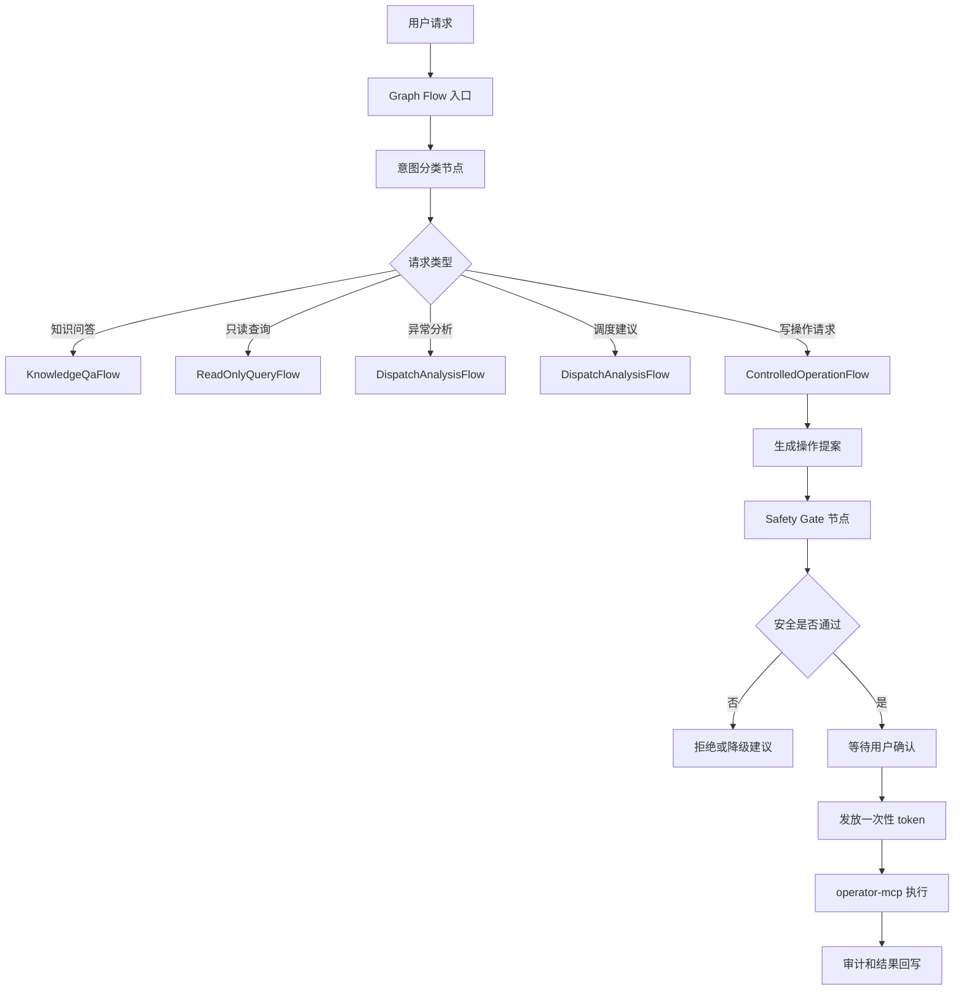

### 9.5 Multi Agent 模式选择

| 模式 | 是否采用 | 用途 |
|---|---:|---|
| SupervisorAgent | 推荐 | 在 Orchestrator 内部协调 Knowledge、Dispatch、Safety |
| Agent Tool | 推荐 | 把 Knowledge、Dispatch、Safety 工具化供 Flow 调用 |
| SequentialAgent | 推荐 | 固定链路，例如提案生成后必须安全评估 |
| ParallelAgent | 可选 | 并行做风险检查、SOP 检索、历史案例检索 |
| LlmRoutingAgent | 谨慎使用 | 简单单次路由，例如知识问答还是状态查询 |
| Handoffs | 第一阶段不推荐 | 不适合作为安全敏感系统主流程 |
| 自定义 FlowAgent | 推荐 | 固化企业审批流、异常流、回滚流 |

### 9.6 ReactAgent 使用边界

| Agent | 是否适合使用 ReAct | 工具权限 |
|---|---:|---|
| Knowledge Agent | 适合 | RAG、文档检索 |
| Dispatch Analysis Agent | 适合 | 只读状态查询、SOP 检索、提案生成 |
| Safety Gate Agent | 谨慎使用 | 只做辅助解释，最终必须结构化输出 |
| MCP Client | 不适合 | 不允许自然语言自由执行写操作 |
| Assistant Orchestrator 顶层 | 不建议纯 ReAct | 必须走 Graph Flow |

建议约束：

| 参数 | 建议 |
|---|---|
| maxSteps | 3 到 5 |
| timeout | 必须设置 |
| tools | 最小必要工具集合 |
| output schema | 必须结构化 |
| includeContents | 默认 false |
| returnReasoningContent | 默认 false |
| fallback | 失败后进入人工处理或降级回复 |

---

## 10. LLM Proxy Router 设计

### 10.1 定位

新增一个轻量 LLM Proxy Router，类似 New API 的定位，但第一阶段只做最小必要能力。

目标：

- 多模型供应商路由。
- 避免单一供应商故障。
- 统一鉴权。
- 统一限流。
- 统一模型能力管理。
- 统一 token 和成本统计。
- 统一日志脱敏。
- Agent 侧只对接一个 OpenAI Compatible 入口。

### 10.2 最小能力

| 能力 | 第一阶段是否需要 | 说明 |
|---|---:|---|
| OpenAI Compatible Chat API | 是 | Agent 侧只对接一种协议 |
| Embedding API 转发 | 是 | RAG 构建和查询需要 |
| 多供应商路由 | 是 | 避免单模型供应商故障 |
| 加权路由 | 是 | 主用 Qwen，备用 DeepSeek 或私有模型 |
| 自动失败重试 | 是 | 上游失败后切备用供应商 |
| 模型能力注册表 | 是 | 标记 tool calling、structured output、长上下文 |
| 用户级限流 | 是 | 防止单用户打爆模型预算 |
| 成本和 token 统计 | 是 | 后续做成本治理 |
| Prompt 日志脱敏 | 是 | 调度业务数据要避免泄露 |
| 复杂计费系统 | 否 | 内部系统第一阶段不需要 |
| 多租户商业化 | 否 | 内部系统第一阶段不需要 |

### 10.3 LLM Proxy 架构

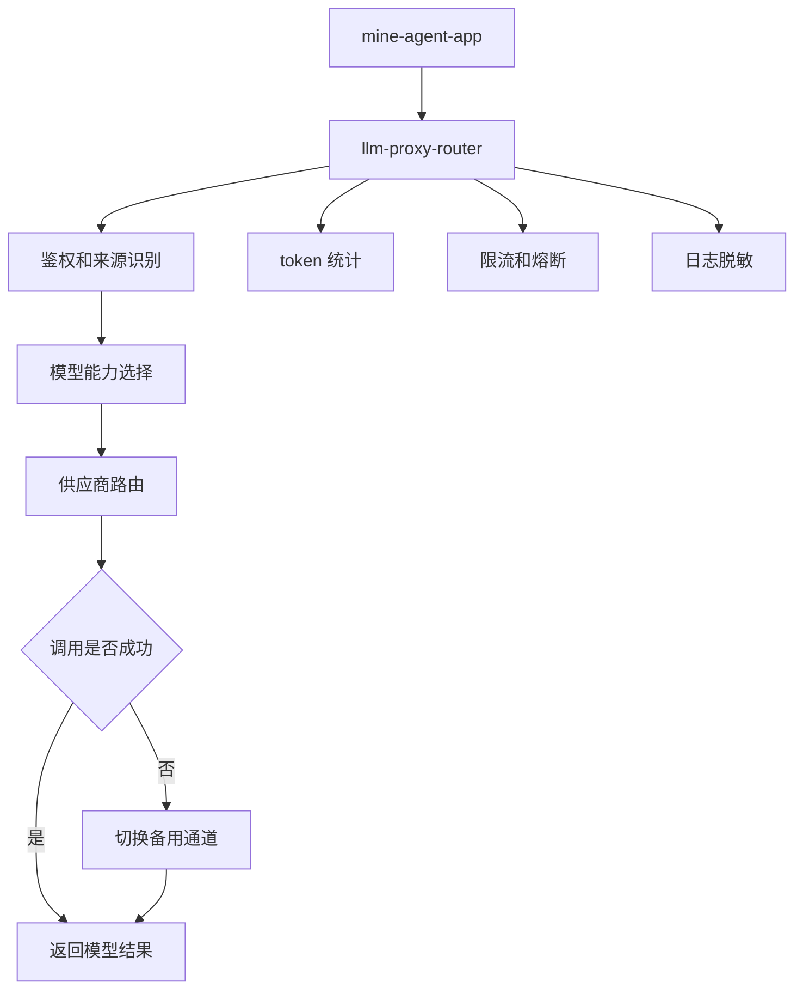

### 10.4 模型路由策略

| 场景 | 首选模型 | 备用模型 | 说明 |
|---|---|---|---|
| 普通知识问答 | Qwen 中等模型 | DeepSeek Chat | 成本优先 |
| 调度提案生成 | Qwen 强模型 | 私有强模型 | 稳定性和结构化输出优先 |
| Safety Gate | 规则引擎 + 强模型 | 规则引擎兜底 | 不能完全依赖 LLM |
| Embedding | 固定 embedding 模型 | 同维度备用模型 | 避免向量维度不一致 |
| 离线知识入库 | 低成本模型 | 暂停重试 | 不影响在线链路 |

### 10.5 Spring AI 接入方式

Agent 服务只配置一个模型入口：

```yaml
spring:
  ai:
    openai:
      base-url: http://llm-proxy-router.internal/v1
      api-key: ${AGENT_LLM_PROXY_KEY}
```

LLM Proxy 内部再决定实际调用哪一个供应商：

```text
mine-agent-app
  -> llm-proxy-router
  -> qwen
  -> deepseek
  -> private-model
  -> fallback-model
```

注意：

1. Agent 侧不要散落多个供应商 SDK。
2. Tool calling 能力必须在模型能力注册表中声明。
3. Safety Gate 使用的模型应与普通问答模型隔离。
4. Embedding 模型不要随意切换，避免向量维度不一致。
5. 重要链路要记录 model、provider、latency、token usage、finish reason。

---

## 11. 数据与中间件隔离

### 11.1 结论

Agent 体系建议独立使用 PostgreSQL、Redis、Milvus、对象存储。Elasticsearch 和 Kafka 第一阶段可以后置。

推荐第一阶段中间件收敛如下：

| 中间件 | 建议 |
|---|---|
| PostgreSQL | 一个独立 Agent PostgreSQL 实例，内部用 schema 区分 agent、operator、llm |
| Redis | 一个独立 Agent Redis 实例，内部用 key prefix 区分 agent 和 operator |
| Milvus | 独立实例或独立 collection |
| Elasticsearch | 第一阶段可选，能不用就先不用 |
| Kafka | 第一阶段可选，异常事件可先用数据库表或 Redis Stream |
| Object Storage | 存储文档原文、解析结果和附件 |

### 11.2 为什么要独立中间件

1. 故障隔离：Agent 的长会话、RAG、token、trace 不应影响生产调度链路。
2. 权限隔离：Agent 不应获得生产库直连权限。
3. 生命周期不同：会话、提案、审计、知识反馈与生产业务数据保留周期不同。
4. 性能特征不同：RAG 检索和 embedding 入库可能产生突发 IO。
5. 安全审计清晰：Agent 所有数据访问都能在独立库中追踪。

### 11.3 PostgreSQL Schema 建议

```text
agent_pg
├── schema agent_core
│   ├── agent_session
│   ├── agent_message
│   ├── agent_memory
│   ├── agent_graph_checkpoint
│   ├── agent_proposal
│   ├── agent_proposal_approval
│   ├── agent_safety_assessment
│   ├── agent_exception_event
│   └── agent_knowledge_feedback
├── schema operator_core
│   ├── operator_tool_registry
│   ├── operator_tool_call_log
│   ├── operator_operation_audit
│   └── operator_idempotency_record
└── schema llm_core
    └── llm_call_log
```

### 11.4 Redis Key 前缀

```text
agent:session:{sessionId}
agent:stream:{messageId}
agent:lock:watcher:{jobName}
operator:token:{proposalId}:{tokenId}
operator:token:used:{tokenId}
operator:ratelimit:{toolName}:{userId}
operator:idempotency:{idempotencyKey}
```

---

## 12. 多实例部署与状态处理

### 12.1 总体部署

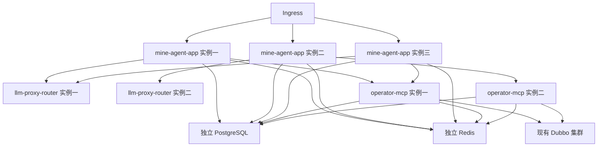

### 12.2 Agent 服务是否有状态

结论：

> mine-agent-app 从业务上依赖状态，但服务实例本身必须无状态。

Agent 需要的状态包括：

- 会话历史。
- Memory。
- 当前任务上下文。
- 提案状态。
- 工具调用记录。
- 流式响应进度。
- 用户确认状态。
- Graph 执行快照。

这些状态都不能只放在某个 JVM 内存里。

### 12.3 状态处理原则

| 状态 | 存储 | 多实例要求 |
|---|---|---|
| 会话消息 | PostgreSQL | 任意实例可读取 |
| 短期上下文 | Redis | 可恢复 |
| Proposal | PostgreSQL | 使用状态机和乐观锁 |
| token | Redis | 原子消费 |
| 幂等记录 | PostgreSQL 或 Redis | 写操作必须查 |
| Graph checkpoint | PostgreSQL | 断线可恢复 |
| SSE 流式状态 | Redis | 可断线重连 |
| Watcher 任务锁 | Redis | 避免重复执行 |
| 工具注册 | PostgreSQL + 本地缓存 | 缓存可重建 |

### 12.4 是否需要粘性会话

| 场景 | 是否需要 |
|---|---:|
| 普通 HTTP 请求 | 不需要 |
| Proposal 确认 | 不需要 |
| MCP 工具调用 | 不需要 |
| SSE 流式响应 | 可以短期粘性，但不能依赖 |
| WebSocket | 可以粘性，但状态必须外置 |
| 后台任务 | 不需要，使用分布式锁 |

### 12.5 后台任务多实例处理

后台压车检测、异常巡视任务需要避免多实例重复执行。

推荐方案：

| 方案 | 推荐度 | 说明 |
|---|---:|---|
| Redis 分布式锁 | 高 | 简单直接，适合第一阶段 |
| ShedLock + PostgreSQL | 高 | Java 生态常用，适合定时任务 |
| Quartz Cluster | 中 | 稍重，适合复杂调度 |
| Kafka 消费组 | 后续可选 | 适合事件流驱动 |
| 单实例 CronJob | 中 | 简单但可用性弱 |

第一阶段建议：

```text
Spring Scheduler
  -> Redis 分布式锁
  -> 执行检测
  -> 写 agent_exception_event
  -> 触发 Dispatch Analysis Flow
```

---

## 13. 安全与权限体系

### 13.1 操作分级

| 类型 | 示例 | 是否需要提案 | 是否需要用户确认 | 是否需要 token |
|---|---|---:|---:|---:|
| 只读 | 查询车辆状态 | 否 | 否 | 否 |
| 低风险写 | 标记建议已读 | 是 | 是 | 是 |
| 中风险写 | 调整任务优先级 | 是 | 是 | 是 |
| 高风险写 | 车辆任务重分配 | 是 | 是 | 是 |
| 极高风险 | 停车、封路、批量调度 | 是 | 多角色审批 | 是 |

### 13.2 写操作安全链路

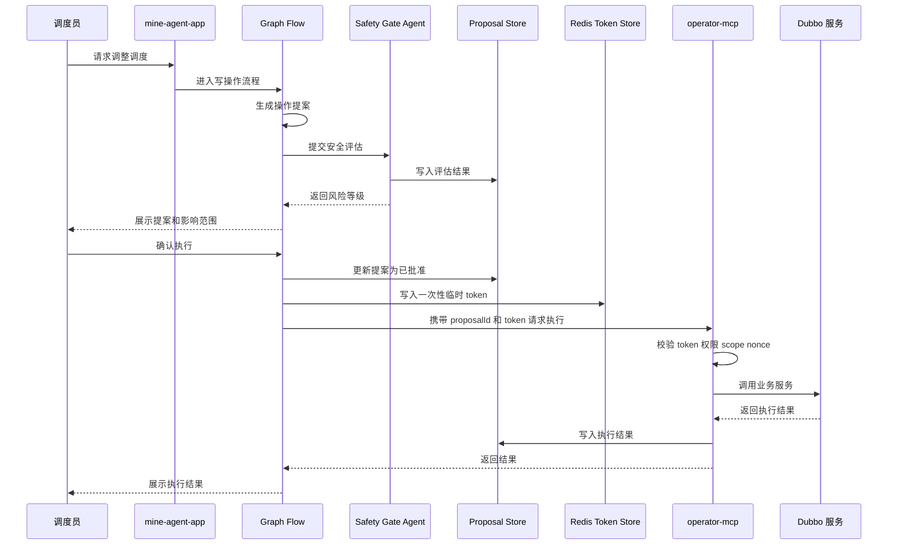

### 13.3 一次性 token 结构

```json
{
  "tokenId": "tok_20260415_xxx",
  "userId": "u123",
  "proposalId": "p987",
  "operationType": "dispatch.adjustVehicleTask",
  "scope": {
    "mineId": "mine-001",
    "vehicleIds": ["truck-102"],
    "taskIds": ["task-7788"]
  },
  "expireTime": "2026-04-15T10:30:00+09:00",
  "nonce": "random-uuid",
  "used": false
}
```

### 13.4 token 原子消费

执行写操作时，operator-mcp 必须用 Redis 原子逻辑消费 token：

```text
校验 token 存在
校验 userId
校验 proposalId
校验 operationType
校验 scope
校验未使用
标记为已使用
设置短期 used 记录
```

该过程必须是原子操作，可以使用 Redis Lua 脚本，避免两个 operator-mcp 实例同时消费同一个 token。

### 13.5 必须拒绝的情况

operator-mcp 执行写操作前，以下情况必须拒绝：

- token 不存在。
- token 已过期。
- token 已使用。
- proposalId 不匹配。
- userId 不匹配。
- operationType 不匹配。
- scope 越权。
- Safety Gate 未通过。
- 提案状态不是可执行状态。
- 参数与提案内容不一致。
- 幂等键重复且状态异常。

---

## 14. 操作提案机制

### 14.1 Proposal 数据结构

```json
{
  "proposalId": "p_20260415_0001",
  "userId": "u_001",
  "sessionId": "s_001",
  "intent": "调整车辆 truck-102 到新的装载任务",
  "riskLevel": "HIGH",
  "operationType": "dispatch.adjustVehicleTask",
  "targetObjects": {
    "mineId": "mine-001",
    "vehicleIds": ["truck-102"],
    "taskIds": ["task-7788"]
  },
  "preCheckResult": {
    "vehicleOnline": true,
    "vehicleLoaded": false,
    "roadAvailable": true,
    "conflictDetected": false
  },
  "safetyAssessment": {
    "passed": true,
    "riskItems": ["任务变更会影响当前排队顺序"],
    "requiredApprovalLevel": "USER_CONFIRM"
  },
  "recommendedAction": "将 truck-102 从等待区调度至 A 区装载点",
  "impactAnalysis": "预计减少 A 区装载等待时间 6 分钟，不影响当前卸载队列",
  "rollbackPlan": "若执行失败，恢复 truck-102 原任务并重新进入等待队列",
  "status": "WAIT_USER_CONFIRM",
  "auditTraceId": "trace-xxx",
  "createdAt": "2026-04-15T10:00:00+09:00"
}
```

### 14.2 Proposal 状态机

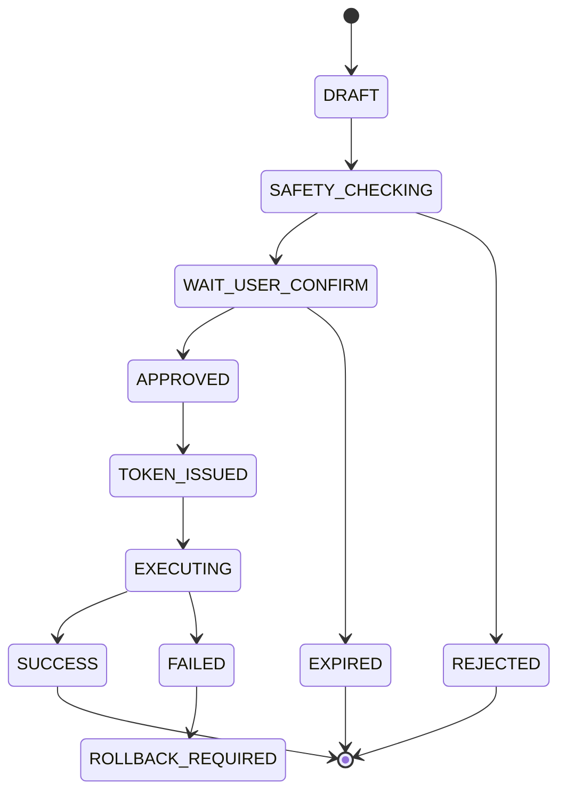

### 14.3 状态说明

| 状态 | 说明 |
|---|---|
| DRAFT | Agent 初步生成草稿 |
| SAFETY_CHECKING | 安全门评估中 |
| WAIT_USER_CONFIRM | 等待用户确认 |
| APPROVED | 用户已确认 |
| TOKEN_ISSUED | 已签发一次性 token |
| EXECUTING | operator-mcp 正在执行 |
| SUCCESS | 执行成功 |
| FAILED | 执行失败 |
| REJECTED | 安全门或用户拒绝 |
| EXPIRED | 超时未确认 |
| ROLLBACK_REQUIRED | 需要人工或系统回滚 |

### 14.4 幂等键建议

```text
idempotencyKey = hash(proposalId + operationType + targetObjectIds + approvedVersion)
```

幂等表字段：

| 字段 | 说明 |
|---|---|
| idempotency_key | 幂等键 |
| proposal_id | 提案 ID |
| operation_type | 操作类型 |
| request_hash | 请求参数摘要 |
| status | EXECUTING SUCCESS FAILED |
| result_json | 执行结果 |
| created_at | 创建时间 |
| updated_at | 更新时间 |

---

## 15. 知识库与 Memory 设计

### 15.1 知识库内容

| 知识类型 | 示例 |
|---|---|
| 接口文档 | Dubbo 接口、HTTP 网关接口、字段说明 |
| 调度规则 | 车辆优先级、装载区规则、卸载区规则 |
| SOP | 车辆离线、压车、通信异常、道路拥堵处理 |
| 设备文档 | 矿卡、挖机、基站、调度终端 |
| 地图知识 | 道路、坡道、装载点、卸载点、禁行区 |
| 历史案例 | 异常处置记录、事故复盘 |
| 安全文档 | 高风险操作约束、审批制度 |
| 系统手册 | 调度平台使用说明、运维手册 |

### 15.2 RAG 流程

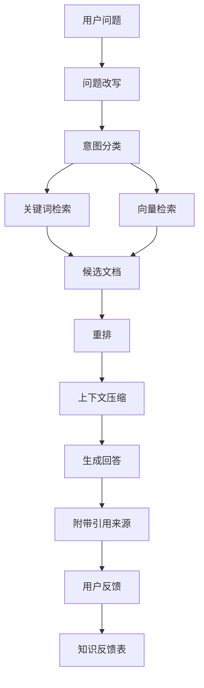

### 15.3 文档切分策略

| 文档类型 | 切分策略 |
|---|---|
| 接口文档 | 按服务、接口、方法切分 |
| SOP | 按场景、步骤、注意事项切分 |
| 调度规则 | 按规则条款切分 |
| 地图语义 | 按矿区、道路段、装卸点切分 |
| 历史案例 | 按事件、原因、处置、结果切分 |

### 15.4 Memory 分类

| Memory 类型 | 生命周期 | 存储 |
|---|---|---|
| 会话 Memory | 当前会话 | Redis + PostgreSQL |
| 用户偏好 Memory | 长期 | PostgreSQL |
| 业务事件 Memory | 中期 | PostgreSQL |
| 提案 Memory | 长期 | PostgreSQL |
| 工具调用 Memory | 长期 | PostgreSQL |
| 短期推理上下文 | 单次请求 | 进程内上下文 + Redis 快照 |

### 15.5 用户纠错沉淀机制

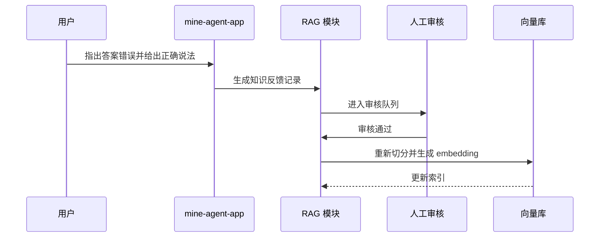

---

## 16. 异常检测与后台任务

### 16.1 基本原则

压车检测、车辆长时间静止检测、通信异常检测、任务超时检测等算法**不应依赖 LLM**。

LLM 的职责是：

- 解释异常。
- 关联上下文。
- 检索 SOP。
- 生成处置提案。
- 提醒调度员确认。

### 16.2 异常事件结构

```json
{
  "eventId": "evt_20260415_0001",
  "eventType": "VEHICLE_CONGESTION",
  "mineId": "mine-001",
  "roadSegmentId": "road-A-12",
  "involvedVehicles": ["truck-101", "truck-102", "truck-103"],
  "severity": "HIGH",
  "detectedAt": "2026-04-15T10:00:00+09:00",
  "evidence": {
    "avgSpeed": 1.2,
    "durationSeconds": 480,
    "queueLength": 5,
    "mapConfidence": 0.92
  },
  "contextSnapshot": {
    "nearbyShovel": "shovel-07",
    "nearestDumpPoint": "dump-02",
    "roadStatus": "AVAILABLE",
    "weather": "NORMAL"
  },
  "suggestedAction": "分析是否需要调整后续车辆路线"
}
```

### 16.3 后台异常链路

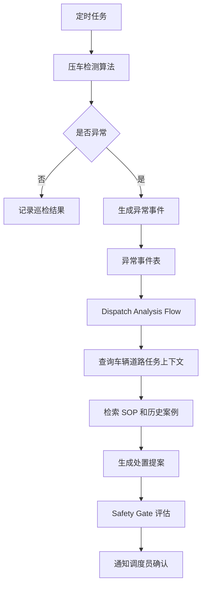

### 16.4 压车检测建议逻辑

第一阶段可以先用规则算法：

```text
当同一路段内车辆数量超过阈值，且平均速度低于阈值，持续时间超过阈值，则判定为疑似压车。
```

输入：

- 车辆位置。
- 车辆速度。
- 道路段 ID。
- 当前任务状态。
- 装载点排队长度。
- 卸载点排队长度。
- 高精地图道路语义。
- 地图鲜度。
- 地图置信度。

输出：

- 是否压车。
- 严重程度。
- 涉及车辆。
- 证据数据。
- 建议触发的 Flow。

---

## 17. Spring AI Alibaba 落地方案

### 17.1 推荐使用方式

| 能力 | 建议实现 |
|---|---|
| ChatClient | Assistant Orchestrator 主对话入口 |
| Tool Calling | 只读工具调用、提案生成工具 |
| MCP | operator-mcp 对外工具协议 |
| Advisor | RAG、Memory、安全前置检查、审计增强 |
| Prompt Template | 不同 Agent 的系统提示词模板 |
| Structured Output | 提案、异常分析、安全评估输出 |
| RAG | 知识库检索增强 |
| Memory | 多轮会话和用户偏好 |
| Observability | traceId、tool call、token、延迟统计 |
| Multi Agent | SupervisorAgent + Agent Tool 作为内部编排模式 |
| FlowAgent | 固定调度流程、安全流程、回滚流程 |
| ReactAgent | 专业子 Agent 局部工具调用 |

### 17.2 工程结构

服务级工程：

```text
mine-dispatch-agent-system
├── mine-agent-app
├── operator-mcp
├── llm-proxy-router
└── common-contracts
```

mine-agent-app 内部包结构：

```text
mine-agent-app
├── api
│   ├── ChatController
│   ├── ProposalController
│   └── EventController
├── orchestrator
│   ├── AssistantOrchestrator
│   └── IntentClassifier
├── flow
│   ├── ReadOnlyQueryFlow
│   ├── KnowledgeQaFlow
│   ├── DispatchAnalysisFlow
│   ├── ProposalFlow
│   └── ControlledOperationFlow
├── agent
│   ├── KnowledgeAgent
│   ├── DispatchAnalysisAgent
│   └── SafetyGateAgent
├── rag
│   ├── DocumentIngestionService
│   ├── RetrieverService
│   ├── RerankService
│   └── CitationService
├── memory
│   ├── SessionMemoryService
│   ├── UserPreferenceMemoryService
│   └── BusinessMemoryService
├── proposal
│   ├── ProposalService
│   ├── ProposalStateMachine
│   └── ApprovalService
├── mcp
│   ├── McpClientService
│   └── ToolCallFacade
├── watcher
│   ├── CongestionDetector
│   ├── WatcherScheduler
│   └── ExceptionEventService
├── llm
│   ├── LlmClient
│   └── ModelCapabilitySelector
└── persistence
    ├── entity
    ├── repository
    └── migration
```

operator-mcp 内部包结构：

```text
operator-mcp
├── mcp
│   ├── McpServerEndpoint
│   └── ToolDispatcher
├── registry
│   ├── ToolRegistryService
│   └── ToolSchemaService
├── security
│   ├── PermissionValidator
│   ├── TokenValidator
│   └── ScopeValidator
├── idempotency
│   └── IdempotencyService
├── audit
│   └── OperationAuditService
├── governance
│   ├── RateLimiter
│   ├── CircuitBreaker
│   └── TimeoutPolicy
├── dubbo
│   ├── DeviceCenterAdapter
│   ├── DispatchCenterAdapter
│   ├── VehicleCenterAdapter
│   ├── TaskCenterAdapter
│   ├── MapCenterAdapter
│   └── AlarmCenterAdapter
└── persistence
    ├── entity
    ├── repository
    └── migration
```

### 17.3 Java 版本策略

| 模块 | 建议 JDK | 原因 |
|---|---:|---|
| 现有 Dubbo 服务 | Java8 | 保持稳定 |
| mine-agent-app | Java17+ | 适配 Spring AI Alibaba 和现代 AI 工程生态 |
| operator-mcp | Java17+ 优先 | MCP 和 Agent 生态更适配 |
| Dubbo Adapter | Java8 或 Java17 双方案 | 取决于 Dubbo 版本兼容性 |
| llm-proxy-router | Java17+ 或 Go | 薄网关，语言可按团队能力选择 |

务实建议：

> 不要把 Spring AI Alibaba 强行塞进老 Java8 调度服务里。正确做法是新增独立 Agent 服务，通过 operator-mcp 和 Dubbo Adapter 与老系统交互。

---

## 18. 与现有 Dubbo 微服务集成

### 18.1 防腐层设计

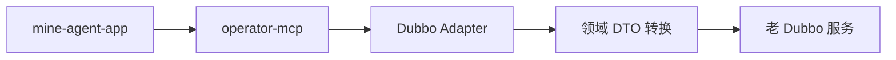

### 18.2 集成原则

1. 不直接改调度核心链路。
2. 不直接访问生产数据库。
3. 不直接访问生产 Redis、Kafka 等中间件。
4. Dubbo 接口必须通过 Adapter 封装。
5. Adapter 内部做字段转换、异常转换、超时控制。
6. 工具开放必须逐个评审。
7. 先开放只读工具，再开放低风险写工具。
8. 写请求默认不自动重试，必须靠幂等键和人工确认。

### 18.3 Dubbo 调用治理

| 机制 | 要求 |
|---|---|
| 超时 | 每个工具单独配置 timeout |
| 限流 | 工具级、用户级、全局级 |
| 熔断 | Dubbo 异常率过高时降级 |
| 重试 | 只读请求可有限重试，写请求默认不自动重试 |
| 降级 | 返回结构化错误和人工处理建议 |
| 审计 | 每次调用记录 traceId、toolName、latency、status |

---

## 19. 数据模型设计

### 19.1 agent_session

| 字段 | 说明 |
|---|---|
| id | 主键 |
| session_id | 会话 ID |
| user_id | 用户 ID |
| mine_id | 矿区 ID |
| title | 会话标题 |
| status | 状态 |
| created_at | 创建时间 |
| updated_at | 更新时间 |

### 19.2 agent_message

| 字段 | 说明 |
|---|---|
| id | 主键 |
| session_id | 会话 ID |
| role | user、assistant、tool、system |
| content | 消息内容 |
| citation_json | 引用来源 |
| trace_id | 调用链 ID |
| created_at | 创建时间 |

### 19.3 agent_memory

| 字段 | 说明 |
|---|---|
| id | 主键 |
| memory_id | 记忆 ID |
| user_id | 用户 ID |
| session_id | 会话 ID |
| memory_type | 会话、用户偏好、业务事件 |
| content | 记忆内容 |
| source | 来源 |
| importance | 重要性 |
| expire_at | 过期时间 |
| created_at | 创建时间 |

### 19.4 agent_graph_checkpoint

| 字段 | 说明 |
|---|---|
| id | 主键 |
| checkpoint_id | 快照 ID |
| session_id | 会话 ID |
| message_id | 消息 ID |
| graph_name | Flow 名称 |
| node_name | 当前节点 |
| state_json | Graph 状态 |
| status | RUNNING、SUCCESS、FAILED |
| created_at | 创建时间 |
| updated_at | 更新时间 |

### 19.5 agent_proposal

| 字段 | 说明 |
|---|---|
| id | 主键 |
| proposal_id | 提案 ID |
| user_id | 用户 ID |
| session_id | 会话 ID |
| intent | 用户意图 |
| operation_type | 操作类型 |
| risk_level | 风险等级 |
| target_objects | 目标对象 JSON |
| pre_check_result | 前置检查 JSON |
| safety_assessment | 安全评估 JSON |
| recommended_action | 推荐动作 |
| impact_analysis | 影响分析 |
| rollback_plan | 回滚方案 |
| status | 状态 |
| version | 乐观锁版本 |
| audit_trace_id | 审计链路 ID |
| created_at | 创建时间 |
| approved_at | 批准时间 |
| executed_at | 执行时间 |

### 19.6 agent_proposal_approval

| 字段 | 说明 |
|---|---|
| id | 主键 |
| proposal_id | 提案 ID |
| approver_id | 审批人 |
| approval_type | 用户确认、二次确认、多角色审批 |
| decision | 通过或拒绝 |
| comment | 审批备注 |
| created_at | 创建时间 |

### 19.7 agent_safety_assessment

| 字段 | 说明 |
|---|---|
| id | 主键 |
| assessment_id | 评估 ID |
| proposal_id | 提案 ID |
| risk_level | 风险等级 |
| passed | 是否通过 |
| risk_items | 风险项 JSON |
| required_approval_level | 审批级别 |
| model_output | 模型输出 |
| rule_output | 规则输出 |
| created_at | 创建时间 |

### 19.8 agent_exception_event

| 字段 | 说明 |
|---|---|
| id | 主键 |
| event_id | 事件 ID |
| event_type | 事件类型 |
| mine_id | 矿区 ID |
| severity | 严重等级 |
| context_snapshot | 上下文快照 |
| evidence | 证据 |
| proposal_id | 关联提案 |
| status | 状态 |
| detected_at | 检测时间 |

### 19.9 agent_knowledge_feedback

| 字段 | 说明 |
|---|---|
| id | 主键 |
| feedback_id | 反馈 ID |
| user_id | 用户 ID |
| session_id | 会话 ID |
| original_answer | 原答案 |
| corrected_answer | 用户纠正内容 |
| status | 待审核、已采纳、已拒绝 |
| reviewer_id | 审核人 |
| created_at | 创建时间 |

### 19.10 operator_tool_registry

| 字段 | 说明 |
|---|---|
| id | 主键 |
| tool_name | 工具名 |
| operation_type | READ 或 WRITE |
| risk_level | 风险等级 |
| permission_code | 权限码 |
| schema_json | 参数 Schema |
| enabled | 是否启用 |
| version | 工具版本 |
| created_at | 创建时间 |

### 19.11 operator_tool_call_log

| 字段 | 说明 |
|---|---|
| id | 主键 |
| trace_id | 调用链 ID |
| session_id | 会话 ID |
| user_id | 用户 ID |
| tool_name | 工具名 |
| request_json | 请求 JSON |
| response_json | 响应 JSON |
| status | 成功或失败 |
| latency_ms | 延迟 |
| error_message | 错误信息 |
| created_at | 创建时间 |

### 19.12 operator_operation_audit

| 字段 | 说明 |
|---|---|
| id | 主键 |
| trace_id | 调用链 ID |
| user_id | 用户 ID |
| proposal_id | 提案 ID |
| operation_id | 操作 ID |
| tool_name | 工具名 |
| request_json | 请求内容 |
| response_json | 响应内容 |
| result_status | 成功失败 |
| error_code | 错误码 |
| latency_ms | 耗时 |
| created_at | 创建时间 |

### 19.13 operator_idempotency_record

| 字段 | 说明 |
|---|---|
| idempotency_key | 幂等键 |
| proposal_id | 提案 ID |
| operation_type | 操作类型 |
| request_hash | 请求参数摘要 |
| status | EXECUTING、SUCCESS、FAILED |
| result_json | 执行结果 |
| created_at | 创建时间 |
| updated_at | 更新时间 |

### 19.14 llm_call_log

| 字段 | 说明 |
|---|---|
| id | 主键 |
| trace_id | 调用链 ID |
| user_id | 用户 ID |
| model | 模型名 |
| provider | 供应商 |
| prompt_tokens | 输入 token |
| completion_tokens | 输出 token |
| latency_ms | 延迟 |
| status | 成功或失败 |
| error_code | 错误码 |
| created_at | 创建时间 |

---

## 20. 关键调用链路

### 20.1 知识问答链路

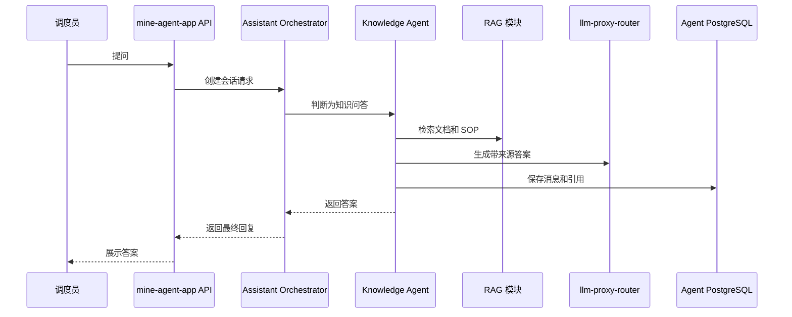

### 20.2 只读查询链路

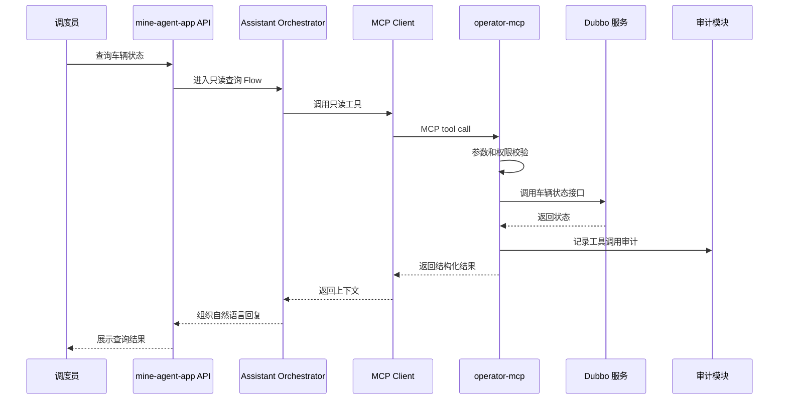

### 20.3 调度提案生成链路

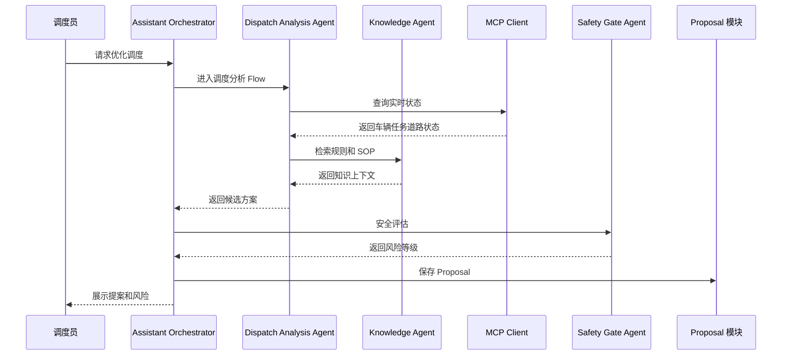

### 20.4 用户确认后执行写操作链路

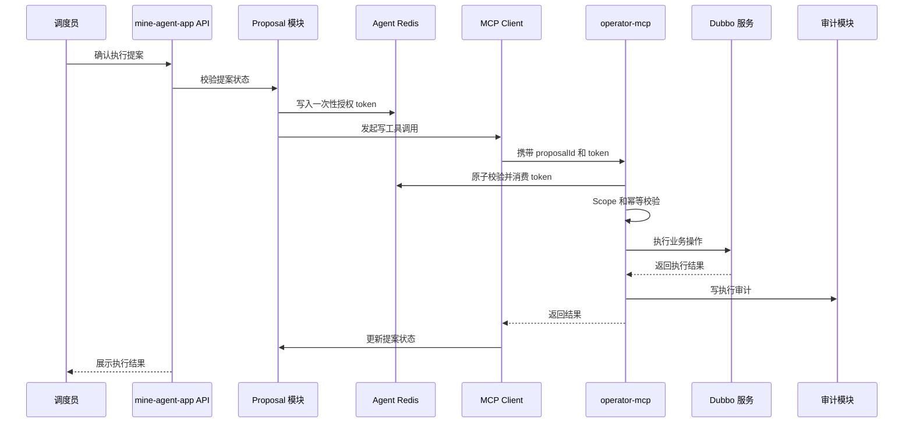

### 20.5 后台异常检测到提案链路

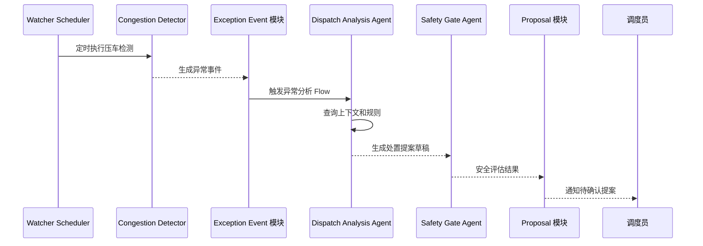

### 20.6 用户纠正答案并沉淀知识链路

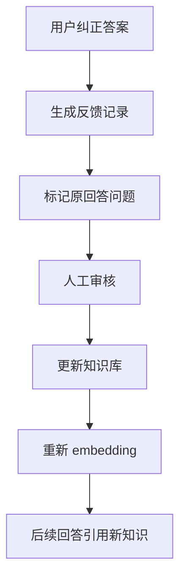

---

## 21. 多实例一致性要求

| 场景 | 一致性要求 | 实现 |
|---|---|---|
| token 消费 | 强一致 | Redis Lua 原子消费 |
| 提案状态流转 | 强一致 | PostgreSQL 乐观锁或行锁 |
| 审计日志 | 最终一致可接受 | 失败重试 |
| 只读查询 | 最终一致可接受 | Dubbo 查询 |
| RAG 检索 | 最终一致可接受 | 异步索引 |
| 异常事件去重 | 强一致 | eventId 唯一索引 |
| 写操作执行 | 强一致 | 幂等键 + 状态机 |
| Graph 执行恢复 | 中等一致 | checkpoint 落库 |

---

## 22. 最小可落地版本

### 22.1 最小服务清单

第一阶段只需要：

```text
mine-agent-app
operator-mcp
llm-proxy-router
PostgreSQL
Redis
Milvus
Object Storage
```

Elasticsearch、Kafka、独立审计服务、独立知识库服务、独立 Memory 服务都可以后置。

### 22.2 最小 Agent 清单

第一阶段只需要：

```text
Assistant Orchestrator Agent
Knowledge Agent
Dispatch Analysis Agent
Safety Gate Agent
```

Exception Agent、Watchdog Agent、Operator Agent 都不需要第一阶段独立存在。

### 22.3 最小工具清单

| 工具 | 类型 | 是否第一阶段开放 |
|---|---|---:|
| vehicle.getStatus | 只读 | 是 |
| task.getCurrentTask | 只读 | 是 |
| dispatch.getQueueStatus | 只读 | 是 |
| map.getRoadSegmentStatus | 只读 | 是 |
| alarm.listActiveAlarms | 只读 | 是 |
| proposal.create | 内部写 | 是 |
| proposal.approve | 内部写 | 是 |
| dispatch.markSuggestion | 低风险写 | 可选 |
| dispatch.adjustVehicleTask | 高风险写 | 暂不开放 |
| dispatch.stopVehicle | 极高风险写 | 暂不开放 |
| map.closeRoadSegment | 极高风险写 | 暂不开放 |

### 22.4 第一阶段不要做

- 不做完全自治调度。
- 不做高风险自动执行。
- 不让 LLM 直接访问数据库。
- 不让 LLM 直接调用 Dubbo。
- 不一次性开放所有接口。
- 不做复杂多角色审批。
- 不做全量历史数据智能分析。
- 不做无引用来源的知识问答。
- 不开放生产网络访问的 Python 代码执行。
- 不把 Agent 中间件和生产业务中间件混用。

### 22.5 Python 代码执行边界

草稿中提到支持 Python 代码执行。建议第一阶段谨慎处理：

| 场景 | 建议 |
|---|---|
| 调度生产操作 | 禁止 |
| 数据分析离线任务 | 可在沙箱中试点 |
| 访问生产网络 | 禁止 |
| 访问生产数据库 | 禁止 |
| 访问用户上传文件 | 可控授权 |
| 执行时间 | 必须限制 |
| 文件系统 | 临时目录隔离 |
| 审计 | 必须记录代码和输出摘要 |

---

## 23. 服务合并与后续拆分策略

### 23.1 当前不建议拆的服务

| 能力 | 不拆原因 |
|---|---|
| RAG 服务 | 与 Agent 上下文耦合强，第一阶段 QPS 不高 |
| Memory 服务 | 与会话强绑定，独立拆分增加复杂度 |
| Proposal 服务 | 与 Flow 状态机强绑定 |
| Safety 服务 | 与 Proposal 和用户确认强绑定 |
| Exception 服务 | 第一阶段事件量有限 |
| Audit 服务 | 可先库表化，后续再汇聚到 ES 或日志平台 |

### 23.2 未来可以拆的条件

| 服务 | 拆分触发条件 |
|---|---|
| agent-rag-service | 文档量大、检索 QPS 高、需要独立扩容 |
| memory-service | 多个 Agent 应用共享长期记忆 |
| proposal-service | 多系统共享提案审批流 |
| audit-service | 审计量大，需要独立检索和合规报表 |
| exception-event-service | 事件流规模扩大，需要 Kafka 和消费组 |
| llm-proxy-router | 如果已有企业统一模型网关，可以直接复用 |

### 23.3 拆分原则

1. 先模块化，后微服务化。
2. 有独立扩容需求再拆。
3. 有明确安全边界再拆。
4. 有跨系统复用价值再拆。
5. 不为了架构好看而拆。

---

## 24. 分阶段实施路线

| 阶段 | 目标 | 交付物 | 技术重点 | 验收标准 |
|---|---|---|---|---|
| Phase 0 | 技术验证 | Spring AI Alibaba demo、MCP demo、RAG demo、LLM Proxy demo | 验证 Chat、RAG、Tool Calling、MCP | 能完成问答和只读工具调用 |
| Phase 1 | 只读问答 | 知识库、接口文档查询、车辆状态查询 | RAG、只读工具、审计 | 答案有来源，只读工具可审计 |
| Phase 2 | 提案生成 | Proposal 模型、Safety Gate、用户确认页 | Graph Flow、结构化输出、风险评估 | 能生成可追溯提案 |
| Phase 3 | 有限写操作 | operator-mcp 写操作、token 校验 | token、幂等、审计 | 用户确认后才能执行 |
| Phase 4 | 异常检测联动 | 压车检测 mock、Dispatch Analysis Flow | 事件驱动、异常分析 | 异常可生成处置建议 |
| Phase 5 | 半自动调度辅助 | 更多调度工具、更多 SOP、更多规则 | 调度策略、回滚机制 | 人在回路下辅助调度 |
| Phase 6 | 多角色审批 | 审批流、策略引擎、风控规则 | 审批治理、策略引擎 | 高风险操作可治理 |

---

## 25. 技术风险与规避措施

| 风险 | 规避策略 |
|---|---|
| LLM 幻觉 | RAG 引用、结构化输出、Safety Gate |
| 越权操作 | operator-mcp 统一权限校验 |
| 误操作 | 提案 + 用户确认 + 一次性 token |
| 调度核心链路受影响 | Agent 旁路接入，不改核心链路 |
| Dubbo 调用雪崩 | 限流、熔断、超时、降级 |
| 知识库污染 | 用户反馈需审核后入库 |
| 工具滥用 | Tool Registry 分级、开关、审计 |
| 高风险自动化过早 | MVP 只做辅助，不做自治 |
| 模型供应商故障 | LLM Proxy 多供应商路由和降级 |
| 多实例状态错乱 | 状态外置、幂等键、Redis 原子操作 |
| 后台任务重复执行 | 分布式锁或任务调度框架 |
| Agent 影响生产中间件 | 独立 PostgreSQL、Redis、Milvus |
| 服务拆太多导致落地慢 | 第一阶段只保留三个新增服务 |
| Agent 拆太细导致调度复杂 | 第一阶段只保留四个核心 Agent |

---

## 26. 原草稿需要修正的点

| 原草稿问题 | 建议 |
|---|---|
| operator-cmp 命名不一致 | 统一为 operator-mcp |
| 有状态服务描述不清晰 | 状态应集中在 Proposal、Token、Audit、Idempotency，不散落在服务内存 |
| SubAgent 边界不清 | 收敛为 Assistant、Knowledge、Dispatch Analysis、Safety Gate |
| Skills 描述偏泛 | Skills 应落到 Tool Registry 和 MCP Tool |
| 安全门位置不明确 | 写操作前必须强制 Safety Gate |
| token 流程不完整 | 补充 scope、nonce、expire、used 校验 |
| 知识库未区分类型 | 区分静态知识、实时业务状态、历史事件 |
| 压车检测与 AI 关系不清 | 算法检测不依赖 LLM，LLM 只做解释和提案 |
| Java8 兼容性未展开 | Agent 新服务独立 JDK17+，老服务通过 Adapter 对接 |
| ReAct 和 Graph 未决策 | 顶层 Graph Flow，叶子节点 ReactAgent |
| LLM 单点问题未解决 | 新增轻量 LLM Proxy Router |
| 生产隔离不足 | Agent 中间件独立部署 |
| 多实例处理不足 | 实例无状态，业务状态外置 |
| 服务拆分过多 | 收敛为 mine-agent-app、operator-mcp、llm-proxy-router |
| Agent 过多 | Watchdog、Exception、Operator 不再独立成 Agent |
| 插件化原则不够明确 | Agent 必须是完全独立旁路插件，故障后不影响生产运营 |

---

## 27. 最终架构原则

```text
服务架构：
新增三个服务：mine-agent-app、operator-mcp、llm-proxy-router。

Agent 架构：
保留四个核心 Agent：Assistant Orchestrator、Knowledge、Dispatch Analysis、Safety Gate。

Agent 编排：
Graph Flow 为主，ReactAgent 为辅。

Multi Agent：
SupervisorAgent + Agent Tool 作为 mine-agent-app 内部编排模式。

模型访问：
统一经过 llm-proxy-router。

数据存储：
Agent 中间件独立于生产系统。

operator-mcp：
业务有状态，实例无状态。

mine-agent-app：
业务有状态，实例无状态。

写操作：
提案、审批、token、幂等、审计一个都不能少。

第一阶段目标：
可信辅助调度，不是完全自动调度。

最高优先级原则：
Agent 是完全独立的旁路插件，原有调度系统零依赖，Agent 故障后生产运营不受影响。
```

最终判断：

> 矿山调度 Agent 的正确方向不是让一个大模型自由调度矿车，而是用 Graph 固化安全流程，用少量必要 Agent 辅助分析，用 operator-mcp 受控执行，用插件化旁路原则保证生产系统不被拖垮。
