# 矿山智能调度 Agent 技术方案

> 整体重构版  
> 适用场景：矿山自动驾驶调度平台、调度员辅助决策、异常分析、知识问答、受控操作执行  
> 技术主线：Spring AI Alibaba + Spring Boot + Dubbo + MCP + Graph Flow + SupervisorAgent + RAG + operator-mcp + LLM Proxy Router + 人在回路安全闭环

---

## 1. 方案摘要

本方案目标是在现有矿山自动驾驶调度平台之上，建设一套**可信、可审计、可回滚、人在回路的智能调度 Agent 系统**。

它不是让大模型直接调度矿车，也不是让 Agent 直接访问生产数据库、Redis、Kafka 或 Dubbo 服务。正确架构是：

```text
调度员
  -> Agent API 网关
  -> Assistant Agent
  -> Graph Flow 编排
  -> 多个专业 SubAgent
  -> operator-mcp 操作中心
  -> Dubbo Adapter
  -> 现有调度微服务
```

核心判断：

1. **顶层采用 Graph / Flow 模式，不采用纯 ReAct 模式。**
2. **多 Agent 采用 SupervisorAgent + Agent Tool 为主，SequentialAgent 和 ParallelAgent 为辅。**
3. **ReActAgent 只作为专业子 Agent 的局部推理单元，不作为全局流程控制器。**
4. **所有影响调度平台状态的写操作必须经过 operator-mcp。**
5. **operator-mcp 是业务有状态、实例无状态的操作中心。**
6. **Agent 服务也是业务有状态、实例无状态。**
7. **Agent 体系独立使用 PostgreSQL、Redis、Milvus、Elasticsearch 等中间件实例，与生产调度系统隔离。**
8. **模型访问统一经过轻量 LLM Proxy Router，避免单一供应商故障。**
9. **第一阶段目标不是自动调度，而是可信辅助调度。**

一句话结论：

> 用 Graph 固化安全流程，用多个专业 Agent 辅助分析，用 operator-mcp 受控执行。

---

## 2. 当前架构与约束

### 2.1 当前系统架构

当前调度管理平台是微服务工程集群：

- 基于 Java8
- 基于 Spring Boot 老版本
- 通过 Dubbo 做服务间调用
- 按领域拆分服务，例如：
  - device-center
  - user-center
  - dispatch-center
  - vehicle-center
  - task-center
  - map-center
  - alarm-center
- Dubbo 服务上层有类似 dubbo-to-http 的网关服务，对外提供 HTTP API

### 2.2 关键约束

| 约束 | 对方案的影响 |
|---|---|
| 老系统基于 Java8 | 不建议直接引入新版 Spring AI Alibaba |
| 调度系统属于生产控制系统 | Agent 不能绕过权限直接写入 |
| 调度操作有安全风险 | 必须有提案、确认、审计、回滚机制 |
| 矿山状态实时变化 | 静态知识库不能替代实时业务查询 |
| LLM 存在幻觉 | 所有关键结论要有依据，所有写操作要有审批链 |
| Dubbo 服务已有业务边界 | 需要 operator-mcp 做统一封装和防腐 |
| 业务接口风险不同 | 需要只读、低风险写、高风险写分级治理 |
| 多模型供应商可能不稳定 | 需要 LLM Proxy Router 统一路由和降级 |
| Agent 读写数据量可能波动 | Agent 中间件应与生产环境隔离 |

### 2.3 设计原则

1. **不影响当前调度系统稳定运行。**
2. **不侵入现有核心调度链路。**
3. **所有业务工具都通过 operator-mcp 封装。**
4. **Agent 不直接访问生产数据库、生产 Redis、生产 Kafka。**
5. **只读能力先行，写操作逐步开放。**
6. **写操作必须人在回路。**
7. **所有提案、审批、执行、失败、回滚都必须可追溯。**
8. **知识库回答必须尽量给出来源。**
9. **服务实例无状态，业务状态外置到 PostgreSQL、Redis、ES 等中间件。**
10. **模型供应商可替换，Agent 侧只面对统一 LLM Proxy。**

---

## 3. 建设目标

### 3.1 第一阶段目标

建设面向调度员、运维人员、管理人员的智能助手，支持：

- 调度系统知识问答
- 接口文档查询
- SOP 检索
- 车辆状态查询
- 任务状态查询
- 道路状态查询
- 异常原因分析
- 操作建议生成
- 操作提案生成
- 用户确认后执行有限低风险写操作

### 3.2 长期目标

逐步演进为：

- 后台巡视 Agent
- 异常自动发现
- 调度提案自动生成
- 半自动辅助调度
- 多角色审批
- 策略引擎 + Agent 协同
- 高精地图感知调度分析
- 人在回路的受控自治调度

---

## 4. 总体架构

### 4.1 架构总览

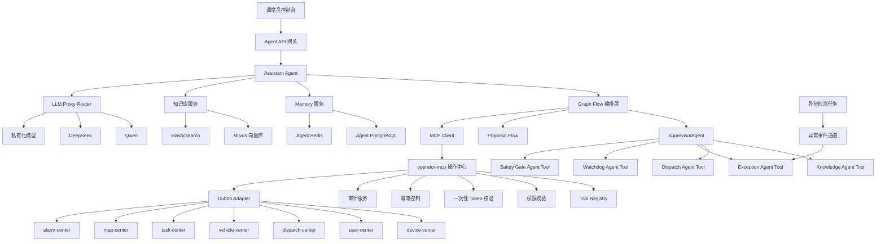

### 4.2 核心边界

```text
LLM 和 Agent：
负责理解、分析、检索、生成回答、生成提案。

Graph Flow：
负责固定业务流程，保证安全门、确认、token、审计不可跳过。

operator-mcp：
负责权限、工具、token、幂等、执行、审计。

Dubbo Adapter：
负责对接老 Dubbo 服务，屏蔽老系统协议和 DTO 差异。

现有调度系统：
保持核心业务稳定，不被 Agent 直接侵入。
```

---


### 4.3 服务级整体系统架构

在工程落地时，不建议把所有能力放到一个单体服务中。更合理的方式是将系统拆成“Agent 服务域、操作服务域、知识服务域、模型服务域、异常检测服务域、现有调度服务域”六类。这样可以做到职责清晰、权限隔离、故障隔离和独立扩容。

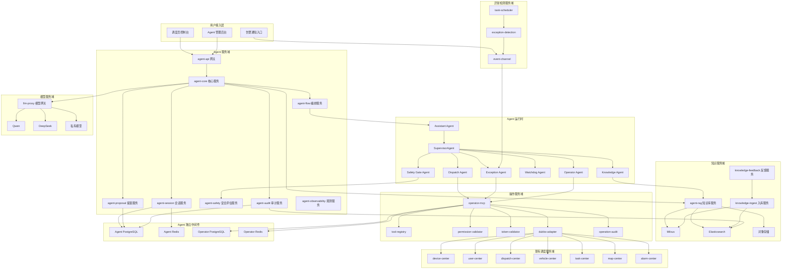

### 4.4 服务拆分与职责说明

| 服务 | 建议形态 | 核心职责 | 是否访问生产系统 | 状态存储 |
|---|---|---|---:|---|
| agent-api | Spring Boot 服务 | 对外提供聊天、会话、提案、确认、结果查询接口 | 否 | 无状态 |
| agent-core | Spring Boot 服务 | Assistant Agent 主入口、上下文组织、请求分发 | 否 | Agent PostgreSQL、Agent Redis |
| agent-flow | Spring Boot 服务或 agent-core 内部模块 | Graph Flow、固定业务流程、节点编排 | 否 | agent_graph_checkpoint |
| agent-session | 内部服务或模块 | 会话、消息、短期上下文、流式响应状态 | 否 | Agent PostgreSQL、Agent Redis |
| agent-proposal | 内部服务或模块 | 提案生成、提案状态机、审批记录 | 否 | Agent PostgreSQL |
| agent-safety | 内部服务或模块 | 安全门规则、风险评估、审批级别判定 | 只读 | Agent PostgreSQL |
| agent-rag | 独立服务 | 文档检索、RAG、引用来源、知识反馈查询 | 否 | Milvus、ES、对象存储 |
| knowledge-ingest | 离线服务 | 文档解析、切分、Embedding、索引构建 | 否 | Milvus、ES、对象存储 |
| knowledge-feedback | 内部服务或模块 | 用户纠错、人工审核、知识沉淀 | 否 | Agent PostgreSQL |
| llm-proxy | 薄网关 | 多模型路由、鉴权、限流、降级、token 统计 | 否 | 可选 PostgreSQL、Redis |
| operator-mcp | 独立服务 | MCP Server、工具注册、权限校验、token 校验、执行审计 | 是 | Operator PostgreSQL、Operator Redis |
| operator-dubbo-adapter | operator-mcp 内部模块或独立服务 | Dubbo DTO 转换、超时、熔断、降级 | 是 | 无状态 |
| exception-detection | 独立服务 | 压车检测、车辆静止检测、通信异常检测 | 只读 | Agent PostgreSQL、Agent Redis |
| event-channel | Kafka 或轻量事件表 | 异常事件流转、去重、重放 | 否 | Kafka 或 PostgreSQL |
| agent-observability | 内部服务或模块 | trace、metrics、日志、tool call 观测 | 否 | ES、Prometheus |

关键边界：

1. `agent-core` 不直接调用 Dubbo。
2. `agent-rag` 不查询生产业务库。
3. `exception-detection` 可以通过只读工具或只读 Adapter 获取业务状态，但不执行写操作。
4. `operator-mcp` 是唯一可以触达生产 Dubbo 写接口的服务。
5. `llm-proxy` 不理解业务，只做模型路由和治理。

### 4.5 Agent 内部模块架构

Agent 运行时内部建议分为六层：入口层、流程层、监督层、专业 Agent 层、工具层、状态层。

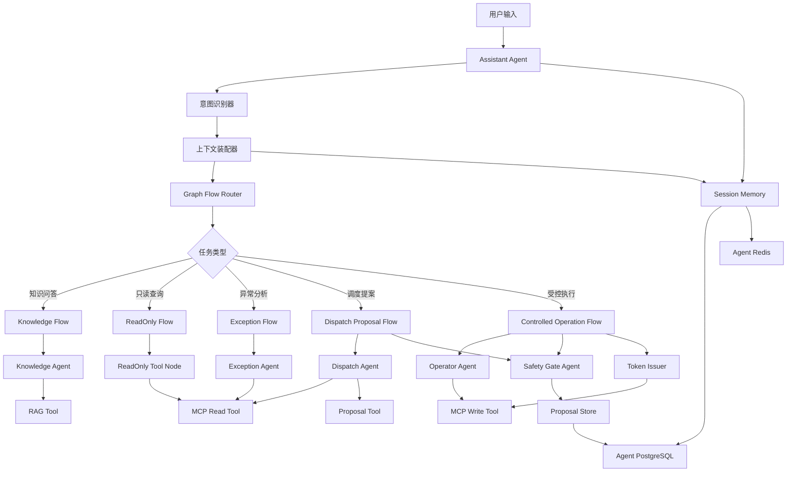

职责解释：

| 层级 | 模块 | 说明 |
|---|---|---|
| 入口层 | Assistant Agent | 负责和用户对话，不直接执行写操作 |
| 流程层 | Graph Flow Router | 根据任务类型进入固定流程 |
| 监督层 | SupervisorAgent | 在复杂任务中协调多个专业 Agent |
| 专业层 | Knowledge、Dispatch、Exception、Safety | 分别处理知识、调度、异常、安全评估 |
| 工具层 | RAG Tool、MCP Tool、Proposal Tool | 所有外部能力都工具化 |
| 状态层 | Session、Proposal、Memory、Checkpoint | 所有关键状态外置存储 |

### 4.6 Agent 之间的调用关系

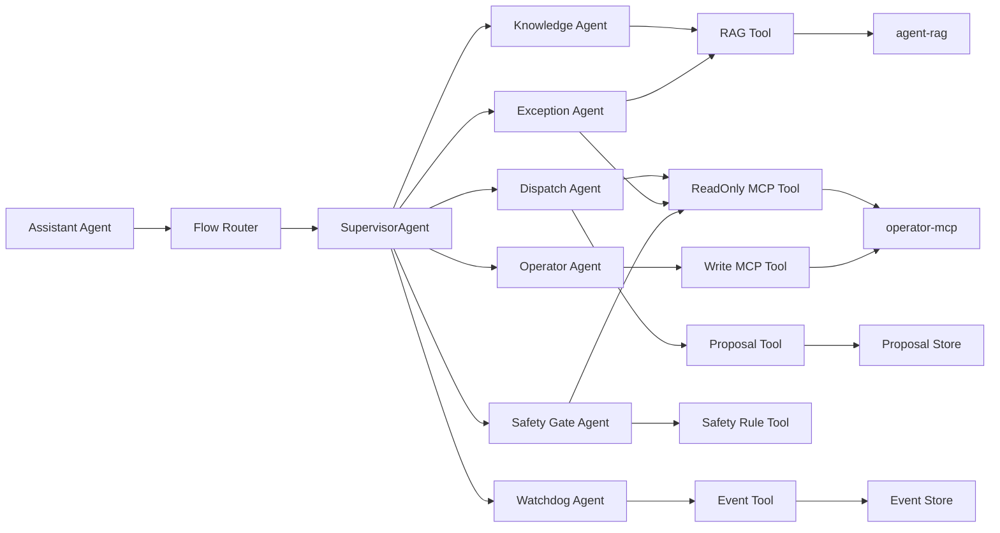

调用原则：

| 调用方 | 被调用方 | 是否允许 | 说明 |
|---|---|---:|---|
| Assistant Agent | Knowledge Agent | 允许 | 知识问答、接口文档检索 |
| Assistant Agent | Dispatch Agent | 允许 | 调度分析和提案生成 |
| Assistant Agent | operator-mcp 写工具 | 不允许 | 必须经过 Flow、Safety、用户确认 |
| Dispatch Agent | ReadOnly MCP Tool | 允许 | 获取车辆、任务、道路状态 |
| Dispatch Agent | Write MCP Tool | 不允许 | 只能生成提案 |
| Exception Agent | ReadOnly MCP Tool | 允许 | 获取异常上下文 |
| Exception Agent | Proposal Tool | 允许 | 生成处置提案 |
| Safety Gate Agent | ReadOnly MCP Tool | 允许 | 做风险评估时读取状态 |
| Safety Gate Agent | Write MCP Tool | 不允许 | 安全门不能执行操作 |
| Operator Agent | Write MCP Tool | 条件允许 | 仅在提案已批准且 token 有效后 |
| Watchdog Agent | Exception Agent | 允许 | 后台异常触发分析 |

### 4.7 服务间调用关系矩阵

| 源服务 | 目标服务 | 协议 | 调用方向 | 主要数据 | 备注 |
|---|---|---|---|---|---|
| 调度员控制台 | agent-api | HTTP、SSE、WebSocket | 用户到 Agent | 用户问题、确认动作 | WebSocket 可选，SSE 更简单 |
| agent-api | agent-core | HTTP 或进程内 | API 到核心 | ChatRequest、sessionId | 小规模可合并部署 |
| agent-core | agent-flow | 进程内或 HTTP | 核心到流程 | FlowContext | 推荐先做进程内模块 |
| agent-core | agent-session | 进程内 | 核心到状态 | message、memory | 统一落库 |
| agent-core | agent-rag | HTTP | 核心到知识 | query、filters | 返回引用来源 |
| agent-core | llm-proxy | OpenAI Compatible API | 核心到模型 | prompt、tools、schema | Agent 不直连模型供应商 |
| agent-flow | agent-proposal | 进程内或 HTTP | 流程到提案 | proposal draft | 状态机强约束 |
| agent-flow | agent-safety | 进程内或 HTTP | 流程到安全 | proposal、context | 写操作前必经 |
| agent-flow | operator-mcp | MCP | 流程到操作中心 | tool call | 只通过 MCP 调用 |
| operator-mcp | operator-dubbo-adapter | 进程内 | MCP 到 Adapter | tool args | 做 DTO 转换 |
| operator-dubbo-adapter | 现有 Dubbo 服务 | Dubbo | Adapter 到业务服务 | Dubbo request | 唯一生产调用入口 |
| exception-detection | event-channel | Kafka 或 DB | 检测到事件 | exception event | 第一阶段可用 DB 表 |
| event-channel | Exception Agent | HTTP 或内部事件 | 事件到 Agent | eventId、snapshot | 生成分析和提案 |
| knowledge-ingest | Milvus | SDK | 入库到向量库 | embedding | 离线任务 |
| knowledge-ingest | Elasticsearch | HTTP | 入库到检索 | chunks | 关键词检索 |
| agent-audit | Elasticsearch | HTTP | 审计到检索 | trace、log | 便于排查 |

### 4.8 端到端调用关系

#### 4.8.1 知识问答链路

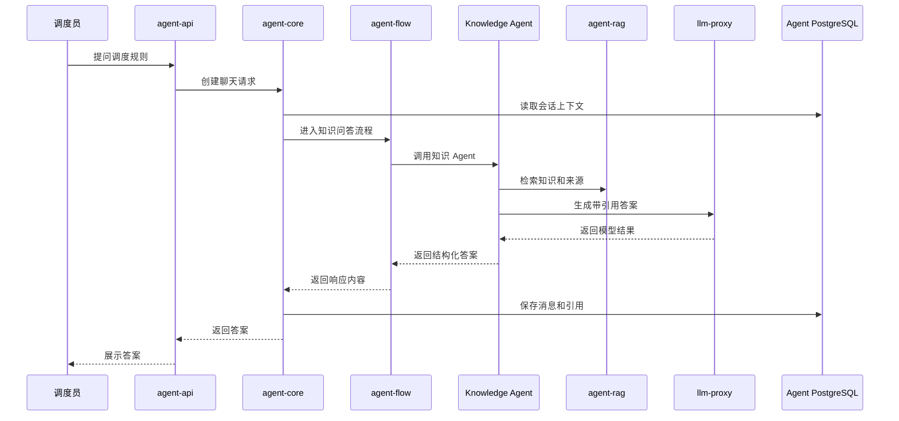

#### 4.8.2 只读状态查询链路

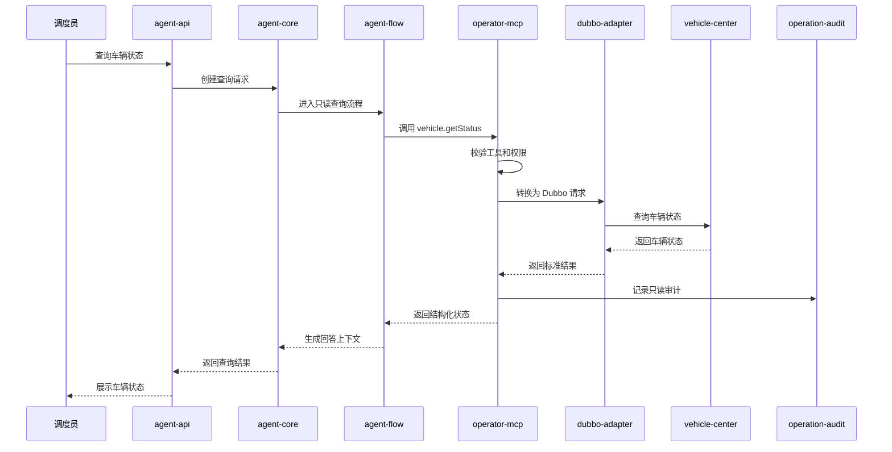

#### 4.8.3 调度提案生成链路

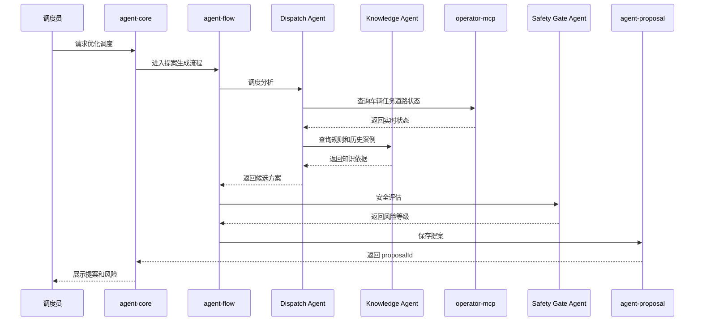

#### 4.8.4 用户确认后受控执行链路

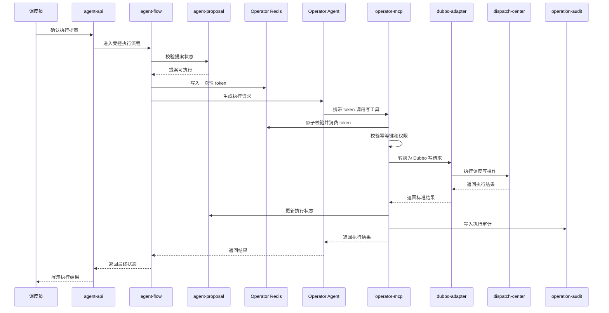

#### 4.8.5 后台异常检测到提案链路

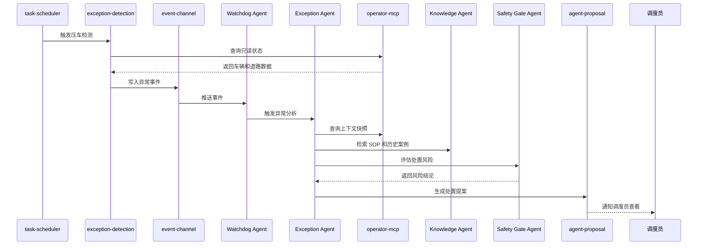

### 4.9 服务部署与实例关系

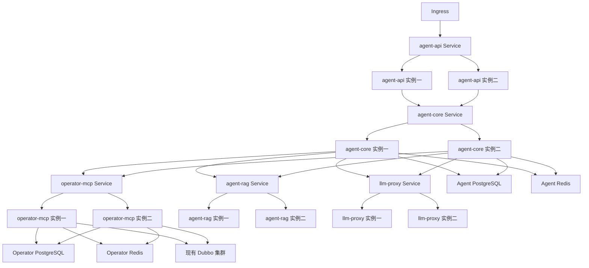

部署原则：

1. `agent-api`、`agent-core`、`operator-mcp`、`llm-proxy` 都可以多实例部署。
2. 不依赖粘性会话保证正确性。
3. SSE 流式输出可以短期粘性，但断线恢复必须依赖 `sessionId`、`messageId`、`checkpointId`。
4. 提案状态以 PostgreSQL 为准。
5. 一次性 token 以 Operator Redis 为准。
6. 写操作幂等以 `idempotencyKey` 为准。
7. `operator-mcp` 实例重启不能导致提案丢失、token 丢失或审计丢失。

### 4.10 模块调用关系的工程落地建议

第一阶段不必一开始拆成太多物理服务。建议按如下节奏演进：

| 阶段 | 服务拆分建议 | 理由 |
|---|---|---|
| Phase 0 | agent-api、agent-core、operator-mcp、llm-proxy | 先验证端到端链路 |
| Phase 1 | 增加 agent-rag、knowledge-ingest | 支撑知识问答和接口文档检索 |
| Phase 2 | 将 agent-proposal、agent-safety 模块化 | 支撑提案和安全门 |
| Phase 3 | operator-mcp 独立扩容 | 写操作和审计需要稳定性 |
| Phase 4 | 增加 exception-detection、event-channel | 支撑后台异常检测 |
| Phase 5 | 拆分 agent-observability | 支撑运行治理和审计分析 |

MVP 物理部署可以简化为：

```text
agent-api 和 agent-core 合并部署
agent-flow 作为 agent-core 内部模块
agent-proposal 作为 agent-core 内部模块
agent-safety 作为 agent-core 内部模块
agent-rag 独立部署
llm-proxy 独立部署
operator-mcp 独立部署
knowledge-ingest 离线任务部署
```

后续当调用量上来后，再把 `agent-flow`、`agent-proposal`、`agent-safety` 拆成独立服务。

## 5. Agent 编排模式选型

### 5.1 结论

矿山智能调度 Agent 不建议采用纯 ReAct 作为顶层架构。推荐采用：

```text
顶层：Graph Flow
多 Agent 编排：SupervisorAgent + Agent Tool
固定链路：SequentialAgent
并行检查：ParallelAgent
局部推理：ReactAgent
执行入口：operator-mcp
```

### 5.2 为什么不采用纯 ReAct

ReAct 的优势是灵活，适合边想边查边调用工具的任务，例如知识问答、状态排查、异常原因探索。但矿山调度系统是生产控制系统，存在高风险写操作。

纯 ReAct 的问题：

| 问题 | 对矿山调度的风险 |
|---|---|
| 路径不确定 | 无法强制写操作经过提案、安全门、确认、token |
| 工具选择漂移 | 上下文变化后可能选择错误工具 |
| 循环次数不可控 | 容易造成工具调用风暴或超时 |
| 状态恢复困难 | 中途失败后不容易从确定节点恢复 |
| 审计不稳定 | 难以把自然语言推理映射成业务状态机 |
| 安全门可能被绕过 | 不能依赖模型自觉遵守流程 |

因此：

> ReAct 可以用于局部分析，但不能作为矿山调度系统的顶层控制流。

### 5.3 为什么采用 Graph Flow

Graph Flow 适合表达确定性业务流程：

```text
输入识别
  -> 上下文补全
  -> 只读工具查询
  -> 提案生成
  -> 安全评估
  -> 用户确认
  -> token 发放
  -> operator-mcp 执行
  -> 审计落库
```

这些节点不应该由 LLM 临时决定是否跳过，而应该由代码和流程引擎强制执行。

### 5.4 顶层 Flow 设计

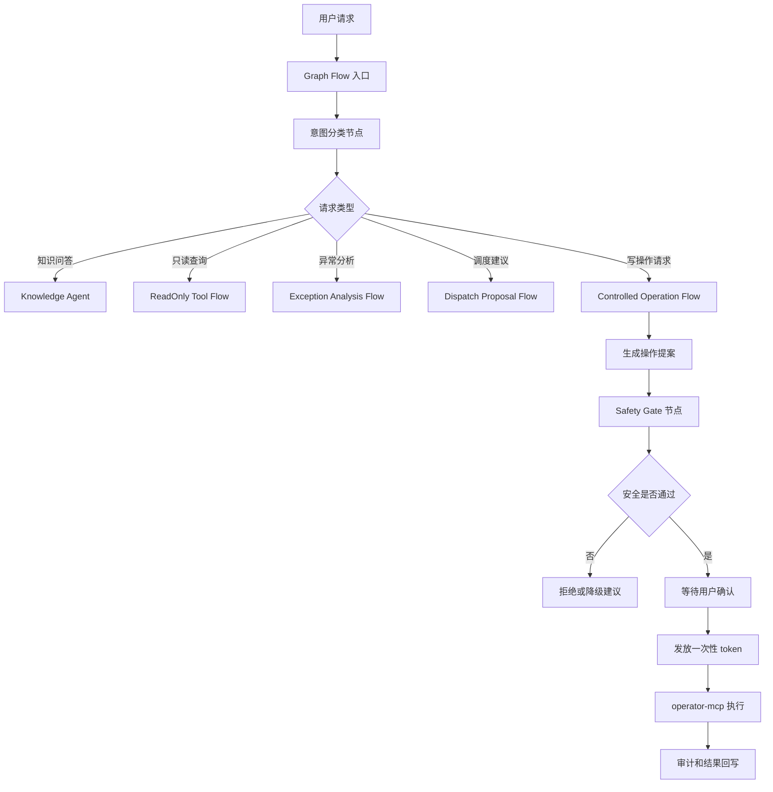

### 5.5 ReactAgent 使用边界

| Agent | 是否适合使用 ReAct | 工具权限 |
|---|---:|---|
| Knowledge Agent | 适合 | RAG、文档检索 |
| Exception Agent | 适合 | 只读状态查询、SOP 检索 |
| Dispatch Agent | 适合 | 只读状态查询、提案生成 |
| Safety Gate Agent | 谨慎使用 | 只做辅助解释，最终必须结构化输出 |
| Operator Agent | 不建议 | 不允许自然语言自由执行写操作 |
| Assistant Agent 顶层 | 不建议纯 ReAct | 必须走 Graph Flow |

建议约束：

| 参数 | 建议 |
|---|---|
| maxSteps | 3 到 5 |
| timeout | 必须设置 |
| tools | 最小必要工具集合 |
| output schema | 必须结构化 |
| includeContents | 默认 false |
| returnReasoningContent | 默认 false |
| fallback | 失败后进入人工处理或降级回复 |

---

## 6. Multi Agent 模式设计

### 6.1 模式选择

Spring AI Alibaba Multi-agent 适合把复杂应用拆成多个专业 Agent 协作。结合矿山调度场景，推荐：

| 模式 | 是否采用 | 用途 |
|---|---:|---|
| SupervisorAgent | 强推荐 | 多步骤任务编排，适合异常分析和提案生成 |
| Agent Tool | 强推荐 | 把 Knowledge、Dispatch、Exception、Safety 等子 Agent 工具化 |
| SequentialAgent | 推荐 | 固定链路，例如提案生成后必须安全评估 |
| ParallelAgent | 推荐 | 并行做风险检查、SOP 检索、历史案例检索 |
| LlmRoutingAgent | 谨慎使用 | 简单单次路由，例如知识问答还是状态查询 |
| Handoffs | 第一阶段不推荐 | 不适合作为安全敏感系统主流程 |
| 自定义 FlowAgent | 后续推荐 | 固化企业审批流、异常流、回滚流 |

### 6.2 为什么以 SupervisorAgent + Agent Tool 为主

矿山调度中的复杂任务通常不是单步动作，而是：

```text
识别异常
  -> 查询实时状态
  -> 检索 SOP
  -> 检索历史案例
  -> 生成候选方案
  -> 做风险评估
  -> 输出提案
```

这天然适合 SupervisorAgent。SupervisorAgent 可以让子 Agent 执行后返回监督者，由监督者继续决定下一步或结束任务。

### 6.3 为什么不以 Handoffs 为主

Handoffs 更适合专家接管式对话，例如客服从技术支持转到财务支持。但矿山调度要求：

- 统一安全门
- 统一审计
- 统一提案状态
- 统一 token 发放
- 写操作路径固定
- 用户不能被随机切换到某个 Agent 后绕过主流程

因此，Handoffs 可以作为后续增强能力，但第一阶段不作为主架构。

### 6.4 推荐 Multi Agent 工作流

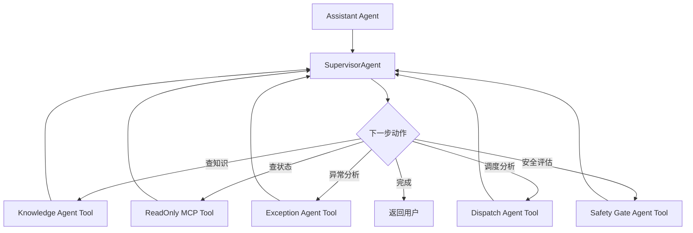

### 6.5 典型编排方式

#### 6.5.1 只读问答

```text
Assistant Agent
  -> 规则分类或 LlmRoutingAgent
  -> Knowledge Agent
  -> RAG
  -> 返回带来源答案
```

#### 6.5.2 异常分析

```text
Assistant Agent
  -> SupervisorAgent
  -> Exception Agent
  -> Knowledge Agent
  -> ReadOnly MCP Tool
  -> Dispatch Agent
  -> Safety Gate Agent
  -> 生成提案
```

#### 6.5.3 写操作

```text
Assistant Agent
  -> Controlled Operation Flow
  -> Proposal Flow
  -> Safety Gate
  -> 用户确认
  -> 一次性 token
  -> operator-mcp
  -> Dubbo Adapter
```

---

## 7. Agent 体系设计

### 7.1 Agent 清单

| Agent | 职责 | 是否允许直接写生产系统 |
|---|---|---:|
| Assistant Agent | 用户主入口，识别意图、组织上下文、返回回答 | 否 |
| Knowledge Agent | 检索知识库、接口文档、SOP、制度文档 | 否 |
| Dispatch Agent | 生成调度分析、调度建议、提案草稿 | 否 |
| Exception Agent | 分析异常事件，生成处置建议和提案草稿 | 否 |
| Watchdog Agent | 接收后台算法事件，触发异常分析 | 否 |
| Safety Gate Agent | 对提案进行风险评估和安全兜底 | 否 |
| Operator Agent | 将已批准提案转换为 MCP 调用 | 只能通过 operator-mcp |

### 7.2 Assistant Agent

职责：

- 接收用户自然语言请求
- 识别意图类型
- 判断是知识问答、只读查询、异常分析还是写操作请求
- 对复杂任务进行拆解
- 调用合适的 SubAgent
- 生成最终回复
- 对写操作生成 Proposal，而不是直接执行

典型意图：

| 意图 | 示例 | 处理方式 |
|---|---|---|
| 知识问答 | 压车怎么处理 | 调用 Knowledge Agent |
| 状态查询 | 查 truck-101 当前状态 | 调用只读 MCP 工具 |
| 异常分析 | 为什么 A 路段堵车 | 调用 Exception Agent |
| 操作建议 | 是否要调整车辆路线 | 调用 Dispatch Agent |
| 写操作 | 把 truck-101 调到 A 装载点 | 生成 Proposal |

### 7.3 Knowledge Agent

职责：

- 检索调度规则
- 检索接口文档
- 检索 SOP
- 检索历史案例
- 输出带来源的答案

禁止行为：

- 不根据记忆编造接口
- 不把历史案例当实时状态
- 不直接访问生产数据库

### 7.4 Dispatch Agent

职责：

- 结合车辆状态、任务状态、道路状态、高精地图语义生成调度建议
- 输出结构化调度提案
- 不直接执行调度操作

输出应包含：

- 当前状态判断
- 约束条件
- 可选方案
- 推荐方案
- 影响分析
- 风险点
- 回滚建议

### 7.5 Exception Agent

职责：

- 处理压车、拥堵、车辆静止、通信异常、任务超时等事件
- 结合知识库和实时业务接口做原因分析
- 生成处置建议或操作提案

### 7.6 Watchdog Agent

职责：

- 接收后台算法检测结果
- 汇总异常事件
- 对高严重度事件触发 Exception Agent
- 第一阶段可以只做 mock 或规则触发

### 7.7 Safety Gate Agent

职责：

- 对 Proposal 做最终安全评估
- 判断风险等级
- 判断是否允许进入用户确认阶段
- 判断是否需要二次确认或多角色审批

评估维度：

- 用户权限
- 操作类型
- 目标车辆
- 目标矿区
- 当前任务状态
- 道路状态
- 是否影响其他车辆
- 是否高风险时间段
- 是否违反 SOP
- 是否存在回滚方案
- 地图鲜度和地图置信度

---

## 8. LLM Proxy Router 设计

### 8.1 定位

新增一个轻量 LLM Proxy Router，类似 New API 的定位，但第一阶段只做最小必要能力。

目标：

- 多模型供应商路由
- 避免单一供应商故障
- 统一鉴权
- 统一限流
- 统一模型能力管理
- 统一 token 和成本统计
- 统一日志脱敏
- Agent 侧只对接一个 OpenAI Compatible 入口

### 8.2 LLM Proxy 最小能力

| 能力 | 第一阶段是否需要 | 说明 |
|---|---:|---|
| OpenAI Compatible Chat API | 是 | Agent 侧只对接一种协议 |
| Embedding API 转发 | 是 | RAG 构建和查询需要 |
| 多供应商路由 | 是 | 避免单模型供应商故障 |
| 加权路由 | 是 | 主用 Qwen，备用 DeepSeek 或私有模型 |
| 自动失败重试 | 是 | 上游失败后切备用供应商 |
| 模型能力注册表 | 是 | 标记 tool calling、structured output、长上下文 |
| 用户级限流 | 是 | 防止单用户打爆模型预算 |
| 成本和 token 统计 | 是 | 后续做成本治理 |
| Prompt 日志脱敏 | 是 | 调度业务数据要避免泄露 |
| 复杂计费系统 | 否 | 内部系统第一阶段不需要 |
| 多租户商业化 | 否 | 内部系统第一阶段不需要 |

### 8.3 LLM Proxy 架构

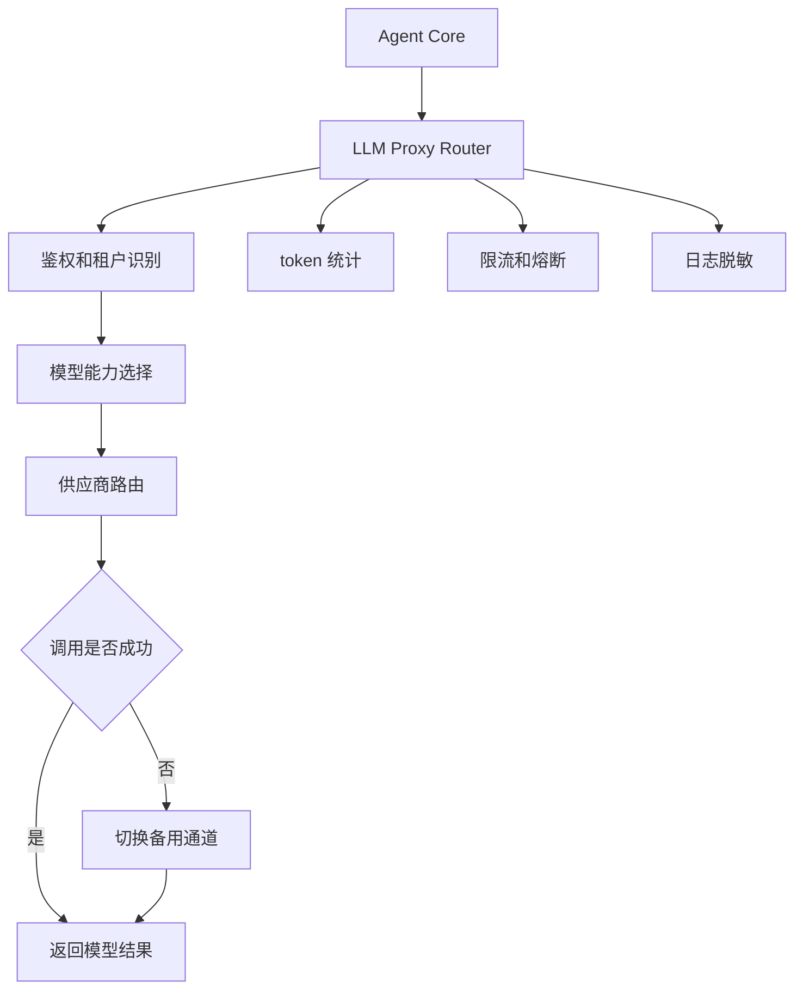

### 8.4 模型路由策略

| 场景 | 首选模型 | 备用模型 | 说明 |
|---|---|---|---|
| 普通知识问答 | Qwen 中等模型 | DeepSeek Chat | 成本优先 |
| 调度提案生成 | Qwen 强模型 | 私有强模型 | 稳定性和结构化输出优先 |
| Safety Gate | 规则引擎 + 强模型 | 规则引擎兜底 | 不能完全依赖 LLM |
| Embedding | 固定 embedding 模型 | 同维度备用模型 | 避免向量维度不一致 |
| 离线知识入库 | 低成本模型 | 暂停重试 | 不影响在线链路 |

### 8.5 Spring AI 接入方式

Agent 服务只配置一个模型入口：

```yaml
spring:
  ai:
    openai:
      base-url: http://llm-proxy.internal/v1
      api-key: ${AGENT_LLM_PROXY_KEY}
```

LLM Proxy 内部再决定实际调用哪一个供应商：

```text
agent-core
  -> llm-proxy
  -> qwen
  -> deepseek
  -> private-model
  -> fallback-model
```

注意：

1. Agent 侧不要散落多个供应商 SDK。
2. Tool calling 能力必须在模型能力注册表中声明。
3. Safety Gate 使用的模型应与普通问答模型隔离。
4. Embedding 模型不要随意切换，避免向量维度不一致。
5. 重要链路要记录 model、provider、latency、token usage、finish reason。

---

## 9. 独立中间件与生产隔离

### 9.1 结论

Agent 体系建议独立使用 PostgreSQL、Redis、Milvus、Elasticsearch 实例，至少使用独立集群命名空间、独立账号、独立权限，不与生产调度系统共用业务库和缓存。

原因：

1. 故障隔离：Agent 的长会话、RAG、token、trace 不应影响生产调度链路。
2. 权限隔离：Agent 不应获得生产库直连权限。
3. 生命周期不同：会话、提案、审计、知识反馈与生产业务数据保留周期不同。
4. 性能特征不同：RAG 检索和 embedding 入库可能产生突发 IO。
5. 安全审计清晰：Agent 所有数据访问都能在独立库中追踪。

### 9.2 推荐中间件

| 组件 | 建议 |
|---|---|
| Agent PostgreSQL | 存储会话、Memory、提案、审计、工具注册表 |
| Agent Redis | 存储短期上下文、流式响应状态、分布式锁 |
| Operator PostgreSQL | 存储工具注册、操作审计、幂等记录 |
| Operator Redis | 存储一次性 token、token used 标记、全局限流 |
| Milvus | 存储知识库向量 |
| Elasticsearch | 存储审计日志、关键词索引、检索辅助 |
| Object Storage | 存储文档原文、解析结果、附件 |
| Kafka | 后续用于异常事件流，第一阶段可先不用 |

### 9.3 隔离架构

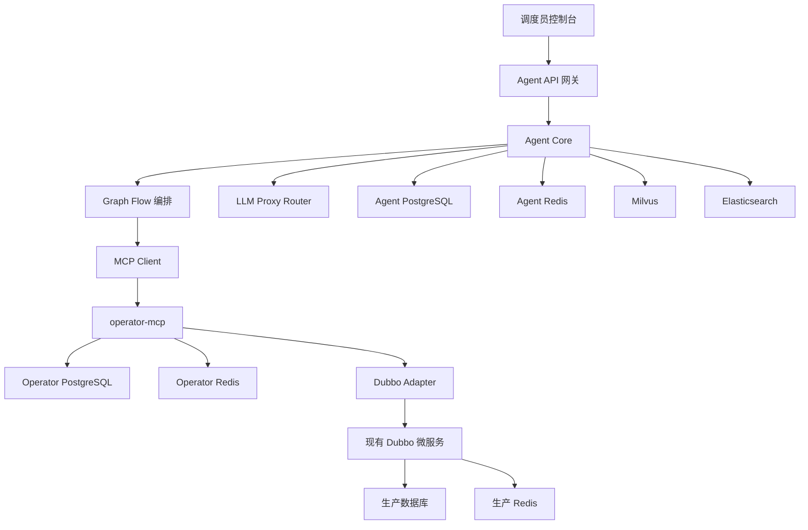

---

## 10. operator-mcp 设计

### 10.1 定位

`operator-mcp` 是整个系统的**操作防火墙**。

它不是普通 MCP Server，而是：

- 工具注册中心
- 权限中心
- 提案执行中心
- Dubbo 防腐层
- 审计中心
- 限流熔断层
- token 校验层
- 幂等控制层

所有影响调度平台状态的操作必须通过 operator-mcp。

### 10.2 operator-mcp 是否有状态

结论：

> operator-mcp 从业务语义上是有状态的，但从服务实例角度必须设计为无状态。

更准确地说：

```text
有状态的是 Proposal、Token、Audit、Idempotency、Tool Registry；
不是某一个 operator-mcp Pod 的内存。
```

### 10.3 operator-mcp 状态分布

| 状态 | 存储位置 | 是否允许只存在实例内存 |
|---|---|---:|
| Tool Registry | PostgreSQL + 本地只读缓存 | 否 |
| Proposal 状态 | PostgreSQL | 否 |
| 一次性 token | Redis | 否 |
| token used 标记 | Redis 原子操作 | 否 |
| 审计日志 | PostgreSQL 或 Elasticsearch | 否 |
| 幂等记录 | PostgreSQL 或 Redis | 否 |
| Dubbo 连接池 | 实例内存 | 是 |
| 本地限流计数 | 实例内存 | 低风险可用 |
| 高风险限流计数 | Redis | 否 |

### 10.4 operator-mcp 内部架构

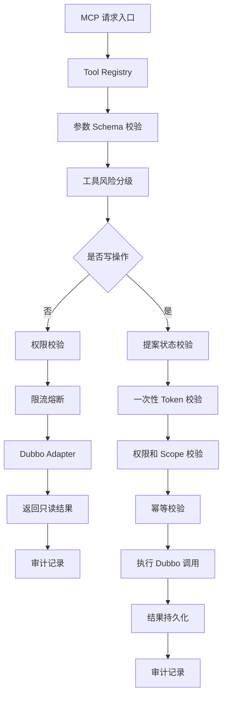

### 10.5 operator-mcp 多实例部署

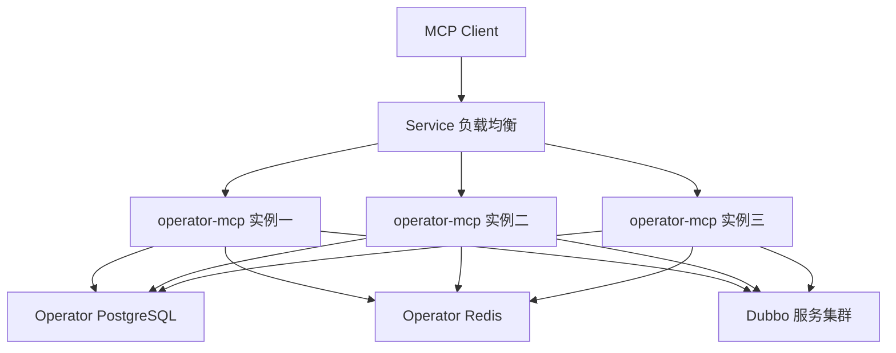

多实例关键点：

1. 不依赖 sticky session。
2. 提案状态读写必须落库。
3. token 校验必须使用 Redis 原子操作。
4. 写操作必须有 idempotencyKey。
5. Dubbo 调用失败后不能盲目重试非幂等写操作。
6. 所有执行结果必须以 proposalId 和 operationId 关联。

### 10.6 Tool 定义示例

```json
{
  "toolName": "dispatch.adjustVehicleTask",
  "description": "调整指定车辆的调度任务",
  "operationType": "WRITE",
  "riskLevel": "HIGH",
  "requiredPermission": "DISPATCH_TASK_ADJUST",
  "requiredToken": true,
  "idempotentKeyFields": ["proposalId", "vehicleId", "targetTaskId"],
  "timeoutMs": 3000,
  "rateLimit": {
    "userQps": 1,
    "globalQps": 10
  },
  "parameters": {
    "proposalId": "string",
    "vehicleId": "string",
    "targetTaskId": "string",
    "reason": "string"
  }
}
```

### 10.7 工具开放策略

第一阶段建议只开放：

| 工具 | 类型 | 风险 |
|---|---|---|
| vehicle.getStatus | 只读 | 低 |
| vehicle.listNearby | 只读 | 低 |
| task.getCurrentTask | 只读 | 低 |
| dispatch.getQueueStatus | 只读 | 中 |
| map.getRoadSegmentStatus | 只读 | 中 |
| alarm.listActiveAlarms | 只读 | 中 |
| proposal.create | 写 Agent 内部表 | 低 |
| proposal.approve | 写 Agent 内部表 | 中 |
| dispatch.markSuggestion | 低风险写 | 中 |

第一阶段不建议开放：

- 强制停车
- 批量改派
- 封路
- 调整全局调度策略
- 直接修改车辆任务状态
- 直接清除安全告警

---

## 11. Agent 服务状态与多实例处理

### 11.1 Agent 服务是否有状态

结论：

> Agent 服务从业务上依赖状态，但服务实例本身必须无状态。

Agent 需要的状态包括：

- 会话历史
- Memory
- 当前任务上下文
- 提案状态
- 工具调用记录
- 流式响应进度
- 用户确认状态
- Graph 执行快照

这些状态都不能只放在某个 JVM 内存里。

### 11.2 状态存储建议

| 状态 | 存储 |
|---|---|
| 会话消息 | PostgreSQL |
| 短期上下文缓存 | Redis |
| 长期 Memory | PostgreSQL |
| 提案状态 | PostgreSQL |
| 流式响应临时状态 | Redis |
| 工具调用日志 | PostgreSQL 或 Elasticsearch |
| Graph 执行快照 | PostgreSQL JSONB |
| 用户确认状态 | PostgreSQL |
| 后台任务锁 | Redis 或 PostgreSQL |

### 11.3 Agent 多实例部署

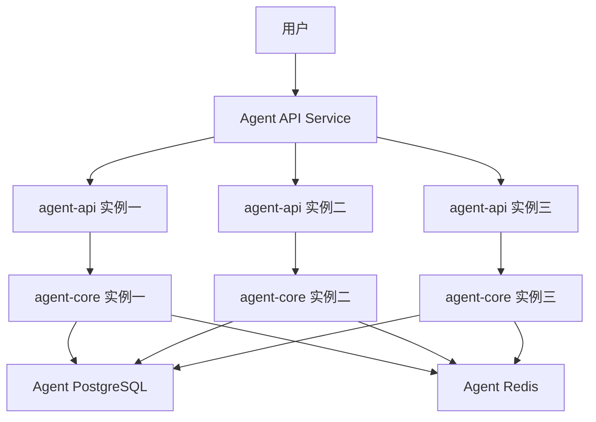

原则：

1. HTTP 普通请求不需要粘性会话。
2. SSE 或 WebSocket 流式响应可以使用短期粘性会话，但不能依赖它保证正确性。
3. 断线重连必须通过 sessionId 和 messageId 恢复。
4. Graph 执行中的关键状态必须可落库。
5. 用户确认按钮不能依赖内存状态，必须读 Proposal Store。

### 11.4 后台任务多实例处理

后台压车检测、异常巡视任务需要避免多实例重复执行。

推荐方案：

| 方案 | 推荐度 | 说明 |
|---|---:|---|
| Redis 分布式锁 | 高 | 简单直接，适合第一阶段 |
| ShedLock + PostgreSQL | 高 | Java 生态常用，适合定时任务 |
| Quartz Cluster | 中 | 稍重，适合复杂调度 |
| Kafka 消费组 | 中高 | 适合事件流驱动 |
| 单实例 CronJob | 中 | 简单但可用性弱 |

第一阶段建议：

```text
Spring Scheduler
  -> Redis 分布式锁
  -> 执行检测
  -> 写 agent_exception_event
  -> 推送 Exception Agent
```

---

## 12. 安全与权限体系

### 12.1 操作分级

| 类型 | 示例 | 是否需要提案 | 是否需要用户确认 | 是否需要 token |
|---|---|---:|---:|---:|
| 只读 | 查询车辆状态 | 否 | 否 | 否 |
| 低风险写 | 标记建议已读 | 是 | 是 | 是 |
| 中风险写 | 调整任务优先级 | 是 | 是 | 是 |
| 高风险写 | 车辆任务重分配 | 是 | 是 | 是 |
| 极高风险 | 停车、封路、批量调度 | 是 | 多角色审批 | 是 |

### 12.2 写操作安全链路

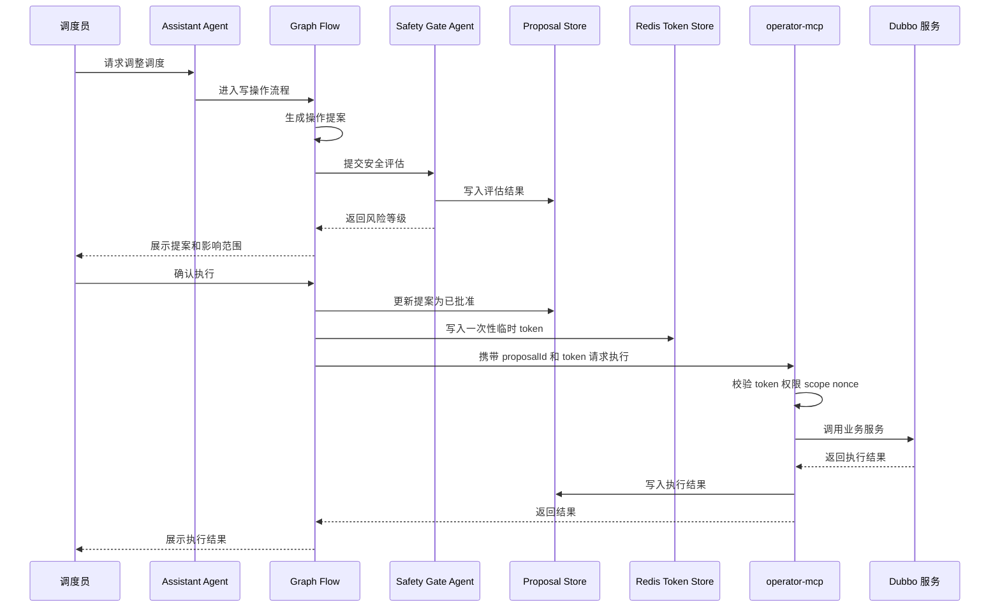

### 12.3 一次性 token 结构

```json
{
  "tokenId": "tok_20260415_xxx",
  "userId": "u123",
  "proposalId": "p987",
  "operationType": "dispatch.adjustVehicleTask",
  "scope": {
    "mineId": "mine-001",
    "vehicleIds": ["truck-102"],
    "taskIds": ["task-7788"]
  },
  "expireTime": "2026-04-15T10:30:00+09:00",
  "nonce": "random-uuid",
  "used": false
}
```

### 12.4 token 原子消费

执行写操作时，operator-mcp 必须用 Redis 原子逻辑消费 token：

```text
校验 token 存在
校验 userId
校验 proposalId
校验 operationType
校验 scope
校验未使用
标记为已使用
设置短期 used 记录
```

该过程必须是原子操作，可以使用 Redis Lua 脚本，避免两个 operator-mcp 实例同时消费同一个 token。

### 12.5 必须拒绝的情况

operator-mcp 执行写操作前，以下情况必须拒绝：

- token 不存在
- token 已过期
- token 已使用
- proposalId 不匹配
- userId 不匹配
- operationType 不匹配
- scope 越权
- Safety Gate 未通过
- 提案状态不是可执行状态
- 参数与提案内容不一致
- 幂等键重复且状态异常

---

## 13. 操作提案机制

### 13.1 Proposal 数据结构

```json
{
  "proposalId": "p_20260415_0001",
  "userId": "u_001",
  "sessionId": "s_001",
  "intent": "调整车辆 truck-102 到新的装载任务",
  "riskLevel": "HIGH",
  "operationType": "dispatch.adjustVehicleTask",
  "targetObjects": {
    "mineId": "mine-001",
    "vehicleIds": ["truck-102"],
    "taskIds": ["task-7788"]
  },
  "preCheckResult": {
    "vehicleOnline": true,
    "vehicleLoaded": false,
    "roadAvailable": true,
    "conflictDetected": false
  },
  "safetyAssessment": {
    "passed": true,
    "riskItems": ["任务变更会影响当前排队顺序"],
    "requiredApprovalLevel": "USER_CONFIRM"
  },
  "recommendedAction": "将 truck-102 从等待区调度至 A 区装载点",
  "impactAnalysis": "预计减少 A 区装载等待时间 6 分钟，不影响当前卸载队列",
  "rollbackPlan": "若执行失败，恢复 truck-102 原任务并重新进入等待队列",
  "status": "WAIT_USER_CONFIRM",
  "auditTraceId": "trace-xxx",
  "createdAt": "2026-04-15T10:00:00+09:00"
}
```

### 13.2 Proposal 状态机

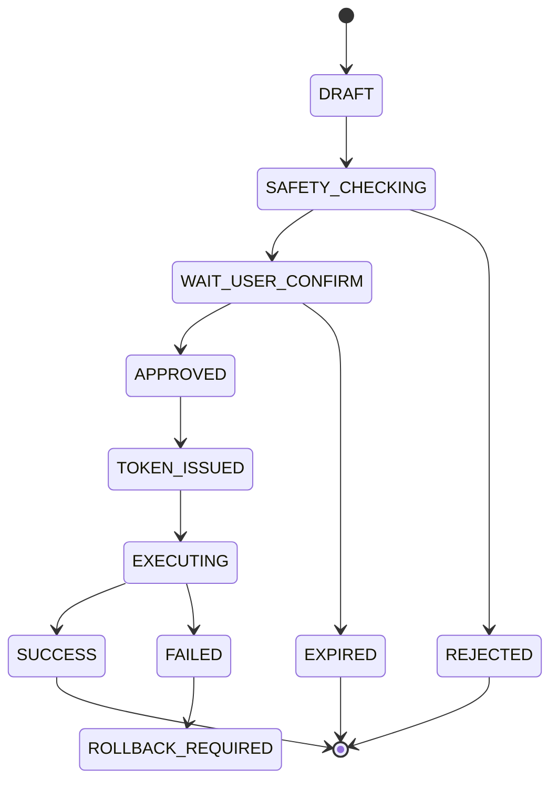

### 13.3 状态说明

| 状态 | 说明 |
|---|---|
| DRAFT | Agent 初步生成草稿 |
| SAFETY_CHECKING | 安全门评估中 |
| WAIT_USER_CONFIRM | 等待用户确认 |
| APPROVED | 用户已确认 |
| TOKEN_ISSUED | 已签发一次性 token |
| EXECUTING | operator-mcp 正在执行 |
| SUCCESS | 执行成功 |
| FAILED | 执行失败 |
| REJECTED | 安全门或用户拒绝 |
| EXPIRED | 超时未确认 |
| ROLLBACK_REQUIRED | 需要人工或系统回滚 |

### 13.4 幂等键建议

```text
idempotencyKey = hash(proposalId + operationType + targetObjectIds + approvedVersion)
```

幂等表字段：

| 字段 | 说明 |
|---|---|
| idempotency_key | 幂等键 |
| proposal_id | 提案 ID |
| operation_type | 操作类型 |
| request_hash | 请求参数摘要 |
| status | EXECUTING SUCCESS FAILED |
| result_json | 执行结果 |
| created_at | 创建时间 |
| updated_at | 更新时间 |

---

## 14. 知识库与 Memory 设计

### 14.1 知识库内容

| 知识类型 | 示例 |
|---|---|
| 接口文档 | Dubbo 接口、HTTP 网关接口、字段说明 |
| 调度规则 | 车辆优先级、装载区规则、卸载区规则 |
| SOP | 车辆离线、压车、通信异常、道路拥堵处理 |
| 设备文档 | 矿卡、挖机、基站、调度终端 |
| 地图知识 | 道路、坡道、装载点、卸载点、禁行区 |
| 历史案例 | 异常处置记录、事故复盘 |
| 安全文档 | 高风险操作约束、审批制度 |
| 系统手册 | 调度平台使用说明、运维手册 |

### 14.2 RAG 流程

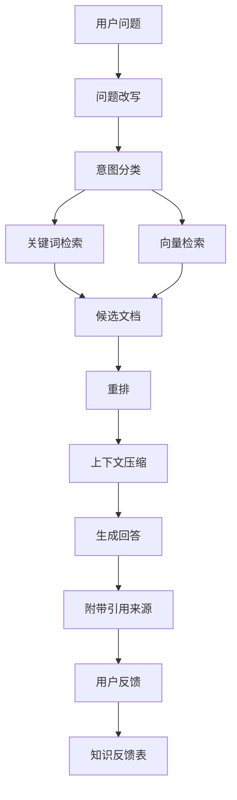

### 14.3 文档切分策略

| 文档类型 | 切分策略 |
|---|---|
| 接口文档 | 按服务、接口、方法切分 |
| SOP | 按场景、步骤、注意事项切分 |
| 调度规则 | 按规则条款切分 |
| 地图语义 | 按矿区、道路段、装卸点切分 |
| 历史案例 | 按事件、原因、处置、结果切分 |

### 14.4 Memory 分类

| Memory 类型 | 生命周期 | 存储 |
|---|---|---|
| 会话 Memory | 当前会话 | Redis + PostgreSQL |
| 用户偏好 Memory | 长期 | PostgreSQL |
| 业务事件 Memory | 中期 | PostgreSQL + ES |
| 提案 Memory | 长期 | PostgreSQL |
| 工具调用 Memory | 长期 | PostgreSQL + ES |
| 短期推理上下文 | 单次请求 | 进程内上下文 + Redis 快照 |

### 14.5 用户纠错沉淀机制

```mermaid
sequenceDiagram
    participant User as 用户
    participant Agent as Assistant Agent
    participant KB as 知识库服务
    participant Review as 人工审核
    participant Vector as 向量库

    User->>Agent: 指出答案错误并给出正确说法
    Agent->>KB: 生成知识反馈记录
    KB->>Review: 进入审核队列
    Review->>KB: 审核通过
    KB->>Vector: 重新切分并生成 embedding
    Vector-->>KB: 更新索引
```

---

## 15. 异常检测与后台任务

### 15.1 基本原则

压车检测、车辆长时间静止检测、通信异常检测、任务超时检测等算法**不应依赖 LLM**。

LLM 的职责是：

- 解释异常
- 关联上下文
- 检索 SOP
- 生成处置提案
- 提醒调度员确认

### 15.2 异常事件结构

```json
{
  "eventId": "evt_20260415_0001",
  "eventType": "VEHICLE_CONGESTION",
  "mineId": "mine-001",
  "roadSegmentId": "road-A-12",
  "involvedVehicles": ["truck-101", "truck-102", "truck-103"],
  "severity": "HIGH",
  "detectedAt": "2026-04-15T10:00:00+09:00",
  "evidence": {
    "avgSpeed": 1.2,
    "durationSeconds": 480,
    "queueLength": 5,
    "mapConfidence": 0.92
  },
  "contextSnapshot": {
    "nearbyShovel": "shovel-07",
    "nearestDumpPoint": "dump-02",
    "roadStatus": "AVAILABLE",
    "weather": "NORMAL"
  },
  "suggestedAction": "分析是否需要调整后续车辆路线"
}
```

### 15.3 后台异常链路

```mermaid
flowchart TD
    A[定时任务] --> B[压车检测算法]
    B --> C{是否异常}
    C -- 否 --> D[记录巡检结果]
    C -- 是 --> E[生成异常事件]
    E --> F[事件通道]
    F --> G[Exception Agent]
    G --> H[查询车辆道路任务上下文]
    H --> I[检索 SOP 和历史案例]
    I --> J[生成处置提案]
    J --> K[Safety Gate 评估]
    K --> L[通知调度员确认]
```

### 15.4 压车检测建议逻辑

第一阶段可以先用规则算法：

```text
当同一路段内车辆数量超过阈值，且平均速度低于阈值，持续时间超过阈值，则判定为疑似压车。
```

输入：

- 车辆位置
- 车辆速度
- 道路段 ID
- 当前任务状态
- 装载点排队长度
- 卸载点排队长度
- 高精地图道路语义
- 地图鲜度
- 地图置信度

输出：

- 是否压车
- 严重程度
- 涉及车辆
- 证据数据
- 建议触发的 Agent

---

## 16. Spring AI Alibaba 落地方案

### 16.1 推荐使用方式

| 能力 | 建议实现 |
|---|---|
| ChatClient | Assistant Agent 主对话入口 |
| Tool Calling | 只读工具调用、提案生成工具 |
| MCP | operator-mcp 对外工具协议 |
| Advisor | RAG、Memory、安全前置检查、审计增强 |
| Prompt Template | 不同 Agent 的系统提示词模板 |
| Structured Output | 提案、异常分析、安全评估输出 |
| RAG | 知识库检索增强 |
| Memory | 多轮会话和用户偏好 |
| Observability | traceId、tool call、token、延迟统计 |
| Multi Agent | SupervisorAgent + Agent Tool |
| FlowAgent | 固定调度流程、安全流程、回滚流程 |
| ReactAgent | 专业子 Agent 局部工具调用 |

### 16.2 工程模块

```text
mine-agent-platform
├── agent-api
├── agent-core
├── agent-flow
├── agent-memory
├── agent-rag
├── agent-safety
├── agent-proposal
├── agent-observability
├── llm-proxy
├── operator-mcp
├── operator-dubbo-adapter
├── exception-detection
└── common-domain
```

### 16.3 Java 版本策略

| 模块 | 建议 JDK | 原因 |
|---|---:|---|
| 现有 Dubbo 服务 | Java8 | 保持稳定 |
| operator-dubbo-adapter | Java8 或 Java17 双方案 | 取决于 Dubbo 版本兼容性 |
| agent-core | Java17+ | 适配新 AI 工程生态 |
| agent-rag | Java17+ | 使用新框架能力 |
| agent-flow | Java17+ | 使用 Agent Framework 和 Graph 能力 |
| operator-mcp | Java17+ 优先 | MCP 和 Agent 生态更适配 |
| llm-proxy | Java17+ 或 Go | 薄网关，语言可按团队能力选择 |

务实建议：

> 不要把 Spring AI Alibaba 强行塞进老 Java8 调度服务里。

正确做法是新增独立 Agent 服务，通过 operator-mcp / Adapter 与老系统交互。

---

## 17. 与现有 Dubbo 微服务集成

### 17.1 防腐层设计

```mermaid
flowchart LR
    A[Agent 世界] --> B[operator-mcp]
    B --> C[Dubbo Adapter]
    C --> D[领域 DTO 转换]
    D --> E[老 Dubbo 服务]
```

### 17.2 集成原则

1. 不直接改调度核心链路。
2. 不直接访问生产数据库。
3. 不直接访问生产 Redis、Kafka 等中间件。
4. Dubbo 接口必须通过 Adapter 封装。
5. Adapter 内部做字段转换、异常转换、超时控制。
6. 工具开放必须逐个评审。
7. 先开放只读工具，再开放低风险写工具。

### 17.3 Dubbo 调用治理

| 机制 | 要求 |
|---|---|
| 超时 | 每个工具单独配置 timeout |
| 限流 | 工具级、用户级、全局级 |
| 熔断 | Dubbo 异常率过高时降级 |
| 重试 | 只读请求可有限重试，写请求默认不自动重试 |
| 降级 | 返回结构化错误和人工处理建议 |
| 审计 | 每次调用记录 traceId、toolName、latency、status |

---

## 18. 数据模型设计

### 18.1 agent_session

| 字段 | 说明 |
|---|---|
| id | 主键 |
| session_id | 会话 ID |
| user_id | 用户 ID |
| mine_id | 矿区 ID |
| title | 会话标题 |
| status | 状态 |
| created_at | 创建时间 |
| updated_at | 更新时间 |

### 18.2 agent_message

| 字段 | 说明 |
|---|---|
| id | 主键 |
| session_id | 会话 ID |
| role | user assistant tool system |
| content | 消息内容 |
| trace_id | 调用链 ID |
| created_at | 创建时间 |

### 18.3 agent_memory

| 字段 | 说明 |
|---|---|
| id | 主键 |
| memory_id | 记忆 ID |
| user_id | 用户 ID |
| session_id | 会话 ID |
| memory_type | 会话、用户偏好、业务事件 |
| content | 记忆内容 |
| source | 来源 |
| importance | 重要性 |
| expire_at | 过期时间 |
| created_at | 创建时间 |

### 18.4 agent_graph_checkpoint

| 字段 | 说明 |
|---|---|
| id | 主键 |
| checkpoint_id | 快照 ID |
| session_id | 会话 ID |
| message_id | 消息 ID |
| graph_name | Flow 名称 |
| node_name | 当前节点 |
| state_json | Graph 状态 |
| status | RUNNING SUCCESS FAILED |
| created_at | 创建时间 |
| updated_at | 更新时间 |

### 18.5 agent_proposal

| 字段 | 说明 |
|---|---|
| id | 主键 |
| proposal_id | 提案 ID |
| user_id | 用户 ID |
| session_id | 会话 ID |
| intent | 用户意图 |
| operation_type | 操作类型 |
| risk_level | 风险等级 |
| target_objects | 目标对象 JSON |
| pre_check_result | 前置检查 JSON |
| safety_assessment | 安全评估 JSON |
| recommended_action | 推荐动作 |
| impact_analysis | 影响分析 |
| rollback_plan | 回滚方案 |
| status | 状态 |
| version | 乐观锁版本 |
| audit_trace_id | 审计链路 ID |
| created_at | 创建时间 |
| approved_at | 批准时间 |
| executed_at | 执行时间 |

### 18.6 agent_proposal_approval

| 字段 | 说明 |
|---|---|
| id | 主键 |
| proposal_id | 提案 ID |
| approver_id | 审批人 |
| approval_type | 用户确认、二次确认、多角色审批 |
| decision | 通过或拒绝 |
| comment | 审批备注 |
| created_at | 创建时间 |

### 18.7 agent_tool_registry

| 字段 | 说明 |
|---|---|
| id | 主键 |
| tool_name | 工具名 |
| operation_type | READ 或 WRITE |
| risk_level | 风险等级 |
| permission_code | 权限码 |
| schema_json | 参数 Schema |
| enabled | 是否启用 |
| version | 工具版本 |
| created_at | 创建时间 |

### 18.8 agent_tool_call_log

| 字段 | 说明 |
|---|---|
| id | 主键 |
| trace_id | 调用链 ID |
| session_id | 会话 ID |
| user_id | 用户 ID |
| tool_name | 工具名 |
| request_json | 请求 JSON |
| response_json | 响应 JSON |
| status | 成功或失败 |
| latency_ms | 延迟 |
| error_message | 错误信息 |
| created_at | 创建时间 |

### 18.9 agent_operation_audit

| 字段 | 说明 |
|---|---|
| id | 主键 |
| trace_id | 调用链 ID |
| user_id | 用户 ID |
| proposal_id | 提案 ID |
| operation_id | 操作 ID |
| tool_name | 工具名 |
| request_json | 请求内容 |
| response_json | 响应内容 |
| result_status | 成功失败 |
| error_code | 错误码 |
| latency_ms | 耗时 |
| created_at | 创建时间 |

### 18.10 agent_safety_assessment

| 字段 | 说明 |
|---|---|
| id | 主键 |
| assessment_id | 评估 ID |
| proposal_id | 提案 ID |
| risk_level | 风险等级 |
| passed | 是否通过 |
| risk_items | 风险项 JSON |
| required_approval_level | 审批级别 |
| model_output | 模型输出 |
| rule_output | 规则输出 |
| created_at | 创建时间 |

### 18.11 agent_exception_event

| 字段 | 说明 |
|---|---|
| id | 主键 |
| event_id | 事件 ID |
| event_type | 事件类型 |
| mine_id | 矿区 ID |
| severity | 严重等级 |
| context_snapshot | 上下文快照 |
| evidence | 证据 |
| proposal_id | 关联提案 |
| status | 状态 |
| detected_at | 检测时间 |

### 18.12 agent_knowledge_feedback

| 字段 | 说明 |
|---|---|
| id | 主键 |
| feedback_id | 反馈 ID |
| user_id | 用户 ID |
| session_id | 会话 ID |
| original_answer | 原答案 |
| corrected_answer | 用户纠正内容 |
| status | 待审核、已采纳、已拒绝 |
| reviewer_id | 审核人 |
| created_at | 创建时间 |

### 18.13 llm_call_log

| 字段 | 说明 |
|---|---|
| id | 主键 |
| trace_id | 调用链 ID |
| user_id | 用户 ID |
| model | 模型名 |
| provider | 供应商 |
| prompt_tokens | 输入 token |
| completion_tokens | 输出 token |
| latency_ms | 延迟 |
| status | 成功或失败 |
| error_code | 错误码 |
| created_at | 创建时间 |

---

## 19. 关键调用链路

### 19.1 只读查询链路

```mermaid
sequenceDiagram
    participant User as 用户
    participant Agent as Assistant Agent
    participant Flow as Graph Flow
    participant MCP as operator-mcp
    participant Dubbo as Dubbo 服务
    participant Audit as 审计服务

    User->>Agent: 查询车辆状态
    Agent->>Flow: 进入只读查询流程
    Flow->>MCP: 调用只读工具
    MCP->>MCP: 权限校验和参数校验
    MCP->>Dubbo: 查询车辆状态
    Dubbo-->>MCP: 返回状态
    MCP->>Audit: 写审计
    MCP-->>Flow: 返回结构化结果
    Flow-->>Agent: 生成回答上下文
    Agent-->>User: 返回回答
```

### 19.2 用户请求生成调度提案链路

```mermaid
sequenceDiagram
    participant User as 用户
    participant Agent as Assistant Agent
    participant Flow as Graph Flow
    participant Dispatch as Dispatch Agent
    participant Safety as Safety Gate Agent
    participant Store as Proposal Store

    User->>Agent: 请求优化调度
    Agent->>Flow: 进入提案流程
    Flow->>Dispatch: 分析调度上下文
    Dispatch-->>Flow: 返回候选方案
    Flow->>Safety: 风险评估
    Safety-->>Flow: 返回评估结果
    Flow->>Store: 保存提案
    Flow-->>User: 展示提案和风险
```

### 19.3 用户确认后执行写操作链路

```mermaid
flowchart TD
    A[用户确认] --> B[提案状态改为已批准]
    B --> C[生成一次性 token]
    C --> D[调用 operator-mcp]
    D --> E[token 原子校验和消费]
    E --> F[幂等校验]
    F --> G[Dubbo 执行]
    G --> H[记录结果]
    H --> I[返回用户]
```

### 19.4 后台异常检测触发提案链路

```mermaid
sequenceDiagram
    participant Job as 定时检测任务
    participant Algo as 压车检测算法
    participant Event as 异常事件通道
    participant Ex as Exception Agent
    participant Safety as Safety Gate Agent
    participant User as 调度员

    Job->>Algo: 执行检测
    Algo-->>Event: 推送异常事件
    Event->>Ex: 触发异常分析
    Ex->>Ex: 查询上下文和 SOP
    Ex->>Safety: 生成提案并安全评估
    Safety-->>Ex: 返回评估结果
    Ex-->>User: 通知调度员确认
```

### 19.5 用户纠正答案并沉淀知识链路

```mermaid
flowchart TD
    A[用户纠正答案] --> B[生成反馈记录]
    B --> C[标记原回答问题]
    C --> D[人工审核]
    D --> E[更新知识库]
    E --> F[重新 embedding]
    F --> G[后续回答引用新知识]
```

---

## 20. 多实例一致性要求

| 场景 | 一致性要求 | 实现 |
|---|---|---|
| token 消费 | 强一致 | Redis Lua 原子消费 |
| 提案状态流转 | 强一致 | PostgreSQL 乐观锁或行锁 |
| 审计日志 | 最终一致可接受 | 失败重试 |
| 只读查询 | 最终一致可接受 | Dubbo 查询 |
| RAG 检索 | 最终一致可接受 | 异步索引 |
| 异常事件去重 | 强一致 | eventId 唯一索引 |
| 写操作执行 | 强一致 | 幂等键 + 状态机 |
| Graph 执行恢复 | 中等一致 | checkpoint 落库 |

---

## 21. 部署拓扑

```mermaid
flowchart TD
    IN[Ingress] --> API[agent-api 多实例]
    API --> CORE[agent-core 多实例]
    CORE --> FLOW[agent-flow 多实例]
    CORE --> PROXY[llm-proxy 多实例]
    CORE --> MCP[operator-mcp 多实例]
    CORE --> RAG[agent-rag 多实例]

    PROXY --> M1[模型供应商一]
    PROXY --> M2[模型供应商二]
    PROXY --> M3[私有模型]

    MCP --> DUBBO[现有 Dubbo 集群]

    CORE --> APG[Agent PostgreSQL]
    CORE --> AR[Agent Redis]
    RAG --> MV[Milvus]
    RAG --> ES[Elasticsearch]
    MCP --> OPG[Operator PostgreSQL]
    MCP --> OR[Operator Redis]
```

---

## 22. MVP 范围

### 22.1 第一阶段必须做

- Agent API 网关
- Assistant Agent
- Graph Flow 基础编排
- Knowledge Agent
- RAG 知识库
- 只读 MCP 工具
- operator-mcp 基础版本
- LLM Proxy Router 薄层
- 独立 Agent PostgreSQL
- 独立 Agent Redis
- 审计日志
- Proposal 数据模型
- Safety Gate mock 版本
- 用户确认流程
- 1 到 3 个低风险写操作闭环

### 22.2 第一阶段不要做

- 不做完全自治调度
- 不做高风险自动执行
- 不让 LLM 直接访问数据库
- 不让 LLM 直接调用 Dubbo
- 不一次性开放所有接口
- 不做复杂多角色审批
- 不做全量历史数据智能分析
- 不做无引用来源的知识问答
- 不开放生产网络访问的 Python 代码执行
- 不把 Agent 中间件和生产业务中间件混用

### 22.3 Python 代码执行边界

草稿中提到支持 Python 代码执行。建议第一阶段谨慎处理：

| 场景 | 建议 |
|---|---|
| 调度生产操作 | 禁止 |
| 数据分析离线任务 | 可在沙箱中试点 |
| 访问生产网络 | 禁止 |
| 访问生产数据库 | 禁止 |
| 访问用户上传文件 | 可控授权 |
| 执行时间 | 必须限制 |
| 文件系统 | 临时目录隔离 |
| 审计 | 必须记录代码和输出摘要 |

---

## 23. 分阶段实施路线

| 阶段 | 目标 | 交付物 | 技术重点 | 验收标准 |
|---|---|---|---|---|
| Phase 0 | 技术验证 | Spring AI Alibaba demo、MCP demo、RAG demo、LLM Proxy demo | 验证 Chat、RAG、Tool Calling、MCP | 能完成问答和只读工具调用 |
| Phase 1 | 只读问答 | 知识库、接口文档查询、车辆状态查询 | RAG、只读工具、审计 | 答案有来源，只读工具可审计 |
| Phase 2 | 提案生成 | Proposal 模型、Safety Gate、用户确认页 | Graph Flow、结构化输出、风险评估 | 能生成可追溯提案 |
| Phase 3 | 有限写操作 | operator-mcp 写操作、token 校验 | token、幂等、审计 | 用户确认后才能执行 |
| Phase 4 | 异常检测联动 | 压车检测 mock、Exception Agent | 事件驱动、异常分析 | 异常可生成处置建议 |
| Phase 5 | 半自动调度辅助 | 多 Agent 协作、更多调度工具 | 调度策略、回滚机制 | 人在回路下辅助调度 |
| Phase 6 | 多角色审批 | 审批流、策略引擎、风控规则 | 审批治理、策略引擎 | 高风险操作可治理 |

---

## 24. 技术风险与规避措施

| 风险 | 规避策略 |
|---|---|
| LLM 幻觉 | RAG 引用、结构化输出、Safety Gate |
| 越权操作 | operator-mcp 统一权限校验 |
| 误操作 | 提案 + 用户确认 + 一次性 token |
| 调度核心链路受影响 | Agent 旁路接入，不改核心链路 |
| Dubbo 调用雪崩 | 限流、熔断、超时、降级 |
| 知识库污染 | 用户反馈需审核后入库 |
| 工具滥用 | Tool Registry 分级、开关、审计 |
| 高风险自动化过早 | MVP 只做辅助，不做自治 |
| 模型供应商故障 | LLM Proxy 多供应商路由和降级 |
| 多实例状态错乱 | 状态外置、幂等键、Redis 原子操作 |
| 后台任务重复执行 | 分布式锁或任务调度框架 |
| Agent 影响生产中间件 | 独立 PostgreSQL、Redis、Milvus、ES |

---

## 25. 原草稿需要修正的点

| 原草稿问题 | 建议 |
|---|---|
| operator-cmp 命名不一致 | 统一为 operator-mcp |
| 有状态服务描述不清晰 | 状态应集中在 Proposal、Token、Audit、Idempotency，不散落在服务内存 |
| SubAgent 边界不清 | 按 Assistant、Dispatch、Exception、Watchdog、Safety、Knowledge 拆分 |
| Skills 描述偏泛 | Skills 应落到 Tool Registry 和 MCP Tool |
| 安全门位置不明确 | 写操作前必须强制 Safety Gate |
| token 流程不完整 | 补充 scope、nonce、expire、used 校验 |
| 知识库未区分类型 | 区分静态知识、实时业务状态、历史事件 |
| 压车检测与 AI 关系不清 | 算法检测不依赖 LLM，LLM 只做解释和提案 |
| Java8 兼容性未展开 | Agent 新服务独立 JDK17+，老服务通过 Adapter 对接 |
| ReAct 和 Graph 未决策 | 顶层 Graph Flow，叶子节点 ReactAgent |
| LLM 单点问题未解决 | 新增轻量 LLM Proxy Router |
| 生产隔离不足 | Agent 中间件独立部署 |
| 多实例处理不足 | 实例无状态，业务状态外置 |

---

## 26. 最终架构原则

```text
Agent 编排：
Graph Flow 为主，ReactAgent 为辅。

Multi Agent：
SupervisorAgent + Agent Tool 为主。

模型访问：
统一经过 LLM Proxy Router。

数据存储：
Agent 中间件独立于生产系统。

operator-mcp：
业务有状态，实例无状态。

agent-core：
业务有状态，实例无状态。

写操作：
提案、审批、token、幂等、审计一个都不能少。

第一阶段目标：
可信辅助调度，不是完全自动调度。
```

最终判断：

> 矿山调度 Agent 的正确方向不是让一个大模型自由调度矿车，而是用 Graph 固化安全流程，用多个专业 Agent 辅助分析，用 operator-mcp 受控执行。
