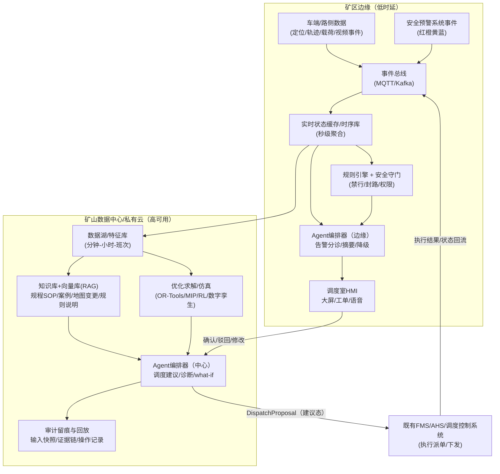
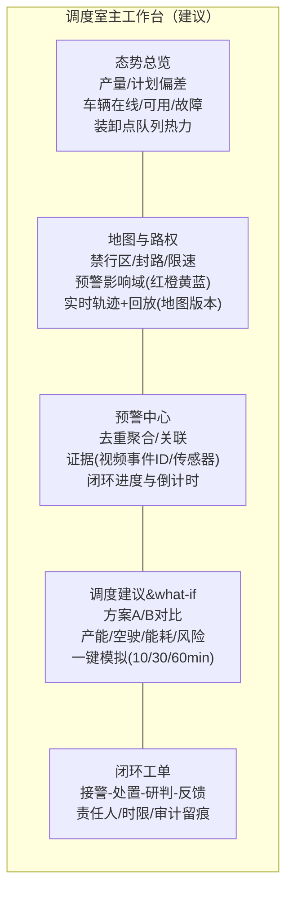

# 矿山自动驾驶调度室调度平台的 LLM Agent 体系设计研究报告

## 执行摘要

国家层面已将矿山（尤其煤矿）智能化定义为以人工智能、工业物联网、云计算、大数据、机器人、智能装备等与矿产开发利用深度融合，形成“全面感知、实时互联、分析决策、自主学习、动态预测、协同控制”的智能系统，并提出到 2025 年“露天煤矿实现智能连续作业和无人化运输”等目标。citeturn1search0 这使得调度室从传统的“人工经验调度”转向“数据驱动 + 多系统协同 + 安全闭环”的指挥中枢。

在金属非金属露天矿场景，国家矿山安全监察局发布的《金属非金属矿山智能化建设指南（2025年版）》明确提出应围绕信息基础、生产计划、采剥作业、运输作业、安全监控、综合管控平台等“十大业务系统”整体规划，并在运输作业中要求“建设车辆调度系统”，具备运输作业规划、车辆实时定位、车辆智能调度控制、多车协同、运输计量、违章监测、轨迹查询等功能。citeturn6view0 同时，监管要求矿山安全风险监测预警处置必须建立“值班查看—预警接警—响应处置—分析研判—核查反馈”的闭环流程，预警等级从高到低划分为红、橙、黄、蓝四级，并鼓励探索利用“人工智能大模型、AI视频识别”等提升监测预警覆盖范围和精准度。citeturn14view0

然而，行业普遍存在数据编码不统一、通信接口不兼容、传输协议不开放、系统集成难度大、建设成本高等突出问题；国家矿山安全监察局发布《智能化矿山数据融合共享规范》，以 6 大专题、40 项规范系统化解决“数据孤岛/信息烟囱”的标准化与互联互通难题。citeturn16search7turn16search1 另一方面，学术研究指出露天矿无人卡车调度中“高频调度”可能损害多干线运输系统效率，并提出以固定时间间隔监测货流、由调度系统主动触发的“间断式实时调度策略”，通过多智能体—离散事件仿真验证其能降低调度频率并提高调度准确性与产能表现。citeturn8search2turn7view0

基于上述政策、标准与研究证据，本报告提出：在既有“车队管理/调度控制系统（FMS/TMS/AHS）+ 安全监控/预警系统 + 地图定位 + 通信网络”之上，构建 **“多角色 LLM Agent + 规则守门 + 运筹优化/仿真”** 的调度助手体系。LLM 的定位应当是“认知与协同层”（理解态势、生成建议、根因归因、生成闭环工单与交接班材料、对策略进行可解释化），而不是直接替代安全关键控制；关键动作通过权限边界、强制人工确认（必要时双人复核）、审计留痕、可回退兜底策略来保证安全与可控。该体系的主要收益路径是：把调度员从“告警风暴与跨系统查证”中解放出来，减少误操作与重复沟通，提高派单质量与一致性，并在拥堵/封路/设备波动等复杂工况下，通过“LLM 生成结构化约束 + 求解器优化 + 数字孪生 what‑if”提升整体运营效率。

---

## 背景与目标

**应用范围与边界（未指定）**  
未指定矿山类型（露天煤矿/金属非金属露天矿/地下矿）、车队规模、路网形态（单干线/多干线）、是否存在人机混行、现有调度系统能力与接口、通信覆盖与时延指标、事故/险情统计口径、能耗计量口径等。为保证可落地性，本报告默认以“露天矿无人（或少人）运输调度室”为主场景，并给出可迁移到地下无人矿卡交通调度的扩展建议（扩展内容同样需以现场数据为准）。citeturn6view0turn14view0

**目标用户（未指定，列出可能角色）**  
目标用户：未指定。建议覆盖以下角色，并按“决策权—执行权—监督权”划分权限：  
调度员（主操作者）、值班经理/调度长（复核与升级决策）、运维工程师（平台/网络/车端系统健康）、数据工程师（数据治理/口径/指标）、安全员/安监值班人员（风险处置与封控策略）。监管办法要求矿山与上级企业明确监测预警值班机构、健全责任制与闭环流程，并对部分矿山实行 24 小时值班要求，这进一步佐证“值班管理与协同角色”必须纳入目标用户范围。citeturn14view0

**业务目标与 KPI（未指定，给出建议量化目标）**  
在矿山运输系统中，卡车调度运输被多篇中文研究指出是露天矿开采的核心环节，且调度运输消耗能耗和成本可占整个生产过程的一半以上，因此调度效率提升具有显著经济杠杆。citeturn10view0 同时，监管闭环对“接警—处置—反馈”的时效性提出刚性要求（如报警发生后 1 小时内反馈初步原因与处置措施等）。citeturn14view0 结合这些约束，建议 KPI 分为“效率、质量、安全、合规、系统”五类：

| KPI 类别 | 指标（示例） | 定义口径（建议） | 建议量化目标（PoC 6–10 周） | 建议量化目标（试点 3–6 月） | 未指定项 |
|---|---|---|---:|---:|---|
| 调度效率 | 任务完成时间 | 单车循环：装载→运输→卸载→返回 的平均与 P95 | 平均↓5%，P95↓8% | 平均↓10%，P95↓15% | 当前基线、任务定义（吨/车次/循环） |
| 调度质量 | 调度撤回/改派率 | 因冲突/不可行/信息错误导致撤回或重派占比 | ↓30% | ↓60% | 现有规则、撤回原因分类 |
| 运转效率 | 车辆空驶率 | 空载里程/总里程 或空载时间/总时间 | ↓5% | ↓10–15% | GPS/里程计口径、载荷识别逻辑 |
| 资源能耗 | 单吨公里能耗 | 燃油/电耗 ÷ 吨公里（或吨耗） | ↓2–3% | ↓5–8% | 能耗采集频率、油电混编计量 |
| 安全合规 | 预警处置时效 | 预警接警到处置动作的 MTTA/MTTR；红橙黄蓝分级 | MTTA↓30%；红/橙超时=0 | MTTA↓50%；误报警↓20% | 预警系统口径、超时定义 |
| 响应时延 | 调度建议时延 | 事件触发到生成可执行建议的 P95 | P95<10s（建议态） | P95<5s（关键事件） | 网络与算力现状 |
| 系统可靠性 | 可用性与审计完整率 | 平台可用性、关键建议链路可追溯率 | ≥99.5%；审计 100% | ≥99.9%；审计 100% | IT/OT 分区与容灾策略 |

说明：预警等级（红橙黄蓝）、闭环流程与“1小时内反馈”属于监管刚性约束，建议纳入验收红线。citeturn14view0

---

## 现状与痛点调研

**调度室常见流程（以“计划—执行—监控—处置—复盘”闭环表述）**  
露天矿智能化建设指南明确提出围绕“信息基础、地质保障、开采设计与生产计划、采剥作业、运输作业、安全监控、综合管控平台”等十大业务系统进行整体规划，并要求在信息基础上实现“高速率低延时网络全覆盖、全时域全过程数据采集应用和分类分级信息安全管理”。citeturn6view0 这对应到调度室，通常形成以下闭环：

1) 班次计划准备：生产计划（剥离/采矿/运输/排土）制定与动态优化；citeturn6view0  
2) 实时派单与协同：车辆调度系统进行运输作业规划、实时定位与调度控制、多车协同等；citeturn6view0  
3) 实时监控与告警：安全风险监测预警系统持续监测并按红橙黄蓝分级报警；citeturn14view0  
4) 异常与风险处置：按“值班查看—预警接警—响应处置—分析研判—核查反馈”闭环执行；citeturn14view0  
5) 复盘与治理：分析预警产生原因、处置情况并采取措施减少误报警；citeturn14view0

**数据流与系统构成（按 IT/OT 分层描述）**  
未指定现场系统名称与厂商栈。结合国家指南与行业现状，调度室常见系统组合可归纳为：

- 运输与车队层：车队管理/运输管理/调度控制（FMS/TMS/AHS），对接无人矿卡与装卸点资源；指南要求车辆调度系统覆盖规划、定位、调度控制、多车协同、计量、违章监测与轨迹查询。citeturn6view0  
- 地图定位与路权层：地图版本、道路/禁行区/封路/限速、定位轨迹；国家标准项目（等同采用 ISO 23725:2024）已明确“露天矿山自主系统与车队管理系统互操作性”应覆盖通信协议、消息结构、遥测信号、地图共享与任务分配等接口要素，反映出“地图/任务/遥测”是跨系统对接的核心。citeturn9view0  
- 安全与监测层：监测预警系统（风险监测、预警响应、分析研判、核查反馈），以及断点续传等数据上传可靠性要求。citeturn14view0  
- 工控与设备层：SCADA/PLC/电气与机电设备状态；指南要求数据中心具备“高可靠低延时数据交换、网络安全等级保护、数据容灾与恢复”。citeturn6view0  
- 通信与基础设施层：工业以太网、无线通信（Wi‑Fi6/5G/UWB 等）；指南给出“主干网络带宽宜不低于 10000 Mbps、出口带宽宜不低于 1000 Mbps”的建设建议，并提出网络安全满足等保要求（示例为等保二级）。citeturn6view0turn1search2

**典型痛点与根因分析（优先引用官方/行业资料与论文）**

痛点一：跨系统数据口径不统一、接口不兼容，导致“数据孤岛/信息烟囱”  
国家矿山安全监察局发布《智能化矿山数据融合共享规范》并强调将建立统一的数据编码、规范接口协议，以解决矿山领域“数据编码不统一、通信接口不兼容、传输协议不开放、系统集成难度大、建设成本高”等突出问题。citeturn16search7turn16search1 金属非金属矿山智能化建设指南也明确提出数据管理应“依据《智能化矿山数据融合共享规范》”，建设统一的数据编码、采集、治理、应用、安全体系。citeturn6view0  
根因：缺乏统一编码与共享规范的落地、供应商协议封闭或接口碎片化、数据治理（主数据/质量/血缘）薄弱。

痛点二：告警风暴与闭环处置负荷高，容易出现超时、误处置或处置不一致  
监管办法规定预警等级红橙黄蓝，并要求建立闭环流程；此外要求矿山对报警发生后 1 小时内反馈初步报警原因和处置措施，对可能危及人身安全的红色预警应立即采取撤人等措施，并强调要分析研判并采取措施减少误报警。citeturn14view0  
根因：告警规则粗糙、缺少告警关联（同因多告警）、跨系统取证与研判成本高、处置知识分散在人员经验与规程文本中。

痛点三：高频调度与复杂工况下的“效率—稳定性”矛盾  
煤炭学报研究指出为解决“高频调度容易影响多干线运输系统效率”的问题，提出间断式实时调度策略：由调度系统主动触发、固定时间间隔监测货流量、预测路径产能满足度并判断电铲富车/欠车状态，目标是减少非必要调度、降低频繁调度引起的产能损失，并通过多智能体—离散事件仿真验证其产能与调度准确性优势。citeturn8search2turn7view0  
根因：调度策略缺乏“触发节奏控制”、对产能波动/拥堵/道路封控等扰动响应不够稳健；过度实时化反而放大噪声与波动。

痛点四：运输成本与能耗压力大，优化空间主要集中在空驶、等待与路径能耗  
中文研究指出卡车调度运输消耗能耗和成本占整个生产过程的一半以上，因此合理的调度运输对矿山生产效益影响巨大；并进一步将调度系统拆分为最佳路线确定、车流规划与实时调度等模块。citeturn10view0  
根因：对能耗/碳排/维修等综合成本建模不足、缺乏把“能耗模型 + 调度决策”联动的优化闭环、缺少仿真评估与反事实对比。

**参考来源列表（优先官方/原始资料）**  
本报告主要引用以下权威来源（按“政策/指南—标准—学术论文”优先级）：  
1) 《关于加快煤矿智能化发展的指导意见》（发改能源〔2020〕283号）—智能化定义与 2025 目标（含露天煤矿无人化运输）。citeturn1search0  
2) 《金属非金属矿山智能化建设指南（2025年版）》—十大业务系统、信息基础与网络/数据中心/数据管理要求、车辆调度系统功能清单。citeturn6view0  
3) 《矿山安全风险监测预警处置工作管理办法（试行）》—预警分级（红橙黄蓝）、闭环流程、1小时反馈、断点续传、鼓励 AI 大模型等。citeturn14view0  
4) 《智能化矿山数据融合共享规范》发布信息—6大专题40项规范、解决编码/接口/协议/集成难题、打通数据孤岛。citeturn16search7turn16search1  
5) 国家标准项目《露天矿山 自主系统和车队管理系统的互操作性》（等同采用 ISO 23725:2024）—FMS/AHS 接口范围（遥测、地图共享、任务分配等）。citeturn9view0  
6) 学术论文：煤炭学报《露天煤矿多干线运输系统无人卡车实时调度策略》（2025）—高频调度问题与间断式调度策略、仿真验证。citeturn8search2turn7view0  
7) 学术论文：安徽工业大学学报《基于改进蚁群算法的露天矿无人驾驶卡车智能调度》（2020）—运输成本占比与综合成本（含油耗、碳排）建模思路。citeturn10view0

---

## Agent 职责与角色划分

**总体原则（面向安全关键系统的“建议态 Agent”）**  
监管文件强调预警处置闭环与数据真实性、及时性、准确性、规范性，并对扰乱/篡改监测数据行为设定严厉监督条款；同时鼓励利用 AI 大模型提升监测预警能力。citeturn14view0 因此本报告建议：LLM Agent 的权限默认不直接下发车辆控制指令，而是生成“结构化建议（DispatchProposal）+ 证据链 + 风险提示 + 回退方案”，由调度员确认后交由既有调度控制系统执行；所有关键建议必须可审计、可追溯、可回放。

**未指定项清单（会显著影响角色边界与权限设计）**  
未指定：是否已经具备AHS/FMS互操作接口、调度控制系统是否支持“建议—确认—执行”三段式、是否需要与监管侧监测预警系统联动上报、是否涉及人员定位/隐私、是否跨矿区集中调度、是否存在多厂家混编车辆等。

**至少五种 Agent 角色定义（建议采用七类，覆盖调度与治理闭环）**

| Agent 角色 | 输入数据（示例） | 输出动作/产物 | 决策频率 | 权限边界（建议） | 安全与合规约束 | 失败模式与回退策略 |
|---|---|---|---|---|---|---|
| 实时监控与告警分诊 Agent | 监测预警系统事件（红橙黄蓝）、车辆状态、道路事件、视频/雷达结构化事件、最近调度动作 | 告警去重聚合、关联归因、优先级排序、处置建议与工单草稿 | 1–5 秒滚动 | 只读 + 工单创建；不可派单/控车 | 预警等级红橙黄蓝；必须支持“闭环流程”字段；红色预警提示“立即措施”；鼓励AI大模型用于监测预警。citeturn14view0 | 误分级/漏关联：回退到规则阈值；红/橙强制人工确认；输出置信度+证据不足提示 |
| 任务分配与调度建议 Agent | 生产计划、车辆实时定位/载荷、装卸点队列、路权/封路/限速、地图版本 | 生成 DispatchProposal（建议态）：派车/改派/路径候选/预计影响 | 事件触发 + 固定间隔 30–120 秒 | 不直接执行；需人确认后调用调度控制系统接口 | 车辆调度系统应具备规划、定位、调度控制、多车协同等功能；建议不得突破禁行/封路规则。citeturn6view0 | 幻觉导致不可行：硬约束校验器拦截；回退到现有启发式/规则策略；保留上一版可行计划 |
| 调度节奏控制与拥堵治理 Agent | 多干线货流、调度频次、道路拥堵/等待、产能偏差 | 给出“是否触发全局再调度”的建议；设置调度周期与阈值 | 60–300 秒 | 只建议“触发/不触发/降频”与参数；不派车 | 高频调度可能影响多干线系统效率；应减少非必要调度并降低产能损失。citeturn8search2turn7view0 | 错误降频导致偏产：回退到默认周期；对关键偏差触发人工复核 |
| 异常诊断与根因分析 Agent | 车端/路侧/平台日志、通信质量、地图变更、工单历史、事件链 | 根因假设树、验证步骤、临时绕行/降级建议、复盘报告草稿 | 告警触发（10–60 秒初版） | 只读 + 报告生成；可建议“隔离车辆/区域”，需安全员/值班经理确认 | 必须可追溯证据；处置建议需纳入闭环流程并可核查反馈。citeturn14view0 | 证据不足误判：列出“missing_evidence”；回退到保守安全策略（停/绕行/人工接管） |
| 预测与优化 Agent | 历史执行数据、队列与拥堵统计、能耗模型参数、天气与班次规律 | 15–120 分钟预测 + what‑if 对比（方案A/B）；多目标优化参数建议 | 5–15 分钟 | 仅建议；不执行 | 调度优化应兼顾产能与调度稳定性；可用仿真验证策略鲁棒性。citeturn8search2turn7view0 | 预测漂移：触发漂移告警；回退到简单基线模型；要求人工复核 |
| 安全守门与合规审计 Agent | 路权规则、禁入区/爆破封路、预警等级影响域、操作员权限、审计策略 | 对 DispatchProposal 进行 PASS/FAIL 校验；生成审计记录 | 每次建议实时校验 | 可“一票否决”；不可控车/不可绕过规则 | 预警分级与闭环处置、断点续传、数据真实性要求；对红色预警需立即措施建议与区域撤人要求。citeturn14view0 | 规则配置错误：双版本规则与灰度；紧急回退到最严格规则集 |
| 交互助手与交接班文档 Agent | 调度员自然语言、态势摘要、规程/SOP 知识库、工单与事件链 | 自然语言问答、交接班摘要、日报/周报、会议纪要 | 随叫随到 | 只读 + 文书生成 | 文书必须引用可追溯来源（事件ID/日志ID/规程条款）；避免编造数据 | 幻觉风险：强制 RAG 引用；关键数字必须来自结构化数据源 |

---

## 技术架构与集成方案

**部署形态建议：边缘 + 本地数据中心 + 可控云的混合模式（未指定则按指南优先就地）**  
《金属非金属矿山智能化建设指南（2025年版）》要求规划建设工业互联网与数据中心，利用大数据、云计算、人工智能、数字孪生、边缘计算等技术，实现高速率低延时网络全覆盖、全时域全过程数据采集应用和分类分级信息安全管理；并对数据中心提出高可靠低延时数据交换、网络安全等级保护、数据容灾与恢复等能力要求。citeturn6view0 在此约束下，推荐：

- 边缘侧：承载低时延数据接入、事件聚合、规则守门、关键 UI 缓存与降级运行；  
- 矿山数据中心/私有云：承载向量库/知识库、调度优化求解、仿真与回放、审计与归档；  
- 可控云（可选，未指定）：用于离线训练/大规模仿真扩容，但必须满足数据分级与出域策略（需现场制定）。

**系统架构图（Mermaid）**



**接口与协议：以“工业互联 + 事件驱动 + 标准化互操作”为主线**  
未指定现网接口能力。建议按三层接口组合：

1) 工控/设备互联：OPC UA（IEC 62541-1:2025 提供 OPC UA 的概念与总览）用于 SCADA/设备网关互操作与信息建模。citeturn3search0turn4search2  
2) 事件流：MQTT（ISO/IEC 20922:2016 标准化，轻量发布订阅，适合 M2M/IoT 受限环境）用于车端遥测与边缘事件分发。citeturn4search3turn4search7  
3) 企业/平台集成：参考 ISA-95（Enterprise‑Control System Integration）定义企业业务与控制系统间接口模型，降低跨域集成的风险、成本与错误。citeturn4search0turn4search8

同时，强烈建议对齐“露天矿山 AHS 与 FMS 的互操作性接口”标准方向：我国已立项国家标准（等同采用 ISO 23725:2024），明确接口应覆盖通信协议、消息结构、遥测信号、地图共享与任务分配，用于调度运矿卡车与协调生产信息。citeturn9view0 这对你的 Agent 系统尤为关键：Agent 生成的建议必须能落到标准化消息语义上，否则难以规模化与多厂商接入。

**时延与可用性要求（建议值，未指定则作为验收基线）**  
监管要求包含“报警发生后 1 小时内反馈初步原因与处置措施”，并要求数据上传节点具备断点续传能力；这意味着系统在网络抖动/断链情况下必须保障事件不丢失、可追溯。citeturn14view0 建议指标：

- 告警分诊到 HMI 呈现：P95 < 5 秒（含聚合与关联）；  
- 调度建议生成：P95 < 10 秒（建议态，非闭环控车）；  
- 安全守门校验：P95 < 200 ms（规则引擎）；  
- 平台可用性：试点 ≥99.5%，规模化 ≥99.9%；  
- 关键事件审计：100% 完整（输入快照、证据链、操作者、结果）。

**模型更新与在线学习策略（安全优先）**  
未指定是否允许在线学习。考虑矿山属于高风险场景，建议：

- 以“离线回放评测 + 灰度发布 + 可回退”为主：在数字孪生/回放系统中评估新模型对 KPI、合规与误报的影响，再逐步灰度；  
- LLM 对外部工具调用采用白名单与最小权限；  
- 对自动/半自动机器系统安全要求可参考 ISO 17757:2019（面向土方机械与采矿作业的自主/半自主机器系统安全要求）。citeturn21search2  
- 工控网络安全体系建议对齐 IEC 62443（覆盖 IACS 生命周期安全）。citeturn21search13turn21search5

**隐私与安全（认证、审计、访问控制）**  
未指定等保等级与数据分级方案。建议至少满足：

- 以 GB/T 22239-2019 作为等级保护基本要求参考（网络安全等级保护基本要求）。citeturn1search2  
- 监测预警系统应防篡改、防屏蔽：监管明确对“人为干扰、破坏、屏蔽、关闭监测预警系统或篡改监测数据”等行为依法严厉打击。citeturn14view0  
- 全链路审计：每条 DispatchProposal 必须绑定输入快照、证据引用、规则校验结果、操作者与确认人；  
- 数据最小化：视频与人员定位等高敏数据不进入 LLM 原始上下文，转换为结构化事件与引用指针（例如仅保留 event_id 与证据摘要）。

---

## LLM 能力与提示工程

**总体策略：RAG（检索增强生成）+ 规则引擎 + 工具调用 + 结构化输出**  
监管办法明确鼓励探索利用“人工智能大模型、AI视频识别”等技术开展监测预警工作。citeturn14view0 同时，矿山数据融合共享规范强调数据编码、采集接口与协议、治理、安全等体系化建设，决定了 Agent 应以“结构化数据与可追溯证据”为核心，而不是自由文本聊天。citeturn16search1turn6view0 建议工程落地原则：

- **结构化输入优先**：多模态（地图/轨迹/视频）先由检测算法与流式计算转成结构化事件（如“道路段 R7 障碍物”“置信度 0.91”“影响域”），再交给 LLM 推理；  
- **RAG 强制引用**：规程/SOP、封路与禁入规则、历史案例必须检索后引用；无证据则拒答或请求补数；  
- **规则守门硬约束**：红橙黄蓝、禁行区、爆破封路、撤人要求等由规则引擎硬拦截；LLM 仅做解释与建议。

**上下文窗口管理：短期态势 vs 长期记忆**  
未指定模型上下文长度与成本上限。建议按两级记忆组织：

- 短期记忆（窗口内）：最近 5–30 分钟关键态势摘要（队列、拥堵、调度动作序列、关键告警）；由边缘侧聚合为“秒级→分钟级摘要”，避免灌入原始时序。  
- 长期记忆（外部存储）：班次报表、事故/险情处置案例、地图版本变更记录、策略评估结论、设备故障知识；存入向量库（语义检索）+ 结构化库（精确检索）。

**每个 Agent 的示例 Prompt 模板（节选，可用于 PoC）**  
以下模板统一要求输出 JSON（便于审计与执行），并包含 `evidence` 字段（事件ID/日志ID/规程条款ID）。日期示例采用 2026-04-02（Asia/Tokyo/Asia/Shanghai 时区可由你的系统配置决定）。

实时监控与告警分诊 Agent：
```text
你是“矿山调度室告警分诊助手”。你的任务是把大量告警合并成少量可执行处置建议，并严格遵守预警等级：红>橙>黄>蓝。
合规要求：
- 必须支持闭环流程字段：值班查看、预警接警、响应处置、分析研判、核查反馈。
- 红色预警：必须给出“立即措施”建议，并标记 requires_human_confirmation=true。
- 不允许编造数据；若证据不足，输出 unknown 并列出缺失证据。
输入（工具已提供）：
1) alarms: [SafetyAlarmEvent...]
2) state_summary: {最近10分钟车辆/道路/装卸点摘要}
3) sop_hits: {从知识库检索到的规程片段与条款ID}
输出（严格JSON）：
{
  "ts":"2026-04-02T10:16:05+08:00",
  "top_incidents":[{"alarm_id":"...","level":"RED","why":"...","impact":"..."}],
  "triage_actions":[{"action":"...","owner":"调度员/安全员/运维","deadline_min":10}],
  "requires_human_confirmation": true,
  "confidence": 0.0-1.0,
  "evidence":["ALM-...","SOP-...","LOG-..."]
}
```

任务分配与调度建议 Agent（强调“建议态”与安全约束）：
```text
你是“无人矿卡调度建议Agent”。你只能输出建议方案，不得直接下发车辆控制指令。
目标：在满足禁行/封路/预警影响域等硬约束下，提高产能、降低空驶与等待，并说明与基线策略的差异。
输入：
- plan: 班次生产计划
- fleet_state: 车辆状态（位置/载荷/健康/电量）
- node_state: 装载点/卸载点队列与能力
- road_rules: 禁行区/封路/限速/会车点（含地图版本）
- alarms: 当前红橙黄蓝预警
输出（JSON）：
{
  "dispatch_cycle_seconds": 60,
  "proposals":[
    {"truck_id":"T12","next_task":{"load":"L3","dump":"D2","route":"R9"},"eta_min":6.5,
     "constraints_checked":["NO_GO_OK","ORANGE_IMPACT_OK","SPEED_OK"],
     "risk_notes":["..."]}],
  "expected_impact":{"throughput_delta_pct":-1.2,"empty_distance_delta_pct":-6.8,"queue_time_delta_pct":-18.0},
  "requires_human_confirmation": true,
  "evidence":["ALM-...","MAP-...","STATE-..."]
}
```

调度节奏控制与拥堵治理 Agent（对齐“减少非必要调度/降低高频调度损失”的研究思路）：
```text
你是“调度节奏控制Agent”。你决定是否触发全局再调度，并给出建议调度周期与触发阈值。
输入：多干线路径货流、调度次数、产能偏差、队列拥堵、道路事件
输出：{ "should_reschedule": true/false, "suggested_cycle_seconds": 120, "reasons":[...], "evidence":[...] }
```

异常诊断与根因分析 Agent：
```text
你是“异常诊断与根因分析Agent”。必须输出“可验证假设树”，并给出每个假设需要的证据、下一步检查与可回退方案。
输出字段：rca_tree / workaround / rollback_plan / confidence / evidence
```

安全守门与合规审计 Agent：
```text
你是“安全守门Agent”。你不做产能最优化，只做合规校验与风险兜底。
输入：DispatchProposal + 最新预警等级/禁行规则/权限信息
输出：{"status":"PASS|FAIL","violations":[...],"required_changes":[...],"evidence":[...]}
```

交互助手与交接班文档 Agent：
```text
你是“调度室交接班助手”。必须基于检索结果回答，输出结构化交接班摘要。
输出必须包含：本班关键事件、处置动作、未闭环事项、下班次风险提示、引用证据ID列表。
```

**多模态输入利用方式（地图/轨迹/摄像头雷达事件）**  
建议把多模态感知系统的输出统一为“事件与证据引用”，再由 LLM 做跨事件推理与解释；这与监管对“AI视频识别”等技术用于监测预警的鼓励方向一致。citeturn14view0 同时，通过国家标准项目（ISO 23725:2024 等同采用）对“地图共享、遥测信号、任务分配”的接口要求，可将多模态事件与地图版本绑定，确保可回放与可审计。citeturn9view0

---

## 决策与优化方法

**LLM 与运筹优化、强化学习、仿真（数字孪生）的协同方式**  
煤炭学报研究以伊敏露天煤矿生产数据为基础，搭建多智能体—离散事件联合仿真系统开展随机试验，比较间断式调度策略与 DISPATCH 等策略在多干线系统下的产能表现与调度频率，说明“仿真回放 + 策略对比”是评估调度策略鲁棒性的有效方法。citeturn8search2turn7view0 同时，露天矿卡车调度研究常将目标从“最短路径/运费最少”扩展为综合成本最小，并显式建模运输成本、维修成本、油耗成本、碳排成本等；该类建模为运筹优化目标函数提供了可解释的工程基础。citeturn10view0

建议分工如下（为可操作性表述为工程职责，而非过程口号）：

- LLM：把调度员目标与现场临时信息（封路、优先级、设备异常）转成结构化约束/权重；生成解释、工单、交接班材料；  
- 运筹优化（MIP/CP-SAT/启发式）：在硬约束下求“可行且近优”的派车/路径/会车方案；  
- 强化学习（RL）：在仿真环境中学习调度触发时机、队列控制策略，在线仅作为候选策略或参数建议；  
- 数字孪生/离散事件仿真：用于离线评估、what‑if、回放与漂移检测。

**调度优化目标函数示例（含“高频调度惩罚项”）**  
设卡车集合 \(K\)，装载点集合 \(L\)，卸载点集合 \(D\)，离散时间步 \(t\)。决策变量 \(x_{k,l,d,t}\in\{0,1\}\) 表示卡车 \(k\) 在 \(t\) 时刻被分配到装载点 \(l\) 并卸载到 \(d\)。

参考“综合成本最小”建模思路可包含：重车/空车运输成本、维修成本、油耗成本、碳排成本等项。citeturn10view0 同时，为避免高频调度损害系统效率，可加入调度次数/变更次数惩罚（与“减少非必要调度、降低频繁调度引起的产能损失”目标一致）。citeturn8search2turn7view0

一个可解释的加权目标示例：

\[
\min_{x}\ \sum_{t}\sum_{k,l,d} x_{k,l,d,t}\Big[\alpha \cdot (T^{travel}_{k,l,d,t}+W^{queue}_{l,t}+W^{queue}_{d,t})
+\beta \cdot E_{k,l,d,t}
+\gamma \cdot C^{carbon}_{k,l,d,t}
+\eta \cdot R_{k,l,d,t}\Big]
+ \lambda \cdot N_{reschedule}
\]

其中：  
- \(E_{k,l,d,t}\)、\(C^{carbon}\) 可由能耗/碳排模型给出（论文给出了油耗与碳排成本建模示意）。citeturn10view0  
- \(N_{reschedule}\) 为调度变更次数（或全局再调度触发次数），用于抑制过度调度；该思想与间断式调度策略核心一致。citeturn8search2turn7view0  
- \(R_{k,l,d,t}\) 来自安全守门（禁行区、预警影响域等硬/软约束）。

**典型约束条件（示例）**

- 每车每时刻最多一任务：\(\sum_{l,d} x_{k,l,d,t} \le 1\)  
- 装载点能力：\(\sum_{k,d} x_{k,l,d,t} \le Cap^{load}_{l,t}\)  
- 卸载点能力：\(\sum_{k,l} x_{k,l,d,t} \le Cap^{dump}_{d,t}\)  
- 禁行/封路/红色预警影响域硬约束：若 \((l,d)\) 经过禁行段，则 \(x_{k,l,d,t}=0\)  
- 地图版本一致性：所有规划需绑定 `map_ver`，与互操作标准对“地图共享”要求一致。citeturn9view0

**求解流程（伪代码）**

```pseudo
on event_trigger or every dispatch_cycle:
  snapshot <- build_state_snapshot()            # 秒级→分钟级聚合
  rules    <- load_road_rules_and_alarm_zones() # 禁行/封路/红橙黄蓝影响域
  intent   <- get_operator_intent_and_plan()    # 班次目标+临场说明

  params <- LLM.parse_to_structured_params(intent, snapshot, rules, SOP_RAG)

  proposal_candidates <- Solver.solve(snapshot, params, rules)
  proposal <- Gatekeeper.validate_and_select(proposal_candidates, rules)

  explanation <- LLM.explain(proposal, baseline_policy, evidence)

  UI.show(proposal, explanation)
  if operator_confirmed:
      dispatch_system.execute(proposal)         # 通过FMS/AHS接口执行
      audit.log(full_trace)
```

---

## 人机交互与可视化

**界面设计目标：把“安全闭环”与“调度效率”合并到一张工作台**  
监管明确预警处置闭环流程与红橙黄蓝分级，并对值班制度、系统实时在线、1小时反馈等提出要求。citeturn14view0 因此 UI 必须天然支持闭环工单与证据链，而不是把安全系统当“另一个屏幕”。

同时，过程工业报警管理标准 ANSI/ISA‑18.2‑2016 规定了基于控制器与 HMI 技术的报警系统生命周期管理一般原则与流程，可为“告警合理化、优先级策略、报警哲学与持续治理”提供方法论参考，避免告警风暴导致关键告警被淹没。citeturn21search4turn3search13

**调度员界面要素（示意图）**



**告警分级与解释性输出（建议格式）**  
- 红色：立即措施（例如撤人、封控区域、停止派单），强制双人复核；citeturn14view0  
- 橙色：高优先级处置（绕行、降速、交通管制），要求给出证据与影响评估；citeturn14view0  
- 黄/蓝：可延后或自动合并，重点做去重与归类，并纳入误报警治理。citeturn14view0  

解释性输出建议包含：  
1) 结论（建议动作）  
2) 证据链（事件ID/日志ID/地图版本/规程条款）  
3) 影响评估（产能、空驶、拥堵、风险）  
4) 备选方案与回退条件

**what‑if 仿真面板（必须可交互）**  
煤炭学报研究通过随机试验对比策略表现（50 次试验、对 DISPATCH 与固定配车等基线对比，并分析调度频率与货流波动），说明 what‑if 需要支持“策略对比 + 随机扰动 + 稳健性指标”。citeturn7view0turn8search2 建议面板支持选择：

- 策略：固定配车 / 现行策略 / LLM+优化策略 / 间断式触发策略  
- 扰动：道路封闭、装卸点能力下降、车辆故障、通信质量下降  
- 输出：总产能、路径完成度、空驶率、平均等待、调度次数、风险暴露

**语音/中文自然语言交互示例对话（节选）**  
调度员：现在 R7 段为什么堵了？给我一个不违反封路规则的调度方案。  
助手：R7 段触发橙色预警（ALM‑20260402‑000872，道路障碍物，影响域：R7 阻断）。建议临时绕行 R9/R11，并将 3 台空车从 L3→D2 改派为 L2→D1 以平衡卸点队列。预计 30 分钟内空驶里程下降约 6%，排队时间下降约 18%。该方案需要你确认后执行，并已通过禁行/封路规则校验。  
（注：预警分级、闭环时效与证据引用要求对齐监管办法。citeturn14view0）

---

## 实施路线图、运营治理与成本 ROI

**实施路线图（PoC → 试点 → 规模化）**  
《金属非金属矿山智能化建设指南》强调“一矿一策”、避免“一刀切”，并提出分类分级推进。citeturn5view0 因此路线图应以“最小闭环 + 影子模式”快速验证，逐步扩展到多矿区与标准化互操作。

| 阶段 | 时间建议 | 关键交付物 | 资源需求（数据/算力/人员） | 验收标准（量化） | 风险与缓解 |
|---|---:|---|---|---|---|
| PoC | 6–10 周 | 告警分诊+闭环工单；调度建议影子模式；交接班摘要 | 数据：至少 30 天告警/轨迹/派单；算力：1 台推理节点；人员：产品1、后端2、数据1、算法1、现场专家1 | MTTA↓30%；告警去重≥60%；建议可行率≥95%；闭环字段完整率=100% | 数据口径乱：先对齐《数据融合共享规范》编码与采集口径方向citeturn16search1turn6view0 |
| 试点 | 3–6 月 | 多干线拥堵治理+调度节奏控制；what‑if 仿真；RCA 知识库 | 数据：3–6 月；算力：边缘+中心高可用；人员：再加前端/测试/运维各1 | 空驶率↓10%；等待↓20%；调度撤回率↓50%；平台可用性≥99.5% | 过度自动化：保持“建议态+人审”；红色预警双人复核citeturn14view0 |
| 规模化 | 6–12 月 | 对齐 ISO 23725/国家标准互操作接口；数据治理与审计平台化；多矿区复用 | 数据：按 40 项规范推进编码/接口/治理/安全；算力：容灾与回放；人员：平台团队 | 可用性≥99.9%；关键建议全可追溯；多厂商车辆接入时间↓50% | 接口碎片化：以“互操作标准”约束厂商与项目交付citeturn9view0 |

**运营与治理（指标、漂移、审计、回退、培训）**

- 监控指标：业务 KPI（空驶、等待、产能偏差）、安全 KPI（红橙处置时效、误报警率）、系统 KPI（可用性、时延、消息堆积）、模型 KPI（采纳率、被否决原因）。监管要求分析研判预警产生原因并减少误报警，应将“误报警率与原因分类”固化为周报指标。citeturn14view0  
- 模型漂移检测：每日离线回放对比（影子模式重跑昨日数据），每周策略评审；当采纳率显著下降或规则否决率上升，触发漂移告警并回退到基线策略。  
- 审计与合规：监管强调不得篡改、销毁监测数据与信息；因此必须保留“输入快照—建议—确认—执行—结果”的证据链。citeturn14view0  
- 应急与回退：一键切换到“规则+现行算法”模式（LLM 仅做摘要不做建议）；断网场景可在边缘侧继续运行告警分诊与基本态势；预警系统数据上传要求断点续传能力，建议事件总线与离线缓存同样实现断点续传。citeturn14view0  
- 培训与变更管理：将告警哲学/优先级策略（参考 ISA‑18.2 的生命周期管理思想）固化到 SOP 与培训中，并通过“模拟演练+回放复盘”提升一致性。citeturn21search4turn21search0

**成本估算与 3 年 ROI（粗略模型，未指定则给出场景化假设）**  
未指定矿山规模、运输成本基线、燃料/电价、现有系统重复建设程度。考虑研究指出运输调度成本与能耗可占生产过程的一半以上，调度优化的 ROI 主要来自空驶/等待/拥堵减少与能耗降低。citeturn10view0

成本模型（示例，人民币）：

| 成本项 | 组成 | 一次性 CAPEX（万） | 年 OPEX（万/年） | 未指定项 |
|---|---|---:|---:|---|
| 开发与集成 | Agent 编排、RAG、接口对接、HMI、审计 | 300–900 | 50–150 | 现有系统可复用程度 |
| 数据工程 | 数据字典/编码、质量治理、特征库、回放 | 150–500 | 80–200 | 数据缺口与历史深度 |
| 算力与基础设施 | 边缘节点、中心推理、存储、容灾 | 200–800 | 100–300 | 网络改造与机房能力 |
| 安全与合规 | 等保、工控安全加固、渗透测试 | 100–300 | 50–120 | 等保等级、测评周期 |
| 运维与培训 | 监控告警、漂移评估、演练与培训 | 50–200 | 80–250 | 组织成熟度 |

3 年 ROI 场景（示例化假设，需 PoC 校准）：  
- 假设年“运输相关成本”（燃料/电费、轮胎维护、等待损失等）= 2 亿元；  
- 通过 Agent+优化体系实现综合节省：保守 2%、中性 5%、乐观 8%；  
- 三年成本（一次性 1600 万 + 年运维 600 万/年）= 3400 万。

| 场景 | 年节省比例 | 年节省（万） | 三年节省（万） | 三年总成本（万） | 三年净收益（万） | 三年 ROI（净收益/成本） |
|---|---:|---:|---:|---:|---:|---:|
| 保守 | 2% | 4000 | 12000 | 3400 | 8600 | 2.53 |
| 中性 | 5% | 10000 | 30000 | 3400 | 26600 | 7.82 |
| 乐观 | 8% | 16000 | 48000 | 3400 | 44600 | 13.12 |

**可立即启动的 3 个 PoC 建议与成功判据**

PoC 建议一：告警分诊 + 闭环工单自动化（合规优先、最快见效）  
- 内容：接入监测预警系统事件，按红橙黄蓝分级去重聚合，生成闭环工单草稿与证据链；  
- 成功判据：MTTA↓30%；红/橙超时=0；闭环字段完整率=100%；误报警原因可归类并进入周报（对齐“减少误报警”要求）。citeturn14view0

PoC 建议二：调度建议影子模式 + 安全守门（不影响生产，量化对比）  
- 内容：Agent 输出 DispatchProposal（不执行），安全守门校验 PASS/FAIL；与基线策略对比空驶/等待/调度次数；  
- 成功判据：建议可行率≥95%；规则否决原因可解释；仿真显示空驶率↓5% 或等待↓10%；调度频次不高于基线（对齐“降低高频调度损失”方向）。citeturn8search2turn7view0

PoC 建议三：异常诊断知识库 + 交接班摘要（提升人效与一致性）  
- 内容：把常见异常（通信中断、地图版本冲突、定位异常、装卸点能力下降）沉淀为 RAG 知识库；自动生成 RCA 假设树与交接班摘要；  
- 成功判据：Top10 异常定位时间↓25%；交接班材料生成时间↓70%；关键数字/结论引用率=100%（无证据拒答）。citeturn14view0

---

## 供 Codex 使用的 prompt（中文）

```text
你是一个资深全栈工程师 + 架构师，请为“矿山自动驾驶调度室 LLM Agent 调度平台”生成一个可运行的演示版（MVP）代码仓库。
要求使用 Python + FastAPI + uvicorn（ASGI），代码可在本地直接运行，用于演示多 Agent（LLM/规则/优化/RAG）如何协同完成：告警分诊、调度建议（建议态）、安全守门与审计留痕。
请输出完整项目代码（含目录结构、关键文件内容、README、示例数据、启动脚本、最小 smoke test）。不要只给片段。要能跑起来。

========================
一、Demo 功能清单（最小可行集）
========================
1) 数据接入 API（HTTP JSON）：
   - POST /ingest/telemetry 接收 VehicleTelemetry（车端遥测）
   - POST /ingest/alarm 接收 SafetyAlarmEvent（安全/道路/设备告警）
2) 查询 API：
   - GET  /state/snapshot 获取当前聚合态势摘要（最近N分钟）
   - GET  /audit/events 获取审计事件列表（谁在何时基于何证据给出何建议）
3) Agent API（建议态，不直接控车）：
   - POST /agents/triage      告警分诊 Agent：输出聚合后的 top_incidents + triage_actions + 工单草稿
   - POST /agents/dispatch    任务分配/调度建议 Agent：输出 DispatchProposal（requires_human_confirmation=true）
   - POST /agents/gatekeeper  安全守门 Agent：对 DispatchProposal 做 PASS/FAIL 校验（禁行/封路/红橙黄蓝影响域/权限）
   - POST /agents/diagnose    异常诊断 Agent：输出 rca_tree（可验证假设树）+ workaround + rollback_plan
   - POST /agents/forecast    预测与优化 Agent（简化版）：输出 30/60 分钟预测与 what-if 对比（可用伪随机/简单模型）
4) 简易 RAG：
   - 内置一个 docs/knowledge_base/ 目录放 SOP/规程/规则说明/案例文本（markdown 或 txt）
   - 启动时将文档向量化写入本地向量库（建议 ChromaDB 或 FAISS），Agent 可 top-k 检索并把引用 evidence_ids 返还
5) 优化求解器（简化版）：
   - 使用 OR-Tools（CP-SAT 或线性规划均可）做一个“把可用车辆分配到装载点/卸载点”的简化优化：
     * 目标：最小化（空驶距离 + 预计等待时间 + 调度变更次数惩罚）
     * 约束：每车一个任务、禁行/封路路段不允许、红色预警影响域不允许
6) 审计与留痕：
   - 所有 Agent 输出都写入 audit log（JSONL 或 SQLite）
   - 每条 DispatchProposal 必须带 evidence 列表（事件ID/文档ID/规则ID）
7) 安全注意：
   - Demo 不存储原始视频/个人定位，只存结构化事件引用（event_id）与摘要
   - 禁止在日志中输出密钥；配置通过环境变量与 .env

========================
二、项目目录结构（必须给出并落实到代码）
========================
请按以下结构生成代码（可微调但要完整）：

mine-llm-dispatch-demo/
  README.md
  pyproject.toml               # 推荐使用 Poetry 或 uv（可选），但要可 pip 安装运行
  .env.example
  app/
    __init__.py
    main.py                    # FastAPI app 入口
    settings.py                # pydantic Settings，读环境变量
    models/
      __init__.py
      telemetry.py             # VehicleTelemetry Pydantic 模型
      alarm.py                 # SafetyAlarmEvent 模型
      proposal.py              # DispatchProposal 模型
      audit.py                 # AuditEvent 模型
    storage/
      __init__.py
      state_store.py           # 内存或SQLite：保存最新态势、最近N分钟事件
      audit_store.py           # JSONL 或 SQLite 审计存储
      vector_store.py          # Chroma/FAISS 封装（embedding & search）
    agents/
      __init__.py
      base.py                  # BaseAgent 接口（run(input)->output）
      triage_agent.py
      dispatch_agent.py
      gatekeeper_agent.py
      diagnose_agent.py
      forecast_agent.py
    rules/
      __init__.py
      rule_engine.py           # 禁行/封路/预警等级影响域/权限校验（确定性规则）
      sample_rules.yaml        # 示例规则文件（可配置）
    optim/
      __init__.py
      solver.py                # OR-Tools 求解，输出任务分配建议
    rag/
      __init__.py
      ingest.py                # 文档入库
      retrieve.py              # top-k 检索
    utils/
      __init__.py
      time.py                  # 时间戳工具（示例日期 2026-04-02）
      ids.py                   # 生成 event_id/proposal_id
      logging.py               # 结构化日志
  docs/
    knowledge_base/
      sop_alarm_triage.md
      sop_red_alert.md
      map_rules.md
      dispatch_policy.md
  scripts/
    run_dev.sh                 # uvicorn 启动脚本
    seed_demo_data.py          # 写入一些模拟遥测与告警
  tests/
    test_smoke.py              # pytest smoke test（至少覆盖 ingest + dispatch + gatekeeper）

========================
三、关键依赖与版本建议（请写入 pyproject.toml 或 requirements.txt）
========================
- Python: 3.11（兼容 FastAPI 要求 Python>=3.10）
- fastapi: >=0.135,<0.136
- uvicorn[standard]: >=0.30,<0.31
- pydantic: >=2.7,<3.0
- pydantic-settings: >=2.0
- python-dotenv: 用于本地加载 .env
- httpx + pytest: 用于测试
- or-tools: 用于优化求解
- 向量库（二选一）：
  A) chromadb（本地持久化到 data/chroma/）
  B) faiss-cpu + sqlite（简单实现）
- embedding（二选一）：
  A) sentence-transformers（本地 embedding）
  B) 如果不想引入 torch，则用一个 MockEmbedding（hash 向量）保证 demo 可跑
- LLM（二选一，demo 可用 mock）：
  A) 外部 LLM API（用环境变量 LLM_PROVIDER=openai/azure/other + API_KEY，不要在代码写死）
  B) 本地 mock LLM（固定模板生成，保证无外部依赖也能跑）

========================
四、主要 API 路由与示例请求/响应 JSON（必须落地到代码与 README）
========================
1) VehicleTelemetry 示例（POST /ingest/telemetry）
{
  "ts": "2026-04-02T10:15:23+08:00",
  "truck_id": "T12",
  "pos": {"x": 1023.4, "y": 884.2, "z": 56.7, "map_ver": "map_2026_04_01"},
  "motion": {"speed_mps": 8.2, "heading_deg": 172.3, "mode": "AUTO"},
  "load": {"state": "EMPTY", "payload_t": 0},
  "health": {"fault_code": null, "soc_pct": 63, "engine_temp_c": 72.1},
  "comms": {"rssi_dbm": -82, "uplink_kbps": 3200, "loss_pct_5s": 0.8}
}

2) SafetyAlarmEvent 示例（POST /ingest/alarm）
{
  "alarm_id": "ALM-20260402-000872",
  "ts": "2026-04-02T10:16:01+08:00",
  "level": "ORANGE",
  "category": "ROAD_OBSTACLE",
  "location": {"road_segment": "R7", "bbox": [1000, 860, 1060, 910]},
  "impact_zone": {"blocked": true, "detour_routes": ["R9", "R11"]},
  "evidence": [{"type": "cv_event", "id": "CV-77821", "confidence": 0.91}]
}

3) DispatchProposal 示例（POST /agents/dispatch 响应）
{
  "proposal_id": "DSP-20260402-0012",
  "generated_by": "dispatch_agent_v1",
  "ts": "2026-04-02T10:16:05+08:00",
  "dispatch_cycle_seconds": 60,
  "proposals": [
    {
      "truck_id": "T12",
      "next_task": {"load": "L3", "dump": "D2", "route": "R9"},
      "constraints_checked": ["NO_GO_ZONE_OK", "ORANGE_DETOUR_OK", "SPEED_LIMIT_OK"],
      "expected": {"eta_min": 6.5, "queue_wait_min": 1.2}
    }
  ],
  "requires_human_confirmation": true,
  "evidence": ["ALM-20260402-000872", "DOC-map_rules.md", "STATE-SUMMARY-10min"]
}

4) Gatekeeper 响应示例（POST /agents/gatekeeper）
{ "status":"PASS", "violations":[], "required_changes":[], "evidence":["RULE-sample_rules.yaml#no_go_zone"] }

========================
五、简易 Agent 实现说明（必须落实到代码）
========================
1) BaseAgent：
   - run(self, input: dict) -> dict
   - 每个 Agent 在 run() 内：
     a) 从 state_store 读取 snapshot
     b) （可选）从 vector_store 检索 SOP/规则文本 top-k，返回 evidence_ids
     c) （可选）调用 optim.solver 得到候选方案
     d) 输出结构化 JSON
2) triage_agent：
   - 输入当前 alarms + snapshot
   - 做简单去重（同 category+road_segment 在 2 分钟内合并）
   - 输出 top_incidents + triage_actions（owner/deadline）
3) dispatch_agent：
   - 调用 optim.solver 生成 proposals
   - 生成 expected_impact（可用简单启发式估计）
4) gatekeeper_agent：
   - 调用 rules.rule_engine 对 proposals 做 hard-check（禁行/封路/红色预警影响域/权限）
5) diagnose_agent：
   - 从日志/告警构造 rca_tree（假设树），每个假设必须列出 missing_evidence
6) forecast_agent：
   - 用简单模型预测队列/拥堵趋势 + what-if 两方案对比
7) RAG：
   - ingest.py：加载 docs/knowledge_base/ 文档，写入向量库
   - retrieve.py：top-k 检索返回 (doc_id, snippet)
8) 优化求解器（伪代码必须写入注释并实现简版）：
   - 变量：x[truck, task] ∈ {0,1}
   - 约束：每 truck 只能一个 task；禁行任务不允许
   - 目标：min (empty_distance + queue_wait + lambda*changes)
   - 输出：按 truck_id 返回 next_task

========================
六、启动脚本与运行说明（README 必须包含）
========================
1) 复制 .env.example 为 .env，并设置：
   - APP_ENV=dev
   - VECTOR_STORE=chroma
   - LLM_PROVIDER=mock
2) 安装依赖：
   - python -m venv .venv && source .venv/bin/activate
   - pip install -e .
3) 启动：
   - uvicorn app.main:app --host 0.0.0.0 --port 8000 --reload
4) 访问：
   - http://127.0.0.1:8000/docs 查看 OpenAPI
5) 可选：运行 scripts/seed_demo_data.py 注入测试数据

========================
七、测试数据与快速验证步骤
========================
README 必须给出 curl smoke test：
1) POST /ingest/telemetry
2) POST /ingest/alarm
3) POST /agents/triage
4) POST /agents/dispatch
5) POST /agents/gatekeeper（对 dispatch 输出做校验）
并提供 pytest tests/test_smoke.py（至少断言 gatekeeper PASS，且 audit 有记录）

========================
八、代码质量与安全注意事项（必须在代码与 README 写清楚）
========================
- 结构化日志：json logging；审计日志不可写入密钥
- 任何敏感数据（原始视频/个人定位）不写入 LLM 上下文与向量库，仅保存事件引用与摘要
- 所有外部 API key 从环境变量读取
- 关键输出必须包含 evidence 字段
- 失败回退：LLM 不可用时仍能用规则+优化输出（或输出“无法生成建议”但不崩溃）

请按以上要求生成完整可运行代码仓库内容（逐文件输出）。
```
