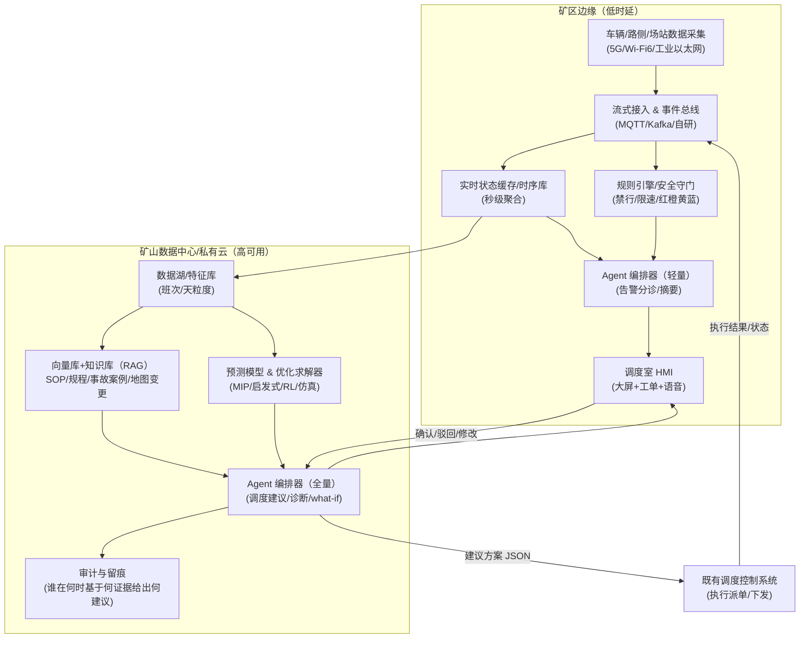
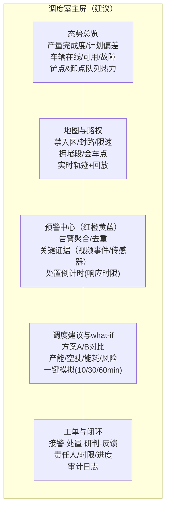

# 矿山自动驾驶调度室调度平台的 LLM Agent 体系设计研究报告

## 执行摘要

矿山自动驾驶运输（尤其露天矿无人矿卡运输）正在从“单车自动驾驶”走向“车—路—云—场站”协同与“生产—运输—安全—能耗”一体化管控。国家层面文件将煤矿智能化定义为把人工智能、工业物联网、云计算、大数据、机器人、智能装备等与煤炭开发利用深度融合，形成“全面感知、实时互联、分析决策、自主学习、动态预测、协同控制”的智能系统，并明确到 2025 年露天煤矿要实现“无人化运输”等目标。citeturn16view0

在此背景下，调度室的核心矛盾从“有没有数据/系统”转为“能否把多源数据及时转化为高质量决策与可追溯处置闭环”。一方面，官方《金属非金属矿山智能化建设指南（2025 年版）》提出露天矿山应围绕信息基础、生产计划、运输作业、安全监控、综合管控平台等“十大业务系统”整体规划，并在“智能矿卡运输系统”中明确车辆调度系统应具备运输作业规划、车辆实时定位、车辆智能调度控制、多车协同、运输计量、违章监测、轨迹查询等能力。citeturn1view0另一方面，行业同时面临数据编码不统一、接口协议不兼容等集成痛点，国家矿山安全监察局发布《智能化矿山数据融合共享规范》并覆盖数据编码、数据采集、数据治理、数据安全、数据应用等 6 大专题、40 项规范，正是为打通“数据孤岛/信息烟囱”提供标准化抓手。citeturn23view0

本报告提出：在“既有调度系统/车队管理/安监系统”之上，构建一套**多 Agent 的 LLM 调度助手体系**，把 LLM 放在“认知与协同层”（理解态势、生成建议、归因解释、驱动流程与工单闭环），而把“安全关键闭环控制”仍交由确定性策略、规则引擎、控制系统执行；通过**权限边界 + 双人确认 + 审计留痕 + 回退机制**，实现“提效不越权”。该体系重点提升：告警分诊与处置闭环速度、异常诊断效率、调度策略对复杂路网/多干线场景的适配，以及调度员的人效与一致性。

对 ROI 来看，学术研究指出露天矿生产中运输成本可占生产总成本的 50% 以上，因此调度优化带来的“空驶/等待/拥堵/能耗”改善具备显著经济杠杆。citeturn28view0同时，国家矿山安全风险监测预警处置管理办法（试行）把预警处置定义为必须闭环的流程，并鼓励使用“人工智能大模型、AI 视频识别”等提升监测预警覆盖与精准度，为 LLM Agent 介入“预警分析研判/处置推理/文书规范化”提供了合规空间。citeturn25view0

---

## 背景与目标

**业务背景（政策与行业方向）**  
煤矿智能化被定位为煤炭工业高质量发展的核心技术支撑，并强调通过智能系统实现开拓、采掘（剥）、运输、安全保障、经营管理等过程的智能化运行；同时指出现阶段仍存在基础理论研发滞后、技术标准与规范不健全、平台支撑作用不足、高端人才匮乏等问题。citeturn16view0在目标层面，到 2025 年“大型煤矿和灾害严重煤矿基本实现智能化”，露天煤矿要实现“无人化运输”。citeturn16view0  
对金属非金属露天矿，《金属非金属矿山智能化建设指南（2025 年版）》强调围绕“运输作业、安全监控、综合管控平台”等系统进行整体规划，并提出信息基础设施要实现“高速率低延时网络全覆盖、全时域全过程数据采集应用和分类分级信息安全管理”。citeturn1view0

**目标用户（未指定，列出可能角色）**  
目标用户：未指定。典型角色包括：调度员、值班经理/调度长、运维工程师（网络/服务器/应用/车辆系统）、数据工程师/数据治理人员、安全员/安监值班人员。该划分与矿山监测预警“值班查看—预警接警—响应处置—分析研判—核查反馈”的闭环职责相一致。citeturn25view0

**业务目标（建议的可量化 KPI）**  
由于用户未提供当前基线（班次节拍、车队规模、道路结构、现有调度算法、网络时延、事故/险情统计口径等均未指定），本报告给出“建议量化目标（相对改进）+ PoC 可验收指标（短周期）”：

| KPI | 定义口径（建议） | PoC 建议目标（6–10 周） | 试点建议目标（3–6 月） |
|---|---|---:|---:|
| 调度决策响应时延 | 从“事件/请求触发”到“给出可执行建议方案”的 P95 时延 | ↓20% | ↓40% |
| 任务完成时间 | 以“装载—运输—卸载—返回”单循环平均时长/方差 | ↓5% / 方差↓ | ↓10% / 方差↓ |
| 调度错误率 | 违规派单/冲突派单/需人工撤回的派单占比 | ↓30% | ↓60% |
| 车辆空驶率 | 空载里程/总里程，或空载时长/总时长 | ↓5% | ↓10–15% |
| 排队等待（铲点/卸点） | 平均等待、P95 等待、拥堵时段占比 | ↓10% | ↓20% |
| 燃料/能耗强度 | 单吨公里能耗、单吨矿能耗（燃油/电耗） | ↓2–3% | ↓5–8% |
| 安全事件 | 事故率、险情/红色预警次数、违规驾驶/违章次数 | 险情处置 MTTA↓30% | 违规↓20%（以月） |
| 系统可用性 | 调度平台+数据链路端到端可用性 | ≥99.5% | ≥99.9% |

说明：运输成本在露天矿成本结构中占比高（文献给出“运输成本占生产总成本 50% 以上”），因此空驶/等待/路径能耗优化往往是 ROI 的主来源之一。citeturn28view0

---

## 现状与痛点调研

### 典型流程、数据流与系统构成（面向“自动驾驶调度室”）

结合政策/指南与行业论文，可将调度室日常运作抽象为“计划—执行—监控—处置—复盘”五段闭环：

1) **生产计划与班次准备**：产量/品位目标、采剥计划、装载点/卸载点策略、道路/区域管制策略；  
2) **实时调度与任务分配**：车辆—铲装—卸载匹配、动态派车、路径/会车/交通管控；  
3) **实时监控与告警**：车辆定位与运行状态、轨迹回放、违章监测、路侧感知、视频/雷达事件、通信质量、系统健康；  
4) **异常与安全处置闭环**：接警、研判、处置、反馈、复盘；  
5) **统计分析与交接班**：产量完成、设备利用率、等待与空驶、能耗、异常原因、改进措施。

在系统层面，《金属非金属矿山智能化建设指南（2025 年版）》明确露天矿山智能化建设可围绕信息基础、开采设计与生产计划、采剥作业、运输作业、安全监控、综合管控平台等“十大业务系统”整体规划。citeturn1view0其中与调度室最强相关的通常包括：

* **车辆调度/车队管理（FMS）**：指南要求“建设车辆调度系统”，具备运输作业规划、车辆实时定位、车辆智能调度控制、多车协同、运输计量、违章监测、轨迹查询等功能。citeturn1view0  
* **地图/定位与道路管理**：论文与行业总结常把“地图管理、路径规划、交通管控”列为无人矿卡调度系统关键技术之一。citeturn27view0  
* **安全监测预警系统（安监/边坡/尾矿库/人员定位等）**：监管侧要求建立预警处置闭环流程，并将预警等级划分为红、橙、黄、蓝四级。citeturn25view0  
* **通信与信息基础设施**：指南强调工业互联网与数据中心建设，并建议主干网络带宽宜不低于 10000 Mbps、无线可采用 Wi‑Fi 6/5G/UWB 等，且网络安全满足等保要求（示例为等保二级）。citeturn1view0  
* **数据治理与共享规范**：国家矿山安全监察局发布《智能化矿山数据融合共享规范》，覆盖数据编码、数据采集（含通信接口与协议）、数据治理、数据安全、数据应用等。citeturn23view0

### 典型痛点与根因

**数据与集成痛点**  
痛点表现通常包括：车辆/路侧/场站/安监数据口径不一、接口协议各自为政、跨系统联动困难、数据质量与时序对齐差、事件难以追溯。其根因可从“标准缺失/不落地 + 系统烟囱化”解释：国家层面文件已明确指出煤矿智能化发展存在“技术标准与规范不健全、平台支撑作用不够”等问题。citeturn16view0《智能化矿山数据融合共享规范》以 40 项规范覆盖数据编码/采集/治理/安全/应用，反映出“统一编码与接口协议”是行业共性瓶颈。citeturn23view0

**调度策略与场景适配痛点**  
露天矿调度并非静态指派，而是强随机动态系统：道路拥堵、装卸点能力波动、设备故障、天气、爆破封路等都会使最优策略随时间变化。研究指出在多干线运输系统中，高频率卡车调度可能影响系统效率；有论文提出由调度系统主动触发、固定时间间隔监测货流量并预测产能满足情况，以减少不必要调度、降低频繁调度引起的产能损失。citeturn9view0这意味着：调度室痛点不仅是“算不算得出”，更是“什么时候算、算到什么粒度、以怎样的节奏下发与校正”。

**告警风暴与处置闭环痛点**  
监管办法要求预警处置必须闭环（“值班查看—预警接警—响应处置—分析研判—核查反馈”），并明确预警等级四级分类。citeturn25view0现实中，误报警/重复报警、信息不完整、跨系统取证难，会造成值班人员负荷上升、响应不一致、复盘不可追溯。监管办法也提出“采取措施减少误报警”。citeturn25view0这类“告警分诊/解释/归因/工单化”恰是 LLM Agent 的高价值切入点。

**信息基础设施与安全合规痛点**  
矿山智能化依赖“低时延网络全覆盖”和数据中心高可靠交换与容灾能力。citeturn1view0同时需满足网络安全等级保护制度：GB/T 22239-2019 给出网络安全等级保护基本要求。citeturn12search0公安部对等保 2.0 的解读强调《网络安全法》确立等级保护制度并提出关键信息基础设施重点保护要求。citeturn12search1在工业控制系统安全上，ISA/IEC 62443 系列提供 IACS 全生命周期安全要求与最佳实践。citeturn12search6  
根因在于：生产安全与网络安全双重约束下，任何引入 LLM 的方案都必须做到“可控、可审、可回退”。

### 参考来源列表（优先官方/原始资料与学术论文）

| 类别 | 资料 | 用途 |
|---|---|---|
| 国家部委/监管 | 《关于加快煤矿智能化发展的指导意见》（发改能源〔2020〕283 号）PDF | 智能化定义、痛点、2025/2035 目标（含露天煤矿无人化运输）citeturn16view0 |
| 国家监管指南 | 《金属非金属矿山智能化建设指南（2025 年版）》PDF | 露天矿智能化“十大业务系统”、信息基础、运输调度系统功能要求、网络带宽/等保示例等citeturn1view0 |
| 国家标准化/能源主管部门 | 《煤矿智能化标准体系建设指南》政策解读（国家能源局） | 标准体系框架与目标、子体系划分（含信息基础/平台与软件等）citeturn21view0 |
| 数据治理规范 | 《智能化矿山数据融合共享规范》发布页（国家矿山安全监察局） | 数据编码/采集接口与协议/治理/安全/应用的规范化方向citeturn23view0 |
| 安全闭环规范 | 《矿山安全风险监测预警处置工作管理办法（试行）》PDF | 预警等级（红橙黄蓝）、闭环流程、鼓励 AI 大模型与 AI 视频识别等citeturn25view0 |
| 学术论文（中文权威期刊） | 《露天煤矿多干线运输系统无人卡车实时调度策略》（煤炭学报，2025）PDF | 多干线场景、高频调度问题、主动触发/间断式调度、仿真评估思路citeturn9view0turn10view0 |
| 学术/期刊页面 | 《考虑能耗动态变化的露天矿卡车运输最优路径规划》（煤炭学报相关页面） | 运输成本占比 >50% 的动因与路径/能耗建模方向citeturn28view0 |
| 国际安全标准 | ISO 17757:2019（Earth-moving machinery and mining — Autonomous and semi-autonomous machine system safety） | 自动/半自动矿用装备系统安全要求的标准依据citeturn0search0 |

---

## Agent 职责与角色划分

下表给出一套面向“矿山自动驾驶调度室调度平台”的 **6 类 Agent**（满足“至少 5 种”要求），强调：LLM Agent 负责“态势理解 + 建议生成 + 解释与协同”，关键控制仍由既有自动驾驶/调度控制系统执行；所有 Agent 输出均需审计留痕并具备回退。

> 未指定：矿种/矿山类型（露天煤矿、金属非金属露天矿、地下矿等）、车队规模、路网形态（单干线/多干线）、现有调度系统能力与算法、车端自动驾驶栈接口形式、监管对接方式。

| Agent 角色 | 输入数据（示例） | 输出动作/产物 | 决策频率/时延 | 权限边界（建议） | 安全与合规约束 | 失败模式与回退策略 |
|---|---|---|---|---|---|---|
| 实时监控与告警分诊 Agent | 车辆定位/速度/工况、装卸点队列、路侧事件、通信质量、安监预警（红橙黄蓝）、视频/雷达结构化事件 | 告警聚合（去重/关联）、优先级建议、处置建议与工单草稿、对外播报摘要 | 1–5 秒滚动；P95 < 5 秒 | 默认只读；可创建/更新工单；不可直接下发车辆控制指令 | 预警处置需符合“闭环流程”，并按红橙黄蓝分级；重大风险优先，建议包含“原因+措施”。citeturn25view0 | 误分级/漏关联：回退到规则阈值+静态告警矩阵；对红色预警强制人工确认；输出置信度与证据链 |
| 任务分配与调度建议 Agent | 生产计划、各电铲/装载点状态、卸载点能力、车辆可用性/载重/电量、道路管制、历史执行偏差 | 生成“派车/改派”建议方案、候选路径/会车策略、预计产能影响；输出可执行 JSON | 事件触发 + 固定间隔（如 30–120 秒）；P95 < 10 秒 | 仅“建议态”；需调度员一键确认后由调度控制系统执行；对安全区/禁入区无权绕过 | 运输调度系统应具备规划、实时定位、调度控制、多车协同等；建议必须满足禁行/限速/会车规则。citeturn1view0 | 幻觉/冲突派单：回退到现有启发式/规则（固定配车、最小等待等）；冲突检测器硬拦截；保留旧策略为兜底 |
| 异常诊断与根因分析 Agent | 告警与日志（车端/路侧/调度系统）、网络指标、地图变更、班次操作记录、设备状态 | RCA（根因推断树）、复现路径、临时绕行/降级建议、需要拉通的责任人清单 | 告警触发；10–60 秒内生成初版 | 只读 + 生成诊断报告；可建议“隔离车辆/暂停派单”，但需人工确认 | 审计要求：诊断结论需可追溯到日志证据；对安全相关必须优先处理并闭环反馈。citeturn25view0 | 证据不足导致误判：输出“假设列表+待验证数据”；自动发起数据补采请求；回退到“保守安全策略” |
| 预测与优化 Agent | 历史产量/队列/空驶、天气/班次规律、设备故障统计、道路拥堵统计、能耗模型参数 | 15–120 分钟滚动预测；多目标优化（产能/能耗/拥堵/风险）；给出 what-if 对比 | 5–15 分钟；离线批处理/准实时 | 仅生成建议与参数；不直接控制车辆 | 需遵守生产计划与安全约束；输出必须包含约束违反检查与敏感性分析 | 预测漂移：触发漂移告警与回退到简单模型；优化不可行：放宽软约束并提示原因 |
| 安全合规与风险控制 Agent | 安监预警等级、禁入区/爆破封路、人员定位、边坡/尾矿库指标、作业票/审批状态 | “策略守门员”：对调度建议做合规校验并可 veto；生成合规解释与审计记录 | 对每次调度建议实时校验；P95 < 200 ms（规则） | 具有“一票否决”但不下发控制；可触发红色预警升级通知 | 预警等级红橙黄蓝；红色需立即措施建议（如撤人/停运影响区域）。citeturn25view0 | 规则配置错误：双版本规则、灰度发布；紧急时回退到“最严格规则集” |
| 交互助手与文档 Agent | 调度员自然语言、运行态势摘要、制度/流程知识库、历史班报 | 自然语言问答、把复杂状态压缩成“可播报/可交接”文本、生成日报/周报/会议纪要 | 随叫随到；< 3 秒返回摘要 | 只读；允许生成文书与查询；不触发生产动作 | 文书需符合监管闭环要求与内部 SOP；引用必须带出处（日志ID/事件ID） | 幻觉风险：强制 RAG 引用、无证据则拒答/反问；关键数字必须来自结构化数据源 |

---

## 技术架构与集成方案

### 系统总体架构（建议：混合部署）

依据露天矿“高速率低延时网络全覆盖”的建设导向，以及数据中心需要支持高可靠低延时数据交换与容灾能力的要求，citeturn1view0建议采用**边缘 + 本地数据中心/私有云 + 受控云（可选）**的混合架构：

* **边缘侧（矿区）**：负责低时延数据接入、事件总线、缓存、关键规则校验、紧急广播、人机界面就近服务；  
* **中心侧（矿山数据中心/私有云）**：承载向量库/知识库、优化求解、训练与评测、报表与归档、权限与审计；  
* **受控云（可选）**：用于离线大规模训练/仿真扩容，但需满足等保与数据出域合规策略（未指定具体合规要求与数据分类分级方案）。



### 关键接口与协议选型（工业侧友好）

**工业互联协议**  
矿山调度平台通常需对接 PLC/SCADA/设备网关。OPC UA 是工业互操作的重要标准体系，并被 IEC 62541 系列标准化（IEC 62541-1 为概念与总览）。citeturn4search0turn4search1  
在大量轻量终端与弱网场景下，可采用 MQTT（ISO/IEC 20922:2016 标准化）作为发布订阅消息协议。citeturn4search2

**企业层到控制层的数据模型接口**  
ISA-95（Enterprise-Control System Integration）给出了企业系统与控制系统集成的架构与层级参考，可用于界定“调度平台/MES/SCADA/控制系统”的边界与接口职责。citeturn5search0turn5search7

### 时延与可用性目标（建议）

未指定：当前网络拓扑、无线覆盖、上行带宽、现有系统 SLA。结合露天矿对低时延网络与冗余的建设建议，citeturn1view0可设定如下工程目标作为验收基线：

| 链路/能力 | 指标建议 |
|---|---|
| 车辆遥测→事件总线 | P95 < 1 s；丢包可容忍但需断点续传（尤其安全链路） |
| 告警分诊→界面呈现 | P95 < 5 s（含关联分析与摘要） |
| 调度建议生成 | P95 < 10 s（仅建议态） |
| 规则校验（安全守门） | P95 < 200 ms（纯规则） |
| 平台可用性 | 试点 ≥99.5%，规模化 ≥99.9% |
| 审计留痕 | 100% 关键建议可追溯（输入快照/证据/操作者/结果） |

### 隐私、安全与合规（等保/工控安全/审计）

* **等级保护**：GB/T 22239-2019 是网络安全等级保护基本要求的国家标准，可作为矿山调度平台与数据平台的等保建设基线之一。citeturn12search0公安部对等保 2.0 解读强调《网络安全法》确立等级保护制度及关键信息基础设施重点保护要求。citeturn12search1  
* **工控安全**：ISA/IEC 62443 系列给出工业自动化与控制系统（IACS）安全要求与过程。citeturn12search6turn12search2  
* **矿用自动/半自动系统安全**：ISO 17757:2019 专门覆盖土方机械与采矿作业中的自动/半自动机器系统安全要求，可作为无人运输系统的安全论证参考。citeturn0search0  
* **访问控制与审计**：建议实行最小权限（RBAC/ABAC）、强认证（如双因子）、关键动作双人复核（4-eyes）、全链路审计与不可篡改存证（WORM/日志签名）。  
* **数据分级与出域控制**：结合《智能化矿山数据融合共享规范》中“数据安全/数据分级定级”等方向（未在本报告中展开附件细则），citeturn23view0建议建立：车端轨迹、视频、人员定位、安监指标等敏感数据的分级与脱敏策略。

---

## LLM 能力与提示工程

### 总体策略：RAG + 规则引擎 + 工具调用 + 多模态“结构化摘要”

监管办法鼓励探索利用“人工智能大模型、AI 视频识别、机器人、无人机、卫星遥感”等技术提升预警覆盖与精准度。citeturn25view0这为多模态输入（地图、轨迹、视频事件）进入“认知层 Agent”提供政策空间。但工程上应坚持：

1) **LLM 不直接信任原始传感器流**：先由流式计算与检测模型输出结构化事件（如“道路 A 段出现障碍物/置信度/持续时间”），再供 LLM 推理；  
2) **RAG 强制引用**：SOP、规程、封路规则、处置流程、历史案例必须来自知识库检索，LLM 输出要带“引用证据 ID”；  
3) **规则引擎强约束**：禁入区、爆破封路、红色预警处置要求等由规则引擎硬约束，LLM 只能解释与建议，不可越权。

### 上下文窗口管理：短期态势 vs 长期记忆

未指定：使用模型的上下文长度、部署形态与成本上限。建议按“短期记忆/长期记忆”分层：

* **短期记忆（Window 内）**：最近 5–30 分钟的高频状态（车辆队列、铲点/卸点负载、道路拥堵、关键告警、调度动作序列）。以“秒级→分钟级”聚合成结构化摘要，避免把原始时序塞进上下文。  
* **长期记忆（外部存储）**：班次报表、历史事故/险情处置、设备故障知识、地图版本变更记录、典型场景策略效果。以向量库（语义检索）+ 结构化库（精确检索）混合。

### 各 Agent 示例 Prompt 模板（可直接用于 PoC）

> 以下模板均假设：通过工具函数获取结构化状态；输出统一为 JSON（便于审计与执行），并带 `evidence` 字段标注证据来源（日志ID/事件ID/规程条款ID）。  

**实时监控与告警分诊 Agent（Prompt 模板）**
```text
你是“矿山调度室告警分诊助手”。目标：把大量告警合并成少量可执行的处置建议，并严格遵守安全分级（红>橙>黄>蓝）。
规则：
- 不允许编造数据；如果证据不足，必须输出unknown并列出需要补充的数据。
- 对红色预警：优先建议“立即措施”，并要求人工确认；不得给出会扩大风险的调度建议。
输入（工具已提供）：
1) alarms: {预警事件列表，含等级、位置、时间、影响域、置信度}
2) context: {车辆与道路态势摘要、最近10分钟调度动作}
3) sop_snippets: {检索到的处置规程片段与条款ID}
输出（严格JSON）：
{
  "top_incidents":[{...}],
  "triage_actions":[{...}],
  "recommended_owner":"调度员/安全员/运维/数据工程",
  "confidence":0-1,
  "evidence":[...]
}
```

**任务分配与调度建议 Agent（Prompt 模板）**
```text
你是“无人矿卡调度建议Agent”。你只输出建议方案，不得直接下发控制指令。
目标：在满足安全与道路约束下，提高产能、降低空驶与等待，并说明与现行策略的差异。
输入：
- plan: 班次产量/路径计划
- fleet_state: 车辆状态(位置/载重/电量/健康度)
- shovel_dump_state: 装载点/卸载点队列与能力
- constraints: 禁行/限速/封路/红橙黄蓝影响域
- baseline_policy: 当前调度策略(固定配车/DISPATCH/FC间断式等)
输出（JSON）：
{
  "dispatch_cycle_seconds": 60,
  "proposals":[
    {"truck_id":"T12","next_task":{"load":"L3","dump":"D2","route":"R7"},"eta_min":...,"risk_notes":[...]}
  ],
  "expected_impact":{"throughput_delta_pct":...,"empty_distance_delta_pct":...,"queue_time_delta_pct":...},
  "requires_human_confirmation": true,
  "evidence":[...]
}
```

**异常诊断与根因分析 Agent（Prompt 模板）**
```text
你是“异常诊断与根因分析Agent”。你必须给出“可验证的假设树”，并为每个假设列出需要的证据。
输入：
- incident: 当前事件
- logs: 车端/路侧/平台日志摘要(带log_id)
- net: 网络与链路质量指标
- map_changes: 最近地图/路权版本变更
输出：
{
  "rca_tree":[{"hypothesis":"...","supporting_evidence":[...],"missing_evidence":[...],"next_check":[...]}],
  "workaround":[...],
  "rollback_plan":[...],
  "confidence":0-1
}
```

**预测与优化 Agent（Prompt 模板）**
```text
你是“预测与优化Agent”。你将自然语言目标转化为优化问题参数，并调用求解器工具获得解，再解释给调度员。
输入：历史窗口数据、当前状态、约束、可调整的策略参数集合
输出：1) 预测（含置信区间）2) 优化参数建议 3) what-if对比表 4) 风险提示
```

**安全合规与风险控制 Agent（Prompt 模板）**
```text
你是“安全守门Agent”。你不做产能最优化，只做合规校验与风险兜底。
输入：调度建议方案 proposal + 最新预警等级与禁行规则
输出：
{"status":"PASS/FAIL","violations":[...],"required_changes":[...],"evidence":[...]}
```

**交互助手与文档 Agent（Prompt 模板）**
```text
你是“调度室文档与问答助手”。必须基于检索结果回答，输出适合交接班的结构化摘要。
输出包括：本班关键事件、处置动作、未闭环事项、建议下个班次关注点。
```

### 多模态输入的落地方式（地图/轨迹/视频）

**推荐做法**：先把多模态内容“结构化为事件”，再交给 LLM。  
例如：  
* 地图：把“封路/禁入区/坡道/会车点/限速区”抽象成可检索的 `road_rule` 文档；  
* 轨迹：把轨迹聚合为“异常停车、反复绕行、排队超阈值、空载过长”等事件；  
* 视频/雷达：由检测模型输出“障碍物/人员闯入/烟尘遮挡/盲区风险”等事件。  
监管办法明确鼓励使用 AI 大模型与 AI 视频识别提升监测预警能力，可作为该工程路径的合规支撑。citeturn25view0

### 示例数据格式与 API 契约（样例 JSON）

**车辆遥测事件（VehicleTelemetry）**
```json
{
  "ts": "2026-04-02T10:15:23.120+08:00",
  "truck_id": "T12",
  "pos": {"x": 1023.4, "y": 884.2, "z": 56.7, "map_ver": "map_2026_04_01"},
  "motion": {"speed_mps": 8.2, "heading_deg": 172.3, "mode": "AUTO"},
  "load": {"state": "EMPTY", "payload_t": 0},
  "health": {"fault_code": null, "soc_pct": 63, "engine_temp_c": 72.1},
  "comms": {"rssi_dbm": -82, "uplink_kbps": 3200, "loss_pct_5s": 0.8}
}
```

**告警事件（SafetyAlarmEvent）**
```json
{
  "alarm_id": "ALM-20260402-000872",
  "ts": "2026-04-02T10:16:01.006+08:00",
  "level": "ORANGE",
  "category": "ROAD_OBSTACLE",
  "location": {"road_segment": "R7", "bbox": [1000, 860, 1060, 910]},
  "impact_zone": {"blocked": true, "detour_routes": ["R9", "R11"]},
  "evidence": [{"type": "cv_event", "id": "CV-77821", "confidence": 0.91}]
}
```

**调度建议输出（DispatchProposal）**
```json
{
  "proposal_id": "DSP-20260402-0012",
  "generated_by": "dispatch_agent_v1",
  "ts": "2026-04-02T10:16:05.120+08:00",
  "dispatch_cycle_seconds": 60,
  "proposals": [
    {
      "truck_id": "T12",
      "next_task": {"load": "L3", "dump": "D2", "route": "R9"},
      "constraints_checked": ["NO_GO_ZONE_OK", "ORANGE_DETOUR_OK", "SPEED_LIMIT_OK"],
      "expected": {"eta_min": 6.5, "queue_wait_min": 1.2}
    }
  ],
  "requires_human_confirmation": true,
  "evidence": ["ALM-20260402-000872", "MAP-RULE-Detour-R7", "STATE-SUMMARY-10min"]
}
```

---

## 决策与优化方法

### LLM 与运筹优化、强化学习、仿真（数字孪生）的协同分工

学术研究表明，露天矿无人卡车实时调度可采用“调度系统主动触发/固定间隔监测货流量/预测路径产能满足度/减少不必要调度”等思路，并以多智能体—离散事件联合仿真进行随机试验评估。citeturn9view0因此推荐的组合是：

* **LLM**：把“人类目标/制度/临场信息”转成结构化约束与策略参数；解释优化结果；生成处置闭环文书；  
* **运筹优化（MIP/CP-SAT/列生成/元启发式）**：在明确约束下求“可行且近优”的派车/路径/会车方案；  
* **强化学习（RL）**：在高保真仿真中学习策略（如调度触发时机、队列控制、借调策略），在线只做受控推理或作为候选策略；  
* **数字孪生/离散事件仿真**：用于离线评估与策略回放（what-if）。

### 调度优化的示例目标函数与约束

设：  
- 卡车集合 \(K\)，装载点 \(L\)，卸载点 \(D\)，时间步 \(t\)。  
- 决策变量 \(x_{k,l,d,t}\in\{0,1\}\)：表示卡车 \(k\) 在 \(t\) 时刻被派往装载点 \(l\) 并卸载到 \(d\)。  
- \(T^{travel}_{k,l,d,t}\)：预计行程时间；\(W^{queue}_{l,t}\)、\(W^{queue}_{d,t}\)：装/卸队列等待；  
- \(E_{k,l,d,t}\)：能耗（燃油/电耗）；  
- \(R_{k,l,d,t}\)：风险代价（禁入区邻近、边坡风险、红色预警域等，来自规则引擎与安监系统）。

可构造多目标加权（或帕累托）优化：

\[
\min_{x}\ \sum_{t}\sum_{k,l,d} x_{k,l,d,t}\Big(
\alpha (T^{travel}_{k,l,d,t}+W^{queue}_{l,t}+W^{queue}_{d,t})
+\beta E_{k,l,d,t}
+\gamma R_{k,l,d,t}
\Big)
\]

典型约束包括：  
\[
\sum_{l,d} x_{k,l,d,t} \le 1,\ \forall k,t
\]
（每车每时刻至多一个任务）

\[
\sum_{k,d} x_{k,l,d,t} \le Cap^{shovel}_{l,t},\ \forall l,t
\]
（装载点能力约束）

\[
x_{k,l,d,t}=0,\ \forall (l,d)\in \text{禁行/封路/红色预警影响域}
\]
（硬安全约束）

以及电量/维护窗口/会车冲突/道路容量（车流）等约束。

> 为什么这类优化值得做：露天矿运输成本可占生产总成本 50% 以上，说明优化运输路径、等待与能耗具有显著经济杠杆。citeturn28view0

### 求解流程（LLM + Solver + 守门 + 解释）

```pseudo
loop every dispatch_cycle_seconds or event_triggered:
  state <- build_state_snapshot()         # 时序聚合、队列估计、路况事件
  rules <- fetch_safety_rules()           # 禁行/预警/限速/封路
  goals <- get_shift_plan_and_operator_intent()

  # 1) LLM 将自然语言目标/临场信息转成结构化参数（可审计）
  params <- LLM.parse(goals, state, rules, SOP)

  # 2) 运筹优化/启发式求解（硬约束先，软约束后）
  proposal <- Solver.solve(state, params, rules)

  # 3) 安全守门（规则引擎/安全Agent）
  if Gatekeeper.check(proposal, rules) == FAIL:
      proposal <- Solver.solve_with_stricter_rules(...)
      if still FAIL: return "No feasible plan" + explanation

  # 4) LLM 生成可解释输出（影响评估、与基线对比、风险提示）
  explanation <- LLM.explain(proposal, baseline_policy, evidence)

  # 5) HMI 展示 + 人工确认（必要时双人确认）
  UI.show(proposal, explanation)
end
```

评估指标建议与论文一致分为：产能/计划完成度、调度准确性、调度频率（避免过度调度造成产能损失）等。citeturn9view0turn10view0

---

## 人机交互与可视化设计

### 告警分级、解释性输出与闭环工单

监管办法对预警等级从高到低划分为红、橙、黄、蓝四级，并要求建立“值班查看—预警接警—响应处置—分析研判—核查反馈”的闭环流程。citeturn25view0因此调度室界面应把“调度效率”与“预警闭环”融合在同一工作台，避免两套系统割裂。

同时，流程工业领域的 ISA-18.2 给出报警管理体系的要求与最佳实践，可借鉴其“报警生命周期/报警哲学/优先级合理化”理念来治理告警风暴与响应一致性。citeturn24search0turn24search1

### 调度员界面要素（建议布局）



### 可交互 what-if 仿真面板

研究中用多智能体—离散事件仿真来评估调度策略，并对调度频率与产能表现进行比较。citeturn9view0据此，what-if 面板建议支持：

* 固定配车 vs 当前策略 vs LLM+优化策略  
* 调度触发方式：高频（车到点触发） vs 间断式（固定间隔/事件触发）  
* 道路封闭/天气恶化/设备故障等扰动注入  
* 输出：总产能、各路径完成度、空载时间、平均等待、调度次数、风险暴露

### 语音/中文自然语言交互示例对话（节选）

**场景：橙色预警 + 道路障碍导致拥堵**  
调度员：`现在 R7 段为什么堵了？给我一个能保证产量的调度方案。`  
交互助手：`R7 段出现“ROAD_OBSTACLE”橙色预警（ALM-20260402-000872），已阻断主干线，当前 6 台空车在 R7 入口排队，预计等待 P95=9.4 分钟。建议临时切换绕行 R9/R11，并将 L3→D2 的 3 台车改派到 L2→D1 以平衡卸点队列。该方案预计 30 分钟内总产能 -1.2%，但空驶里程 -6.8%、排队时间 -18%。需要你确认后下发。`（同时展示证据与方案 A/B）

**场景：红色预警（人身风险）**  
安全员：`红色预警出来了，调度要怎么做？`  
告警分诊 Agent：`红色预警：边坡异常变形（ALM-...）。按照预警分级规则，建议立即对影响域执行“停运+撤离人员”措施，并冻结该区域相关路线派单；请安全员确认封控范围。调度方案已自动切换到“最严格规则集”，并生成闭环工单草稿。`citeturn25view0

---

## 实施路线图与里程碑

> 未指定：可用历史数据量、既有系统可开放 API 范围、矿区网络现状、采购流程与安全测评周期。以下为可落地的通用路线图。

| 阶段 | 周期建议 | 交付物 | 资源需求（最低） | 关键验收标准（量化） | 风险与缓解 |
|---|---:|---|---|---|---|
| PoC | 6–10 周 | 1) 告警分诊与闭环工单 2) 调度建议“影子模式” 3) 交接班自动摘要 | 数据：30 天历史告警/调度/轨迹；算力：1 台推理 GPU 或高端 CPU；人：产品1、后端2、数据1、算法1、矿山专家1 | MTTA↓30%；告警去重率>60%；调度建议可行率>95%（规则校验通过） | 数据质量差：先做数据字典与事件口径；权限难：先影子模式 |
| 试点 | 3–6 月 | 1) 多干线/拥堵场景优化 2) what-if 仿真面板 3) 异常诊断知识库 | 数据：3–6 月；算力：边缘节点+中心集群；人：再加前端/测试/运维各1 | 空驶率↓10%；等待↓20%；调度撤回率↓50%；系统可用性≥99.5% | 过度自动化：强制人审+双人确认；漂移：持续评估与回退 |
| 规模化 | 6–12 月 | 1) 覆盖全矿区/多矿区 2) 标准化接口与数据治理 3) 合规审计与等保/工控安全体系化 | 数据：按《数据融合共享规范》推进编码与接口；citeturn23view0算力：高可用；人：平台化团队 | 可用性≥99.9%；关键操作 100% 可追溯；形成标准化 KPI 看板 | 合规周期长：并行推进等保与 ISA/IEC 62443 安全体系citeturn12search6turn12search0 |

---

## 运营与治理

监管办法强调预警处置闭环、值班制度与系统实时在线，并鼓励 AI 大模型等技术用于监测预警。citeturn25view0因此运营治理建议围绕“三条线”：

**效果线（业务 KPI）**：产能完成度、空驶率、排队/等待、调度撤回率、告警 MTTA/MTTR、误报警率（需要明确口径）。  
**安全线（合规与风险）**：红色预警处置时限达标率、禁入区违规 0 容忍、关键操作双人确认覆盖率、审计日志完整性。citeturn25view0  
**模型线（质量与漂移）**：RAG 命中率、引用覆盖率、建议可行率（规则通过率）、人类采纳率、事后反事实评估（采纳 vs 未采纳差异）、数据漂移（分布变化）与概念漂移（效果下降）。

建议建立**持续评估流水线**：  
1) 每日离线回放（昨天数据在“影子模式”下重跑），对比 KPI；  
2) 每周策略评审会（调度、安全、运维、数据共同参加）；  
3) 每月审计抽查（关键建议链路、证据充分性、越权检查）；  
4) 重大变更走 MOC（变更管理），参考报警管理标准化思路（如 ISA-18.2 的生命周期理念）。citeturn24search0

**应急与回退**  
* 一键切换到“规则+现行算法”模式（LLM 全部降级为只读摘要）；  
* 模型不可用时 UI 仍能展示关键态势与告警；  
* 对红色预警域，系统默认采用最严格限制并要求人工确认解除。

---

## 成本估算与 ROI

> 说明：以下为“粗略成本模型 + 示例化 ROI 场景”。矿山规模、车队数量、班次制度、燃料/电价、现有系统成熟度均未指定，必须在 PoC 期间用实测数据校准。

### 粗略成本模型（示例）

| 成本项 | 组成 | 一次性（万元） | 年度（万元/年） |
|---|---|---:|---:|
| 研发与集成 | Agent 编排、RAG、接口对接、HMI、审计 | 300–800 | 50–150 |
| 数据工程 | 数据字典/编码、质量治理、特征库、回放体系 | 150–400 | 50–120 |
| 算力与基础设施 | 边缘服务器、推理节点、存储、备份容灾 | 150–500 | 80–250 |
| 安全与合规 | 等保建设/测评、账号体系、工控安全加固 | 80–200 | 30–80 |
| 运维与持续评估 | 监控告警、漂移检测、灰度发布、培训 | 50–150 | 80–200 |

### 三年 ROI 场景（以运输成本杠杆为核心）

依据文献，露天矿运输成本可占生产总成本 50% 以上。citeturn28view0因此可用“运输相关 OPEX 节省比例”作为 ROI 主假设。

**示例假设（可替换为你方数据）**  
* 年运输相关 OPEX：2 亿元（假设）  
* LLM Agent 体系带来的运输环节综合节省：保守 2%，中性 5%，乐观 8%（来自空驶/等待/拥堵/异常处置缩短）  
* 三年总投入：一次性 1200 万 + 年度 350 万/年（示例）

| 场景 | 年节省比例 | 年节省金额（万元） | 三年节省（万元） | 三年总成本（万元） | 三年净收益（万元） | 三年 ROI（净收益/成本） |
|---|---:|---:|---:|---:|---:|---:|
| 保守 | 2% | 4000 | 12000 | 2250 | 9750 | 4.3 |
| 中性 | 5% | 10000 | 30000 | 2250 | 27750 | 12.3 |
| 乐观 | 8% | 16000 | 48000 | 2250 | 45750 | 20.3 |

> 注意：以上仅为“量纲正确”的示例。真实 ROI 需要把：产量提升带来的收入、停机减少、事故风险下降（可保险化/损失避免）等纳入；同时扣除矿区网络改造等潜在 CAPEX（若已建设则不计）。《金属非金属矿山智能化建设指南》对网络与数据中心能力提出了较高要求，若现状不足，前期投入会明显上升。citeturn1view0

---

## 可立即启动的 PoC 建议与成功判据

### 告警分诊与闭环工单 PoC（强合规、快见效）

**内容**：接入安监/车辆/路侧告警流，按红橙黄蓝分级聚合，自动生成“处置建议 + 工单草稿 + 证据链”，并强制闭环字段（接警/处置/研判/反馈）。预警分级与闭环流程对齐监管办法。citeturn25view0  
**成功判据**：  
1) MTTA（平均接警到确认）降低 ≥30%；  
2) 告警去重/合并率 ≥60%；  
3) 关键告警（红/橙）证据引用完整率 ≥95%，且 0 起越权建议（被安全守门拦截）。

### 调度建议“影子模式 + what-if” PoC（不改现网、可量化对比）

**内容**：在不下发控制的前提下，生成派车建议与 30/60 分钟仿真对比，输出对空驶/等待/产能影响；特别针对多干线/拥堵场景，参考“减少不必要调度、降低高频调度引起的产能损失”的研究思路。citeturn9view0  
**成功判据**：  
1) 建议方案规则校验通过率 ≥95%；  
2) 相对基线策略的仿真指标：空驶率降低 ≥5%，等待降低 ≥10%；  
3) 调度员采纳率（建议被人工确认的比例）≥30% 且呈上升趋势。

### 异常诊断知识库 + 交接班自动摘要 PoC（提升人效、减少经验依赖）

**内容**：把常见异常（通信中断、定位漂移、地图版本冲突、装卸点能力异常等）沉淀为知识库；LLM 根据日志证据输出 RCA 假设树与验证步骤，并自动生成交接班摘要。与“标准体系/数据规范”的建设方向一致。citeturn21view0turn23view0  
**成功判据**：  
1) Top10 常见异常的平均定位时间降低 ≥25%；  
2) 交接班报告生成时间降低 ≥70%，且关键信息遗漏率（人工抽样）≤5%；  
3) 所有诊断结论均能追溯到日志/事件证据（引用覆盖率 100%）。


